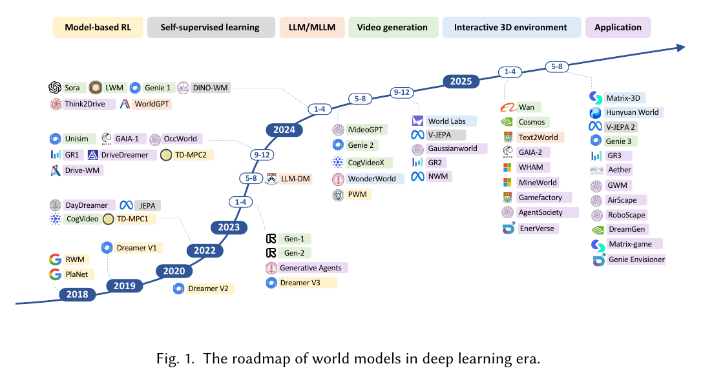
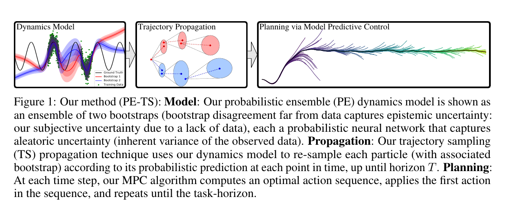
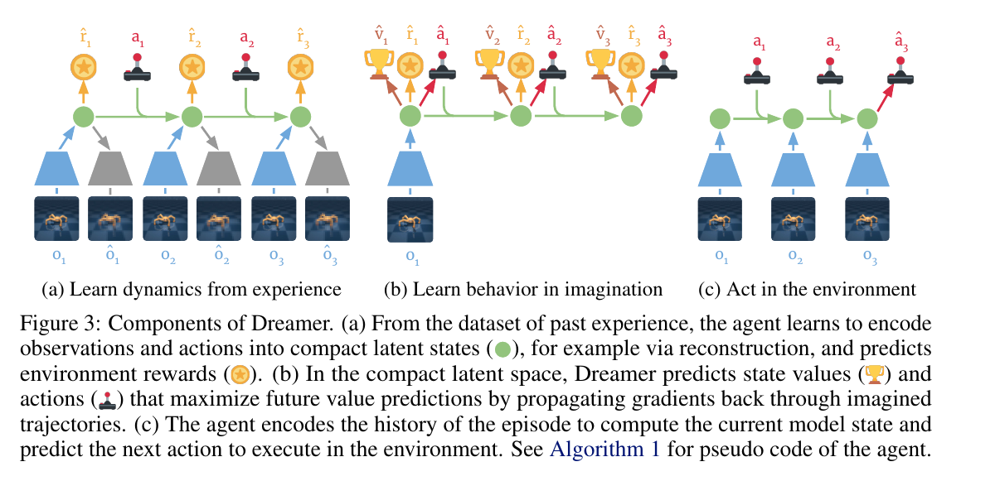
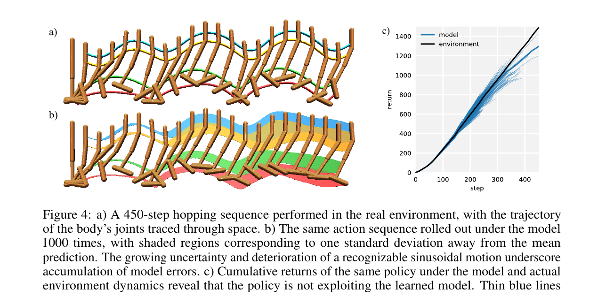
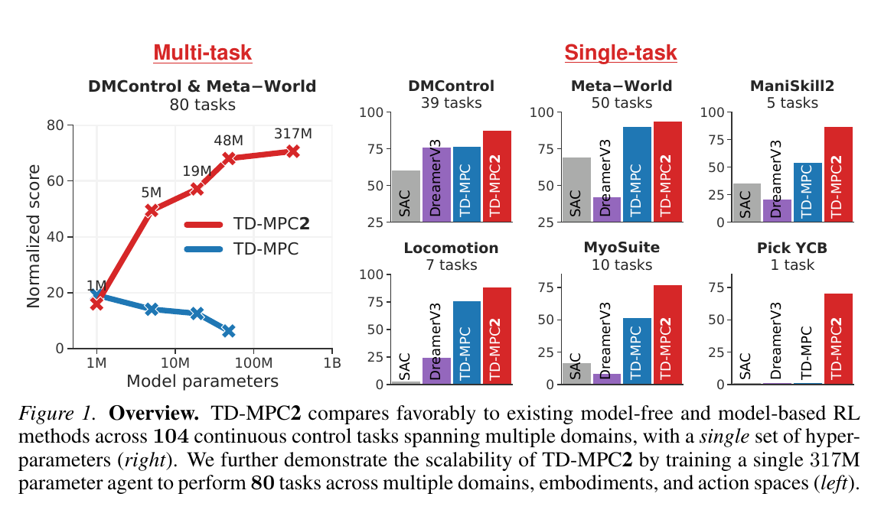

# 12.2 Model-Based RL： Model-Free  Model-Based

<a id="article-start"></a>

， `reset()`  Gym 。，，。， RL ：**，“”？**

 **Model-Based RL（MBRL，）** 。，、，。 Model-Free ，MBRL “”，“，”。



<div style="text-align: center; font-size: 0.9em; color: var(--vp-c-text-2); margin-top: -10px; margin-bottom: 20px;">
  <em> 1：。：Ding et al., “Understanding World or Predicting Future? A Comprehensive Survey of World Models”, Fig. 1[^worldmodelsurvey]。</em>
</div>

::: tip 
， [](#article-start)  [](#intuition-first)。“ →  → ”，。
:::

## ：

，“”。Ding ： **understanding the world**，； **predicting future dynamics**，、[^worldmodelsurvey]。 MBRL ，。

，[^embodiedwmsurvey]：

|      |                             |  MBRL                          |
| ------------ | ----------------------------------- | -------------------------------------- |
|          | ，  |  reward/value    |
|      |  rollout，  |            |
|      | 、token、BEV/voxel、3D  | 、   |
|  | ，        | 、， |

：、，[^adwmsurvey]。：“”，“”。

，：**MBRL ，、， rollout、。** ， Dreamer ， MuZero ，、JEPA 、。

## Model-Free vs Model-Based

，—— DQN、PPO、SAC  DPO、GRPO—— **Model-Free RL**。，。

###  {#intuition-first}

，：

- **Model-Free**：“”，“”。
- **Model-Based**：“”，。
- ****：，。

，；。

，Model-Free “”， ****。：

|            |                                     |
| -------------- | ------------------------------------------------- |
| $s_t$          |  $t$ ，、、 |
| $a_t$          |  $t$ ，、、     |
| $r_t$          |  $t$                                |
| $\pi_\theta$   | ，“”        |
| $p$            |                                 |
| $\hat{p}_\phi$ | ，$\phi$          |
| $\gamma$       | ，                      |

：

$$
p(s_{t+1}\mid s_t,a_t)
$$

： $s_t$， $a_t$， $s_{t+1}$。Model-Free ，。

：

$$
\tau=(s_0,a_0,r_0,s_1,\ldots),\qquad
s_{t+1}\sim p(\cdot\mid s_t,a_t),\quad a_t\sim \pi_\theta(\cdot\mid s_t)
$$

： $s_t$， $\pi_\theta$  $a_t$， $p$  $s_{t+1}$  $r_t$。 $\tau$ 。

Model-Free “”：

$$
J_{\text{MF}}(\theta)
=
\mathbb{E}_{\tau\sim p,\pi_\theta}
\left[
\sum_{t=0}^{\infty}\gamma^t r_t
\right]
$$

。 $\sum_t \gamma^t r_t$ ；$\gamma^t$ ；，。 Model-Free ， $J_{\text{MF}}(\theta)$ 。

， REINFORCE、A2C、PPO，：

$$
\nabla_\theta J_{\text{MF}}(\theta)
=
\mathbb{E}_{\tau\sim p,\pi_\theta}
\left[
\sum_t
\nabla_\theta \log \pi_\theta(a_t\mid s_t)\,\hat{A}_t
\right]
$$

：，；，。$\log \pi_\theta(a_t\mid s_t)$ “ $s_t$  $a_t$  log ”，$\hat{A}_t$ 。

， DQN、SAC、TD3， TD ：

$$
y_t
=
r_t+\gamma(1-d_t)\max_{a'}Q_{\bar{\theta}}(s_{t+1},a')
$$

 $y_t$  critic ： $r_t$，。 episode ，$d_t=1$， $(1-d_t)$ 。

critic  loss ：

$$
\mathcal{L}_{Q}(\theta)
=
\mathbb{E}_{(s,a,r,s',d)\sim\mathcal{D}}
\left[
\big(Q_\theta(s,a)-y_t\big)^2
\right]
$$

： critic  $Q_\theta(s,a)$， $y_t$，。：$s_{t+1}$  replay buffer，。

MBRL “”。，：

$$
\hat{p}_\phi(s_{t+1}, r_t \mid s_t, a_t)
$$

 $p$ ； $\hat{p}_\phi$ “”。、、，，。

，，：

$$
a_{0:H-1}^{*}
=
\arg\max_{a_{0:H-1}}
\sum_{h=0}^{H-1}
\gamma^h\hat{r}_\phi(\hat{s}_{t+h},a_{t+h})
$$

，$\arg\max$ ””；$H$ ；$\hat{s}$  $\hat{r}$ 。MPC ， $a_0^*$，。

 rollout ，：

$$
\hat{s}_{t+h+1},\hat{r}_{t+h}
\sim
\hat{p}_\phi(\cdot\mid \hat{s}_{t+h},a_{t+h})
$$

：**Model-Free  `next_state`；Model-Based  `world_model`， imagined state  imagined reward 。**

###  {#mf-mb-table}

|        | Model-Free RL                | Model-Based RL                         |
| ---------- | ---------------------------- | -------------------------------------- |
|    |        | ， |
|    | ，       | ，     |
|    | 、           |                |
|    | DQN, PPO, SAC, DPO, GRPO     | Dyna, PETS, PlaNet, MuZero, Dreamer    |
|    | 、、 | 、、   |
| “” |                    | ，         |

：Model-Free ；Model-Based 。，，。

::: tip 
 [](#intuition-first)， [ MBRL ](#minimal-mbrl-practice)。，，，。
:::

## ：？

 MBRL ：

$$
\mathcal{D}=\{(s_t, a_t, r_t, s_{t+1}, d_t)\}_{t=1}^{N}
$$

 replay buffer 。： $s_t$、 $a_t$、 $r_t$、 $s_{t+1}$， episode  $d_t$。

，“，”：

$$
\hat{p}_\phi(s_{t+1}, r_t, d_t \mid s_t, a_t)
$$

 $(s_t,a_t)$，、。， `world_model(state, action) -> next_state, reward, done`。，：**，？**

， MuJoCo 、，：

$$
\Delta s_t=s_{t+1}-s_t,\qquad
\widehat{\Delta s_t}=f_\phi(s_t,a_t)
$$

？，，。“” $s_{t+1}$ 。 2.0， 2.1，“ 0.1”。

：

$$
\mathcal{L}_{\text{det}}(\phi)
=\mathbb{E}_{\mathcal{D}}\left[
\|\Delta s_t-f_\phi(s_t,a_t)\|_2^2
+\lambda_r(r_t-\hat{r}_\phi(s_t,a_t))^2
\right]
$$

 loss 。 $f_\phi(s_t,a_t)$  $\Delta s_t$； $\hat{r}_\phi(s_t,a_t)$  $r_t$。$\lambda_r$ ，“” loss 。

### ： +  shooting MPC {#minimal-mbrl-practice}

 PETS。 MBRL  ** one-step dynamics model**， shooting  MPC。， MBRL ：、、、。

 Gym ：

$$
s_t=[x_t,v_t],\qquad a_t\in[-1,1]
$$

： $x_t$  $v_t$。 $a_t$ ， $[-1,1]$，。

$$
v_{t+1}=0.95v_t+0.15\tanh(a_t),\qquad
x_{t+1}=x_t+v_{t+1}
$$

“”。，$0.95v_t$ ，$0.15\tanh(a_t)$ 。。

 $x=0$，、：

$$
r_t=-(x_{t+1}^2+0.1v_{t+1}^2+0.001a_t^2)
$$

。，、、；， 0、、，reward 。

：

$$
[\widehat{\Delta x_t},\widehat{\Delta v_t},\hat r_t]
=f_\phi([x_t,v_t],a_t)
$$

，、，“、、”。，。

 $M$ ， $H$ ：

$$
a_{0:H-1}^{*}
=
\arg\max_{a_{0:H-1}^{(j)},\,j=1,\ldots,M}
\sum_{h=0}^{H-1}\gamma^h\hat r_{t+h}^{(j)}
$$

。 $M$ ； $j$  $H$ ， $\hat r_{t+h}^{(j)}$；，。 $a_0^*$，。 Model Predictive Control。

 [minimal_mbrl_point_mass.py](./snippets/minimal_mbrl_point_mass.py)，：

```bash
python docs/chapter12_future_trends/embodied-intelligence/model-based-rl/snippets/minimal_mbrl_point_mass.py
```

， MBRL  MPC ：

```text
one_step_model_mse=0.013716
random_policy_return=-2246.07, final_state=[8.50, -0.25]
mbrl_mpc_return=-18.76, final_state=[0.17, 0.07]
```

：

```python
# 1. 
state = env_reset()
action = torch.empty(1).uniform_(-1.0, 1.0)
next_state, reward = env_step(state, action)

# 2.  next_state - state  reward
target = torch.cat([next_state - state, reward.unsqueeze(-1)], dim=-1)
pred = model(state, action)
model_loss = ((pred - target) ** 2).mean()

# 3. MPC 
action_sequences = torch.empty(num_samples, horizon, 1).uniform_(-1.0, 1.0)
scores = score_action_sequences(model, state, action_sequences)
real_action = action_sequences[scores.argmax(), 0]

# 4. ，、
next_state, reward = env_step(state, real_action)
```

，：Model-Free  `policy(state) -> action`  `Q(state, action)`； MBRL  `model(state, action) -> next_state, reward`，。

 PETS？“”。、、；，“”。PETS[^pets] ， **、、 MPC** ， MBRL 。

PETS ， **** ：

$$
p_{\phi_i}(\Delta s_t, r_t\mid s_t,a_t)
=\mathcal{N}(\mu_{\phi_i}(x_t), \Sigma_{\phi_i}(x_t)),
\qquad x_t=[s_t,a_t]
$$

。：“”。PETS ：“ $\mu$， $\Sigma$ ”。 $i$  $i$ 。

：

$$
\mathcal{L}_{\text{nll}}(\phi_i)
=
\frac{1}{2}(y_t-\mu_{\phi_i})^\top\Sigma_{\phi_i}^{-1}(y_t-\mu_{\phi_i})
+\frac{1}{2}\log |\Sigma_{\phi_i}|,
\qquad y_t=[\Delta s_t,r_t]
$$

 loss 。“”： $y_t$  $\mu_{\phi_i}$ ，； $\Sigma_{\phi_i}$ ，，。 $\log|\Sigma_{\phi_i}|$ 。“”，。



<div style="text-align: center; font-size: 0.9em; color: var(--vp-c-text-2); margin-top: -10px; margin-bottom: 20px;">
  <em> 2：PETS 、trajectory propagation  MPC 。：Chua et al., “Deep Reinforcement Learning in a Handful of Trials using Probabilistic Dynamics Models”, Fig. 1[^pets]。</em>
</div>

。

， $\Sigma_{\phi_i}$  **aleatoric uncertainty**，； **epistemic uncertainty**，“”。，：，-，。

， rollout，。， $\epsilon_{\text{model}}$， $k$  $k$ ：

$$
\epsilon_{t+k}\approx \mathcal{O}(k\epsilon_{\text{model}})
$$

。：，。 1 ，， rollout 。 MBRL 。PETS  MPC ，MBPO[^mbpo]  rollout，Dreamer ， model bias 。

### ：

 PyTorch 。、、early stopping、，。

```python
import torch
import torch.nn as nn


class ProbabilisticDynamics(nn.Module):
    def __init__(self, state_dim: int, action_dim: int, hidden_dim: int = 256):
        super().__init__()
        out_dim = state_dim + 1  # delta_state + reward
        self.net = nn.Sequential(
            nn.Linear(state_dim + action_dim, hidden_dim),
            nn.SiLU(),
            nn.Linear(hidden_dim, hidden_dim),
            nn.SiLU(),
        )
        self.mu = nn.Linear(hidden_dim, out_dim)
        self.logvar = nn.Linear(hidden_dim, out_dim)

    def forward(self, state: torch.Tensor, action: torch.Tensor):
        h = self.net(torch.cat([state, action], dim=-1))
        mu = self.mu(h)
        logvar = self.logvar(h).clamp(-10.0, 2.0)
        return mu, logvar


def gaussian_nll(mu: torch.Tensor, logvar: torch.Tensor, target: torch.Tensor):
    inv_var = torch.exp(-logvar)
    return 0.5 * ((target - mu) ** 2 * inv_var + logvar).mean()


def train_step(model, optimizer, batch):
    state, action, reward, next_state = batch
    target = torch.cat([next_state - state, reward.unsqueeze(-1)], dim=-1)

    mu, logvar = model(state, action)
    loss = gaussian_nll(mu, logvar, target)

    optimizer.zero_grad()
    loss.backward()
    optimizer.step()
    return loss.item()
```

 $\mathcal{L}_{\text{nll}}$： $\mu$， `logvar`。，，，。

### ： CEM  MPC 

， MPC：，，，。 CEM（Cross-Entropy Method） PETS、MPC 。

```python
@torch.no_grad()
def rollout_model(model, state, actions, discount=0.99):
    # actions: [num_samples, horizon, action_dim]
    num_samples, horizon, _ = actions.shape
    state = state.expand(num_samples, -1)
    returns = torch.zeros(num_samples, device=state.device)
    gamma = 1.0

    for t in range(horizon):
        mu, logvar = model(state, actions[:, t])
        pred = mu + torch.randn_like(mu) * torch.exp(0.5 * logvar)
        delta_state, reward = pred[:, :-1], pred[:, -1]
        state = state + delta_state
        returns = returns + gamma * reward
        gamma *= discount

    return returns


@torch.no_grad()
def cem_plan(model, state, action_dim, horizon=15, iters=5, samples=512, elites=64):
    mean = torch.zeros(horizon, action_dim, device=state.device)
    std = torch.ones_like(mean)

    for _ in range(iters):
        actions = mean + std * torch.randn(samples, horizon, action_dim, device=state.device)
        actions = actions.clamp(-1.0, 1.0)
        scores = rollout_model(model, state, actions)
        elite_actions = actions[scores.topk(elites).indices]
        mean = elite_actions.mean(dim=0)
        std = elite_actions.std(dim=0).clamp_min(1e-3)

    return mean[0].clamp(-1.0, 1.0)
```

 `mean[0]`，。，，。 receding horizon ，。

## MBRL 

MBRL ，“” RL 。



<div style="text-align: center; font-size: 0.9em; color: var(--vp-c-text-2); margin-top: -10px; margin-bottom: 20px;">
  <em> 3：Dreamer “、、”。：Hafner et al., “Dream to Control”, Fig. 3[^dreamer]。</em>
</div>

### 1. ：Dyna 

Sutton  1991  Dyna [^dyna]  MBRL ：，，。

“”：，。——，。

```python
# Dyna （）
for step in range(num_steps):
    s, a, r, next_s = env.step(policy(s))
    replay.add(s, a, r, next_s)
    world_model.fit(replay)

    for _ in range(planning_steps):
        imagined_s, imagined_a = replay.sample_state_action()
        imagined_next_s, imagined_r = world_model.predict(imagined_s, imagined_a)
        value_fn.update(imagined_s, imagined_a, imagined_r, imagined_next_s)
```

MBPO  Dyna： replay buffer， replay buffer ， rollout ，[^mbpo]。：**，。**



<div style="text-align: center; font-size: 0.9em; color: var(--vp-c-text-2); margin-top: -10px; margin-bottom: 20px;">
  <em> 4：MBPO  rollout ， rollout 。：Janner et al., “When to Trust Your Model”, Fig. 4[^mbpo]。</em>
</div>

### 2. ：MPC、MCTS  MuZero

，。

， **MPC（Model Predictive Control，）**： $H$ ，，，、。“”，。

 Atari ，AlphaZero[^alphazero]  MuZero[^muzero] 。AlphaZero  MCTS，MuZero ：，。

### 3. ：PlaNet、Dreamer  TD-MPC

。，。， MBRL ，。

PlaNet[^planet] “，”；Dreamer [^dreamer][^dreamerv3]  actor-critic ， latent imagination 。TD-MPC2[^tdmpc2] 。

， MBRL ，“”：、、、。

## 



<div style="text-align: center; font-size: 0.9em; color: var(--vp-c-text-2); margin-top: -10px; margin-bottom: 20px;">
  <em> 5：TD-MPC2 。：Hansen et al., “TD-MPC2”, Fig. 1[^tdmpc2]。</em>
</div>

### AlphaZero：

AlphaZero ，。， MCTS [^alphazero]。“”，。

：，。，。

### MuZero：

MuZero ：，[^muzero]。，、。

：“”，。

MuZero ：

$$
s_0=h_\theta(o_{1:t}),\qquad
r_{k+1},s_{k+1}=g_\theta(s_k,a_k),\qquad
p_k,v_k=f_\theta(s_k)
$$

：

|        |                       |                                  |                                    |
| ---------- | ------------------------- | ------------------------------------ | -------------------------------------- |
| $h_\theta$ |  $o_{1:t}$        |  $s_0$                     |              |
| $g_\theta$ |  $s_k$  $a_k$ |  $s_{k+1}$、 $r_{k+1}$ |                        |
| $f_\theta$ |  $s_k$              |  $p_k$、 $v_k$           | 、 |

 MuZero “”，“，、、”。：

$$
\mathcal{L}_{\text{MuZero}}
=\sum_{k=0}^{K}
\left(
\ell^r(u_{t+k}, r_k)
+\ell^v(z_{t+k}, v_k)
+\ell^p(\pi_{t+k}, p_k)
\right)
$$

 $K$ 。 $k$，loss ： $r_k$  $u_{t+k}$； $v_k$  $z_{t+k}$； $p_k$  MCTS  $\pi_{t+k}$。，MuZero ，。


<div style="text-align: center; font-size: 0.9em; color: var(--vp-c-text-2); margin-top: -10px; margin-bottom: 20px;">
  <em> 6：MuZero  learned model 、。：Schrittwieser et al., “Mastering Atari, Go, Chess and Shogi by Planning with a Learned Model”, Fig. 1[^muzero]。</em>
</div>

### Dreamer：

Dreamer 、 actor-critic [^dreamer][^dreamerv3]。 latent dynamics， rollout ，。

DreamerV3 ：、、Atari、Minecraft [^dreamerv3]。 MBRL “”“”。

Dreamer  RSSM（Recurrent State-Space Model） $h_t$  $z_t$：

$$
h_t=f_\phi(h_{t-1}, z_{t-1}, a_{t-1}),\qquad
z_t\sim q_\phi(z_t\mid h_t,o_t)
$$

 $h_t$ “”， $z_t$ “”。$h_t$ 、；$z_t$  $o_t$，。

、：

$$
\mathcal{L}_{\text{world}}
=\sum_t
\left[
-\log p_\phi(o_t\mid h_t,z_t)
-\log p_\phi(r_t\mid h_t,z_t)
-\log p_\phi(c_t\mid h_t,z_t)
+\beta\,\mathrm{KL}\big(q_\phi(z_t\mid h_t,o_t)\,\|\,p_\phi(z_t\mid h_t)\big)
\right]
$$

 world model loss ：

|                               |                                            |
| ------------------------------- | ---------------------------------------------------- |
| $-\log p_\phi(o_t\mid h_t,z_t)$ |                              |
| $-\log p_\phi(r_t\mid h_t,z_t)$ |                                  |
| $-\log p_\phi(c_t\mid h_t,z_t)$ |  episode                     |
| $\mathrm{KL}(q_\phi\|p_\phi)$   |  |

“”；KL ， rollout 。

，actor ，：

$$
J(\psi)=
\mathbb{E}_{\hat{p}_\phi,\pi_\psi}
\left[
\sum_{t=0}^{H}\gamma^t \hat{r}_t
\right]
$$

 RL ，。 $r_t$，Dreamer  $\hat{r}_t$；，Dreamer  $\hat{p}_\phi$。actor  $\psi$，。


<div style="text-align: center; font-size: 0.9em; color: var(--vp-c-text-2); margin-top: -10px; margin-bottom: 20px;">
  <em> 7：Dreamer  latent imagination 。：Hafner et al., “Dream to Control”, Fig. 3[^dreamer]。</em>
</div>

|  /  |              |              |                |
| ----------- | ------------------------ | -------------------------- | ---------------------- |
| Dyna        |  |  |  RL、      |
| PETS        |        | MPC +              |          |
| AlphaZero   |              | MCTS +         | 、、   |
| MuZero      |      | latent MCTS                | 、Atari            |
| Dreamer     |  RSSM      | latent imagination     | 、、 |
| TD-MPC2     |  | latent MPC +       | 、 |

##  MBRL？

 MBRL ，“MBRL ”，、、。


<div style="text-align: center; font-size: 0.9em; color: var(--vp-c-text-2); margin-top: -10px; margin-bottom: 20px;">
  <em> 8：、、。：Feng et al., “A Survey of World Models for Autonomous Driving”, Fig. 1[^adwmsurvey]。</em>
</div>

1. ****：，。MBRL 。
2. ****：，。
3. ****：、、。，。
4. **Sim-to-Real **：“”，。

::: info MBRL 
MBRL  **model bias**：，，。PETS [^pets]，Dreamer [^dreamer]，。
:::

##  RL  MBRL？

 8  10  DPO、PPO、GRPO  Agentic RL， MBRL。 MBRL ， ****。

 LLM ， token 、。，“”。，LLM  test-time search、self-play、process reward， dynamics model。

。、、。“”。 MBRL 。

## 

：？

：，；、。OpenAI  Sora [^sora]。

：

- ****：“”，“”。
- ****：，、。
- ****： Hz ，。
- ****：、。

“”，、、， RL、MPC、。

## ：？

**，。** ，：Ding “”“”[^worldmodelsurvey]；Li  embodied AI 、、 taxonomy[^embodiedwmsurvey]；Feng 、[^adwmsurvey]。，。

**PETS：“”。** PETS  “in a handful of trials”，，、[^pets]。，；、。

**MBPO：“”。** MBPO ， rollout [^mbpo]。 1  5 ，。，，。

**PlaNet  Dreamer：“”。** PlaNet [^planet]；Dreamer  actor-critic [^dreamer]。：， latent state。

**MuZero：“”。** MuZero ，[^muzero]。、， MCTS。：，“”。

**TD-MPC2：“”。** TD-MPC2  latent model predictive control ， decoder-free [^tdmpc2]。：，、。

<details>
<summary>：MBRL  Model-Free RL？</summary>

。MBRL ，，。Model-Free  PPO、SAC  RL ， Isaac Lab ，。

： Model-Free ，、、。 Dreamer、TD-MPC2、MuZero “”，、、。

</details>

## 

|                        |  MBRL                                    |
| ------------------------------------ | -------------------------------------------------- |
| MDP （ 3 ）              | 、               |
| DQN （ 4 ）            | Dyna                   |
|  Actor-Critic（ 5-6 ） | Dreamer  actor  critic           |
| PPO （ 7 ）            |  RL  PPO               |
| （）                 | MBRL 、          |
|  RL（ 12.5 ）                | ， |

##  QA

### Q1：？

， MBRL 。，：

$$
\hat{p}_\phi(s_{t+1}, r_t, d_t\mid s_t,a_t)\approx p(s_{t+1}, r_t, d_t\mid s_t,a_t)
$$

，。 $\approx$ “”，“”。、、，。

 $\hat{p}_\phi \neq p$， rollout 。：

1. ****： $s_{t+1}$、$r_t$、。
2. ****： $\hat{s}_{t+1}$ ， rollout 。
3. ****：“”， model exploitation。

，：

$$
\epsilon_m
=
\max_{s,a}
D_{\mathrm{TV}}\left(
p(\cdot\mid s,a), \hat{p}_\phi(\cdot\mid s,a)
\right)
$$

 $D_{\mathrm{TV}}$ “”。$\epsilon_m$ ，：。

 $\epsilon_m$ ，。：

$$
\left|V_p^\pi(s)-V_{\hat{p}}^\pi(s)\right|
\lesssim
\mathcal{O}\left(
\frac{\gamma R_{\max}}{(1-\gamma)^2}\epsilon_m
\right)
$$

， $(1-\gamma)^2$ 。$\gamma$  1，，，。，、，。

，：**，。** MBPO  “When to Trust Your Model”，：，， rollout[^mbpo]。PETS ，[^pets]。

，，：

```python
@torch.no_grad()
def conservative_model_step(ensemble, state, action, beta=2.0, stop_threshold=0.5):
    preds = torch.stack([model.sample(state, action) for model in ensemble])
    mean_pred = preds.mean(dim=0)
    uncertainty = preds.var(dim=0).mean(dim=-1)

    delta_state, reward = mean_pred[:, :-1], mean_pred[:, -1]
    reward = reward - beta * uncertainty

    should_stop = uncertainty > stop_threshold
    next_state = state + delta_state
    return next_state, reward, should_stop
```

“”，“，”。 MBRL ： rollout、、、、。

### Q2：？

，。Model-Free /；MBRL ：

$$
\text{MBRL cost}
\approx
\text{model training}
+
\text{planning or imagination rollout}
+
\text{policy/value update}
$$

，。Model-Free ；MBRL ， rollout。

 CEM/MPC ，：

$$
\mathcal{O}(I\cdot N\cdot H\cdot M\cdot C_{\text{model}})
$$

：CEM  $I$ ； $N$ ； $H$ ； $M$ ，；$C_{\text{model}}$ 。。

 MBRL  ****。PETS  benchmark  SAC/PPO [^pets]；Dreamer ，、[^dreamer]；TD-MPC2  decoder-free ， latent [^tdmpc2]。

：

|                          |                     |
| ---------------------------- | ------------------------------- |
| ， | PPO、SAC  Model-Free    |
|      | MBRL、MPC、、 |
|                |  MBRL， Dreamer、TD-MPC |
|              | 、 horizon、    |

：，，：

```python
# ：MPC 
expert_action = cem_plan(world_model, state, action_dim)

# ： MPC
policy_action = actor(state)
distill_loss = ((policy_action - expert_action) ** 2).mean()
```

“”，“”。，Model-Free ；、、， GPU 。

### Q3：LeCun ， MBRL ？

LeCun “”， RL 。LeCun  2022  position paper ：、、 JEPA/H-JEPA ，、[^lecun2022]。

MBRL ：

$$
\hat{p}_\phi(s_{t+1}, r_t, d_t\mid s_t,a_t)
$$

：，、。PETS、MBPO、Dreamer、MuZero ，：PETS ，Dreamer ，MuZero 、。

LeCun/J(EPA)  ****，。I-JEPA ，，[^ijepa]；V-JEPA ，，、[^vjepa]。

“”：

|               |                          |                    |
| ----------------- | -------------------------------- | -------------------------- |
|  MBRL         | 、、         | 、、       |
|   |                | 、、   |
| LeCun/J(EPA)  | 、 embedding         | 、、 |
| MuZero/Dreamer  | 、、 |        |

JEPA ：

$$
z_y = E_{\bar{\theta}}(y),\qquad
\hat{z}_y = P_\phi(E_\theta(x), c),\qquad
\mathcal{L}_{\text{JEPA}}
=
\|\hat{z}_y-\mathrm{sg}(z_y)\|_2^2+\Omega(z)
$$

： $E_{\bar{\theta}}$  $y$  $z_y$； $E_\theta$  $x$， $P_\phi$  $\hat{z}_y$；loss 。$\mathrm{sg}$  stop-gradient，，。


<div style="text-align: center; font-size: 0.9em; color: var(--vp-c-text-2); margin-top: -10px; margin-bottom: 20px;">
  <em> 9：Video-JEPA  joint-embedding predictive architecture， embedding。：Bardes et al., “Revisiting Feature Prediction for Learning Visual Representations from Video”, Fig. 2[^vjepa]。</em>
</div>

 $x$ ，$y$ ，$c$ 、，$\mathrm{sg}$  stop-gradient，$\Omega$ 。，； MBRL ，。2026  LeWorldModel  JEPA ，[^lewm]。

：**MBRL “”，LeCun “”；，、。**

### Q4：Model-Based  Model-Free ？

 RL ：

$$
J(\theta)
=
\mathbb{E}_{\tau\sim p,\pi_\theta}
\left[
\sum_{t=0}^{\infty}\gamma^t r_t
\right]
$$

， Model-Free  Model-Based，。“ reward ”， **，**。

 $p(s_{t+1},r_t\mid s_t,a_t)$。

**Model-Free** 。 $(s,a,r,s')$ 。 Q-learning / SAC  critic ：

$$
y_t
=
r_t+\gamma(1-d_t)Q_{\bar{\theta}}(s_{t+1}, \pi_\psi(s_{t+1}))
$$

 $s_{t+1}$  replay buffer，。critic  $y_t$。

**Model-Based** ：

$$
\mathcal{L}_{\text{model}}(\phi)
=
-\mathbb{E}_{\mathcal{D}}
\log \hat{p}_\phi(s_{t+1}, r_t, d_t\mid s_t,a_t)
$$

 loss ：、。：， loss， log likelihood。

：

$$
a_{0:H-1}^{*}
=
\arg\max_{a_{0:H-1}}
\sum_{h=0}^{H-1}
\gamma^h
\hat{r}_\phi(\hat{s}_{t+h}, a_{t+h})
$$

 $\hat{s}$  $\hat{r}$ 。，。

：

$$
J_{\text{imag}}(\psi)
=
\mathbb{E}_{\hat{p}_\phi,\pi_\psi}
\left[
\sum_{h=0}^{H}
\gamma^h \hat{r}_{t+h}
\right]
$$

 $J_{\text{imag}}$  RL ， $\hat{p}_\phi$， $p$。“”， ****。Model-Free ；Model-Based ， rollout 。

### Q5：Model-Based  Model-Free ？

 Model-Free。 `world_model`，`next_state`  replay buffer ：

```python
# Model-Free: SAC / DDPG  critic 
state, action, reward, next_state, done = replay.sample()

with torch.no_grad():
    next_action = actor(next_state)
    target_q = target_critic(next_state, next_action)
    y = reward + gamma * (1.0 - done) * target_q

q = critic(state, action)
critic_loss = ((q - y) ** 2).mean()
critic_loss.backward()
critic_optimizer.step()
```

 Model-Based。，：

```python
# Model-Based: 
state, action, reward, next_state, done = replay.sample()
target = torch.cat([next_state - state, reward, done], dim=-1)

mu, logvar = world_model(state, action)
model_loss = gaussian_nll(mu, logvar, target)
model_loss.backward()
model_optimizer.step()

#  imagined transition
imagined_state = state
imagined_return = 0.0
discount = 1.0

for h in range(horizon):
    imagined_action = actor(imagined_state)
    pred = world_model.sample(imagined_state, imagined_action)
    delta_state, imagined_reward, imagined_done = split_prediction(pred)

    imagined_return += discount * imagined_reward
    discount *= gamma * (1.0 - imagined_done)
    imagined_state = imagined_state + delta_state

actor_loss = -imagined_return.mean()
actor_loss.backward()
actor_optimizer.step()
```

：

- Model-Free  `next_state` 。
- Model-Based  `imagined_state` 。
- Model-Free 、、。
- Model-Based 、，。

### Q6：？

。（ MuJoCo、Isaac Sim），。、、、；，。

：

1. ****：。
2. ****： latent ，。
3. ****： residual dynamics  domain adaptation。
4. ****：，。

MuZero ：，，[^muzero]。，“”，“、、”。

### Q7： MBRL， Model-Free？

：

** MBRL**：、、、、、。、 locomotion、、，。

** Model-Free**：、、、 baseline。PPO  Isaac Lab ，。

****： Model-Free ，、、， MPC 。Dreamer、TD-MPC2、MuZero ，“”“”，、、。

### Q8： PETS？ PETS？

 PETS， MBRL ：、、trajectory propagation  MPC[^pets]。“、”。

 PETS 。：

1. ：$f_\phi(s_t,a_t)\rightarrow[\Delta s_t,r_t]$。
2.  shooting MPC：，，。
3. ，。

，：

$$
\widehat{\Delta s_t},\hat r_t=f_\phi(s_t,a_t)
$$

PETS ， epistemic uncertainty：

$$
p_{\phi_i}(\Delta s_t,r_t\mid s_t,a_t)
=\mathcal{N}(\mu_{\phi_i},\Sigma_{\phi_i})
$$

， MSE loss；PETS  Gaussian NLL，。 MBRL ，、、。

## 

Model-Free RL “”，Model-Based RL “”。，Model-Free ；、、，，、。

MBRL ：，。 Model-Free  Model-Based ，、、。

[](../)， Sim-to-Real、、VLA 。

---

****：

[^worldmodelsurvey]: Ding, J. et al. (2025). Understanding World or Predicting Future? A Comprehensive Survey of World Models. _ACM Computing Surveys_. <https://arxiv.org/abs/2411.14499>

[^embodiedwmsurvey]: Li, X. et al. (2025). A Comprehensive Survey on World Models for Embodied AI. <https://arxiv.org/abs/2510.16732>

[^adwmsurvey]: Feng, T. et al. (2025). A Survey of World Models for Autonomous Driving. <https://arxiv.org/abs/2501.11260>

[^dyna]: Sutton, R. S. (1991). Dyna, an Integrated Architecture for Learning, Planning, and Reacting. _SIGART Bulletin_. <https://www.incompleteideas.net/papers/sutton-91dyna.pdf>

[^pets]: Chua, K. et al. (2018). Deep Reinforcement Learning in a Handful of Trials using Probabilistic Dynamics Models. _NeurIPS_. <https://arxiv.org/abs/1805.12114>

[^mbpo]: Janner, M. et al. (2019). When to Trust Your Model: Model-Based Policy Optimization. _NeurIPS_. <https://arxiv.org/abs/1906.08253>

[^planet]: Hafner, D. et al. (2019). Learning Latent Dynamics for Planning from Pixels. _ICML_. <https://arxiv.org/abs/1811.04551>

[^dreamer]: Hafner, D. et al. (2020). Dream to Control: Learning Behaviors by Latent Imagination. _ICLR_. <https://arxiv.org/abs/1912.01603>

[^dreamerv3]: Hafner, D. et al. (2023). Mastering Diverse Domains through World Models. <https://arxiv.org/abs/2301.04104>

[^tdmpc2]: Hansen, N. et al. (2024). TD-MPC2: Scalable, Robust World Models for Continuous Control. _ICLR_. <https://arxiv.org/abs/2310.16828>

[^alphazero]: Silver, D. et al. (2017). Mastering Chess and Shogi by Self-Play with a General Reinforcement Learning Algorithm. <https://arxiv.org/abs/1712.01815>

[^muzero]: Schrittwieser, J. et al. (2020). Mastering Atari, Go, Chess and Shogi by Planning with a Learned Model. _Nature_. <https://arxiv.org/abs/1911.08265>

[^sora]: Brooks, T. et al. (2024). Video generation models as world simulators. OpenAI. <https://openai.com/index/video-generation-models-as-world-simulators/>

[^lecun2022]: LeCun, Y. (2022). A Path Towards Autonomous Machine Intelligence. OpenReview. <https://openreview.net/forum?id=BZ5a1r-kVsf>

[^ijepa]: Assran, M. et al. (2023). Self-Supervised Learning from Images with a Joint-Embedding Predictive Architecture. _CVPR_. <https://arxiv.org/abs/2301.08243>

[^vjepa]: Bardes, A. et al. (2024). Revisiting Feature Prediction for Learning Visual Representations from Video. <https://arxiv.org/abs/2404.08471>

[^lewm]: Maes, J. et al. (2026). LeWorldModel: A Unified End-to-End World Model for Autonomous Driving. <https://arxiv.org/abs/2603.19312>
