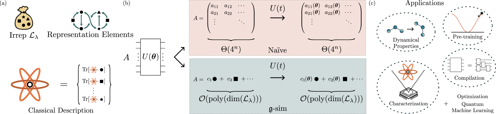
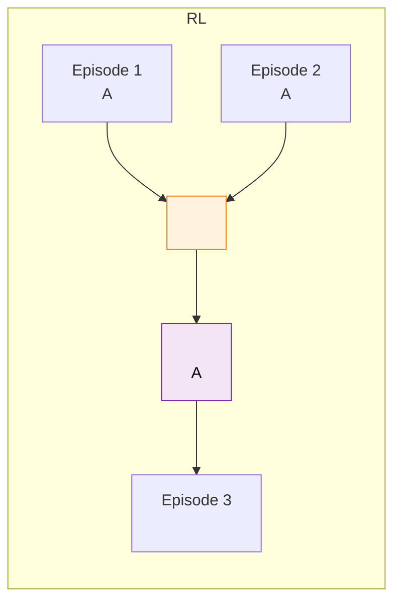
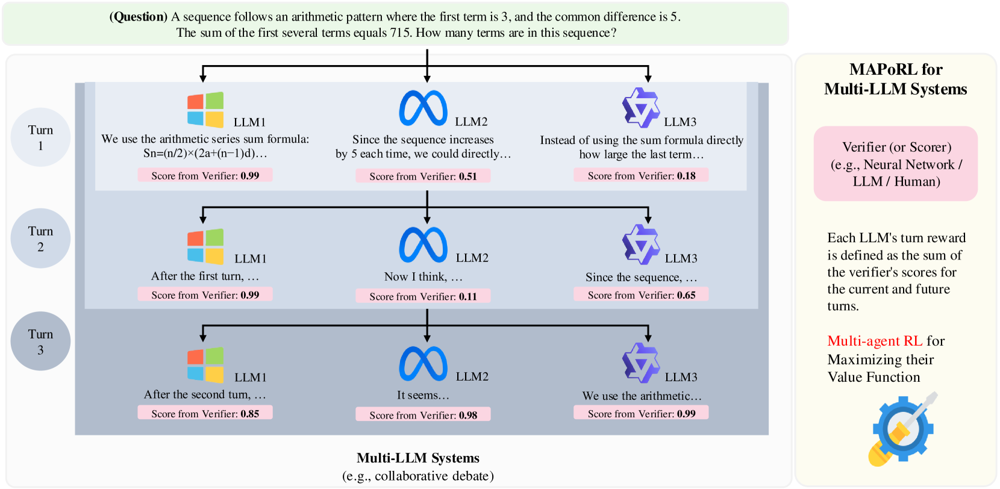

# 12.4 LLM 

 LLM ， RL（MARL）。MARL ****：，——""。 **CTDE（，，Centralized Training with Decentralized Execution）**："" Critic ，。

```mermaid
flowchart TD
    subgraph "Centralized Training ()"
        C[" Critic ()"]
        O1["1  (O₁)"] --> C
        O2["2  (O₂)"] --> C
        A1["1  (A₁)"] --> C
        A2["2  (A₂)"] --> C

        C -->|" Q  / Advantage"| R["Reward & "]
    end

    subgraph "Decentralized Execution ()"
        Actor1["1 Actor"]
        Actor2["2 Actor"]

        O1_E[" (O₁)"] --> Actor1
        Actor1 -->|""| A1_E[" (A₁)"]

        O2_E[" (O₂)"] --> Actor2
        Actor2 -->|""| A2_E[" (A₂)"]
    end

    R -.->|""| Actor1
    R -.->|""| Actor2

    style C fill:#fce4ec,stroke:#c62828,color:#000
    style Actor1 fill:#e3f2fd,stroke:#1976d2,color:#000
    style Actor2 fill:#e3f2fd,stroke:#1976d2,color:#000
```

<div style="text-align: center; font-size: 0.9em; color: var(--vp-c-text-2); margin-top: -10px; margin-bottom: 20px;">
  <em>：CTDE (，) 。 MAPPO  MADDPG 。 LLM ， Critic  Agent （ GPT-4）。</em>
</div>

|        |                            |                 |
| ---------- | ---------------------------------- | ----------------------- |
| **IPPO**   |  PPO，   | ，      |
| **MAPPO**  | PPO + （CTDE）         |       |
| **QMIX**   |  Q  Q  |               |
| **MADDPG** |  DDPG +  Critic    | ，/ |

、，****，—— MAPPO  LLM ：

|              |  MARL                          | LLM  RL                              |
| ---------------- | ---------------------------------- | -------------------------------------------- |
| ****     | /（、）  | （ token ）                  |
| ****   | （、） | （Coder  Reviewer ） |
| **Episode ** |              | ，                       |
| ****     |                    | （）                 |
| ****     |                              |                            |

 LLM  RL 、。

## 

### ： (Role-Playing Collaboration)

—— LLM Agent ，，。 **ChatDev** 。


<div style="text-align: center; font-size: 0.9em; color: var(--vp-c-text-2); margin-top: -10px; margin-bottom: 20px;">
  <em> 1：ChatDev 。 LLM  CEO、CTO、Programmer、Reviewer ，（、、、），。：<a href="https://arxiv.org/abs/2307.07924" target="_blank" rel="noopener noreferrer">ChatDev Paper</a></em>
</div>

```
: " GitHub Issue"
├── Planner： Issue，
├── Coder：
├── Reviewer：，
└── Tester：，
```

 CTDE ， LLM  RL 。

**。**  MARL ， LLM Agent ""（ token）。 Q ""。**（rollout）**， reward 。

**Reward 。** ** + ** reward：

$$R_i = \alpha \cdot R^{\text{outcome}} + (1-\alpha) \cdot R_i^{\text{process}}$$

 $R^{\text{outcome}}$  reward（？Issue ？），$R_i^{\text{process}}$  $i$  reward（、）。$\alpha$  0.5-0.7，。 9  ORM vs PRM ——。

 **MetaGPT** （SOP） Prompt。 RL ，SOP ****——，，， PPO  reference model  KL （ 7 ）。



<div style="text-align: center; font-size: 0.9em; color: var(--vp-c-text-2); margin-top: -10px; margin-bottom: 20px;">
  <em> 2：MetaGPT 。 Agent ， Standardized Operating Procedures (SOPs)  Agent ，""。：<a href="https://arxiv.org/abs/2308.01432" target="_blank" rel="noopener noreferrer">MetaGPT Paper</a></em>
</div>

### ： (Debate and Competition)

12.3 ，** RL** 。， LLM Agent ，， Judge 。

 12.3 ：****，****。（Population Training）——，，。

```mermaid
flowchart TD
    subgraph " RL"
        Q[""] --> A["Agent α:  A"]
        Q --> B["Agent β:  B"]
        A -->|" B"| AB["Agent α: "]
        B -->|" A"| BA["Agent β: "]
        AB --> J["Judge: "]
        BA --> J
        J -->|"reward +1"| A
        J -->|"reward -1"| B
    end

    style J fill:#fff3e0,stroke:#f57c00,color:#000
    style A fill:#e3f2fd,stroke:#1976d2,color:#000
    style B fill:#fce4ec,stroke:#c62828,color:#000
```

### ： (Open-Ended Multi-Agent Environments)

， RL ：**（Open-Ended Environment）**，，。 **Generative Agents（）** ——25  LLM  Agent ，。

 RL ，：

- ** Reward **：””，——、、， RL（Multi-Objective RL）：$$R_t = \sum_{m=1}^{M} w_m \cdot r_m(s_t, a_t)$$  $w_m$ 。
- ****：（””、””），。 4  DQN  ε-greedy ，。
- ****：，””？** + LLM-as-Judge**， 12.3 ””。

 RL ：** reward shaping** ，——。

## LLM  RL 

### ：

 MARL ——，。LLM ：

- ****：Coder  Reviewer 。 Coder ，Reviewer 。
- ****： MARL ，。LLM ，（ Python  Java），。

****：**-**——，。 curriculum learning，，。

### ：

 9 （9.1 ）——7 ，？：**，？**

，Coder ，Reviewer  bug ，Coder 。"" reward ？

- Coder """"
- Reviewer ""
-  Reviewer ，Coder 

 CTDE  Critic ——""。 LLM ，""""，""、""。

****：。（、），。：

$$R_i = \alpha \cdot R_i^{\text{process}} + (1 - \alpha) \cdot R^{\text{outcome}}$$

 $R_i^{\text{process}}$  $i$ ，$R^{\text{outcome}}$ 。

### ：

，Agent ——？？ episode ，。

 DQN （ 4 ）：DQN ****，****——""， episode 。



 RL ：** RL **。""——，"、"。****：（、），（）。

## 

### MAPoRL：



<div style="text-align: center; font-size: 0.9em; color: var(--vp-c-text-2); margin-top: -10px; margin-bottom: 20px;">
  <em> 3：MAPoRL 。 RL （Post-Co-Training）。，“ Reward”（ Coder  Reviewer）， RL 。：<a href="https://arxiv.org/abs/2502.18439" target="_blank" rel="noopener noreferrer">MAPoRL Paper</a></em>
</div>

MAPoRL [^maporl]  LLM Agent 。****——，""。，Coder  Reviewer ？Tester  Coder ？

### M-GRPO：GRPO 

 9  GRPO：，。M-GRPO [^mgrpo] ——。，， 3 "Coder-Reviewer-Tester"，。

$$\text{Advantage}_i = \frac{R_i - \text{mean}(R_{1..G})}{\text{std}(R_{1..G})}$$

 $R_i$  $i$  reward。 GRPO （ Critic），。

### SAGE：

SAGE [^sage] ****： Agent  →  →  →  → 。 12.3 ，。

### MARTI：

MARTI [^marti] 。： LLM Agent ， Agent 。""， Agent  RL 。

## 

|                           |  LLM  RL       |
| --------------------------------- | -------------------------------- |
| CTDE  Critic                  |          |
|  Generator-Judge（12.3 ） |            |
|  ORM/PRM（9.1 ）    |        |
| GRPO （ 9 ）          | M-GRPO   |
| DQN （ 4 ）           | ：   |
| PPO（ 7 ）                    |        |
| （ 7 ）             |  |
| Bespoke Labs KL=0.001（9.5 ）   |  KL    |

：**LLM  RL ""**。（9.1 ）、（ 5-6 ）、（ 7 ）、reward （9.5 ）——，。

## ：

。， RL 。

### ：-（Freeze-Rotate Training）

，：

**Step 1： SFT 。** ——Coder ，Reviewer ，Tester 。

**Step 2：，RL 。**  Reviewer  Tester， RL  Coder。Coder  Reviewer  Tester——" Reviewer ，"。

**Step 3：。**  Coder ， Coder，RL  Reviewer。Reviewer  Coder——"Coder ，"。

**Step 4：。**  Step 2-3 。

```python
class FreezeRotateTrainer:
    """-"""

    def __init__(self, agents, env, num_rounds=3):
        self.agents = agents  # {"coder": model_c, "reviewer": model_r, ...}
        self.env = env
        self.num_rounds = num_rounds

    def train(self, tasks):
        for round_idx in range(self.num_rounds):
            for role, model in self.agents.items():
                print(f"Round {round_idx}: Training {role}")

                # 
                for other_role, other_model in self.agents.items():
                    if other_role != role:
                        other_model.freeze()

                # RL 
                for task_batch in tasks:
                    trajectories = self.rollout_multi_agent(task_batch)
                    rewards = self.compute_multi_agent_reward(trajectories)
                    model.update(trajectories, rewards, role)

                # 
                for m in self.agents.values():
                    m.unfreeze()

    def rollout_multi_agent(self, tasks):
        """ rollout"""
        trajectories = []
        for task in tasks:
            state = {"task": task, "history": []}

            # 
            for role, model in self.agents.items():
                action = model.act(state, role)
                state["history"].append({
                    "role": role, "action": action
                })

            trajectories.append(state)
        return trajectories

    def compute_multi_agent_reward(self, trajectories):
        """ reward"""
        rewards = []
        for traj in trajectories:
            #  reward（）
            outcome = self.env.evaluate(traj)
            outcome_reward = 1.0 if outcome["success"] else 0.0

            #  reward（）
            process_rewards = {}
            for step in traj["history"]:
                role = step["role"]
                quality = self.env.evaluate_step(step)
                process_rewards[role] = quality

            #  reward
            total_reward = 0.6 * outcome_reward + 0.4 * sum(
                process_rewards.values()
            ) / max(len(process_rewards), 1)

            rewards.append(total_reward)
        return rewards
```

### ： GRPO（M-GRPO ）

M-GRPO  GRPO ——，****：

```
:  GitHub Issue #1234

 A ( 1):
  Planner → : →→→
  Coder   → :  45 
  Reviewer → : 
  Tester  → : 3/3 
   reward: 0.85

 B ( 2):
  Planner → : →
  Coder   → :  12  45 
  Reviewer → : LGTM
  Tester  → : 2/3 （ case ）
   reward: 0.60

 C ( 3):
  Planner → :  Issue→→→
  Coder   → :  45 ，
  Reviewer → : 
  Tester  → : 3/3 
   reward: 0.90

GRPO :  C ， B 
           →  C 
```

M-GRPO **reward **。：

** reward**： reward。，""。

** reward**：——$\alpha \times$  reward + $(1-\alpha) \times$  reward。$\alpha$  0.5-0.7。

### ：（Self-Play）

——：

**Generator vs Judge**：Generator ，Judge 。 RL ——Generator ，Judge 。

**Proposer vs Solver**：Proposer ，Solver 。 Proposer " Solver "—— Solver ，。"" RL 。

****——，。****（Population）：， 10-20 。FlexMARL [^flexmarl] 、，。

## ： RL 

 RL ——、、。FlexMARL [^flexmarl]  KD-MARL [^kdmarl] 。

### 

```mermaid
flowchart TD
    subgraph ""
        subgraph "Worker Group 1"
            W1["Planner  GPU"]
            W2["Coder  GPU"]
            W3["Reviewer  GPU"]
        end

        subgraph "Worker Group 2"
            W4["Planner  GPU"]
            W5["Coder  GPU"]
            W6["Reviewer  GPU"]
        end

        E["\n（//）"]
        B["Reward Buffer\n trajectory"]
        T["Trainer GPU\n"]

        W1 --> E
        W2 --> E
        W3 --> E
        W4 --> E
        W5 --> E
        W6 --> E
        E --> B
        B --> T
        T -->|""| W1
        T -->|""| W2
        T -->|""| W3
        T -->|""| W4
        T -->|""| W5
        T -->|""| W6
    end

    style E fill:#e3f2fd,stroke:#1976d2,color:#000
    style T fill:#e8f5e9,stroke:#388e3c,color:#000
    style B fill:#fff3e0,stroke:#f57c00,color:#000
```

：

****。——Planner  14B，Coder  32B，Reviewer  7B。，，。

****。（），。——Coder 。

****。——，。 JSON Schema ， 9.3 。

##  RL：

 **Model-Free**——，。 Q-Learning、DQN、PPO、DPO、GRPO， Model-Free。：**Model-Based RL（MBRL）""，""""**。

|                  | Model-Free（）   | Model-Based                      |
| ---------------- | ------------------------ | -------------------------------- |
|  |                    |              |
|          | （）       | （""）     |
|          | （） | （） |
|          | DQN、PPO、DPO、GRPO      | Dreamer、MuZero、AlphaZero       |
|              |              | ，       |

 $\hat{P}(s_{t+1}|s_t, a_t)$ " $s_t$  $a_t$，"。，，。

###  MBRL ？

****。（CoT），""：

$$\text{CoT } \approx \text{}$$

：

- **** = （ token）
- **** = 
- **** = （、、）
- **Reward** = 

 9  GRPO  DeepSeek-R1  RL ——，RL 。

###  + MBRL：""

MBRL ：****。 Model-Free MARL ， Model-Based MARL " A，？"

：，，。，——，。

**AlphaZero / MuZero**  MBRL 。AlphaGo ， MuZero ——， MCTS 。**Dreamer **， Model-Free 。

MARL  MBRL ****：，（"，？？"）。、、，。

## 

 MARL ， LLM  RL ：

1. ****：。-。
2. ****：。。
3. ****： episode 。 RL 。
4. ** RL**：""""， CoT 。

，：

- **-**：，
- ** GRPO（M-GRPO）**：，、
- ****：，

 PettingZoo  RL ，[（CQL / IQL / DT）](../offline-rl/)。

---

## ： PettingZoo  RL

，。——，。[PettingZoo](https://github.com/Farama-Foundation/PettingZoo)  MARL ， Gymnasium （Farama ）， API。

### ：？

|            | （Gymnasium）  | （PettingZoo）               |
| ---------- | ---------------------- | ------------------------------------ |
|  | 1                    | 2                          |
|  | （）   | （）     |
|    | （） | （，？）     |
|    | ε-greedy /       |  |
|    | DQN / PPO / SAC        | QMIX / MAPPO / MADDPG                |

### PettingZoo 

```bash
pip install pettingzoo
```

|         |       |                                       |                        |
| ----------- | --------- | --------------------------------------------- | -------------------------- |
| `classic`   |     | `chess_v3`, `connect_four_v3`, `tictactoe_v3` | ，   |
| `butterfly` | / | `cooperative_pong_v5`, `pistonball_v6`        |  |
| `mpe`       |       | `simple_adversary_v3`, `simple_spread_v3`     | ，     |
| `sisl`      | / | `pursuit_v4`, `waterworld_v4`                 | 、             |
| `atari`     |       | `pong_v3`                                     |  Atari           |

### ：

（Connect Four）——：

```python
from pettingzoo.classic import connect_four_v3

env = connect_four_v3.env(render_mode="human")
env.reset()

for agent in env.agent_iter():
    observation, reward, termination, truncation, info = env.last()

    if termination or truncation:
        action = None
    else:
        mask = observation["action_mask"]
        valid_actions = [i for i, m in enumerate(mask) if m == 1]
        action = valid_actions[0]  # ：

    env.step(action)

env.close()
```

PettingZoo  **AEC（Agent Environment Cycle）**：，。

```mermaid
flowchart LR
    A1[" 1\n →  → "] --> E[""]
    E --> A2[" 2\n →  → "]
    A2 --> E2[""]
    E2 --> A1

    style A1 fill:#e3f2fd,stroke:#1976d2,color:#000
    style A2 fill:#fff3e0,stroke:#f57c00,color:#000
    style E fill:#f5f5f5,stroke:#666,color:#000
    style E2 fill:#f5f5f5,stroke:#666,color:#000
```

### ：

`simple_spread`  RL ：N  N ，。

```python
from pettingzoo.mpe import simple_spread_v3
import numpy as np

env = simple_spread_v3.env(N=3, local_ratio=0.5, max_cycles=100)
env.reset()

total_rewards = {agent: 0 for agent in env.agents}

for agent in env.agent_iter():
    obs, reward, termination, truncation, info = env.last()

    if termination or truncation:
        action = None
    else:
        action = env.action_space(agent).sample()

    env.step(action)
    if reward is not None:
        total_rewards[agent] += reward

print(":")
for agent, reward in total_rewards.items():
    print(f"  {agent}: {reward:.2f}")

env.close()
```

 `local_ratio=0.5` """"——。

### 

 PPO（IPPO）—— PPO ：

```python
from pettingzoo.mpe import simple_spread_v3
from stable_baselines3 import PPO
import supersuit as ss

env = simple_spread_v3.env(N=3)
env = ss.pettingzoo_env_to_vec_env_v1(env)
env = ss.concat_vec_envs_v1(env, 8, num_cpus=1, base_env="single")

model = PPO("MlpPolicy", env, verbose=1, learning_rate=3e-4, n_steps=2048)
model.learn(total_timesteps=200_000)
model.save("./models/ippo_simple_spread")
```

::: tip
（），。（），。
:::

###  Agentic RL

PettingZoo " RL "。 9  Agentic RL ""。****—— LLM Agent ， RL 。

## 

[^maporl]: Park C, Han S, et al. "[MAPoRL: Multi-Agent Post-Co-Training for Collaborative Large Language Models with Reinforcement Learning](https://arxiv.org/abs/2502.18439)." 2025. ——  LLM Agent ， reward。

[^mgrpo]: Hong H, Yin J, et al. "[Multi-Agent Deep Research: Training Multi-Agent Systems with M-GRPO](https://arxiv.org/abs/2511.13288)." 2025. ——  GRPO ， Critic 。

[^sage]: Peng Y, et al. "[SAGE: Multi-Agent Self-Evolution for LLM Reasoning](https://arxiv.org/abs/2603.15255)." 2026. —— 。

[^marti]: Zhang K, Tian K, et al. "[MARTI: A Framework for Multi-Agent LLM Systems Reinforced Training and Inference](https://openreview.net/forum?id=E7jZqo0A50)." ICLR 2026. ——  RL 。[GitHub](https://github.com/TsinghuaC3I/MARTI)

- Zhang G, et al. "[The Landscape of Agentic Reinforcement Learning for LLMs: A Survey](https://arxiv.org/abs/2509.02547)." 2025. —— Agentic RL ，。
- Tran K-T, et al. "[Multi-Agent Collaboration Mechanisms: A Survey of LLMs](https://arxiv.org/abs/2501.06322)." 2025. —— LLM ，//、。
- Jin W, et al. "[A Comprehensive Survey on Multi-Agent Cooperative Decision-Making](https://arxiv.org/abs/2503.13415)." 2025. ——  MARL  LLM 。
- Li J, et al. "[FlexMARL: Rollout-Training Co-Design for Efficient LLM-Based Multi-Agent Reinforcement Learning](https://arxiv.org/abs/2602.09578)." 2026. —— 、。
- Pavel M I, Hu S, Masum M A, Pratama M, Kowalczyk R, Cao Z J. "[KD-MARL: Resource-Aware Knowledge Distillation in Multi-Agent Reinforcement Learning](https://arxiv.org/abs/2604.06691)." 2026. —— 。

[^flexmarl]: Li J, et al. "[FlexMARL: Rollout-Training Co-Design for Efficient LLM-Based Multi-Agent Reinforcement Learning](https://arxiv.org/abs/2602.09578)." 2026. —— 、。

[^kdmarl]: Pavel M I, Hu S, Masum M A, Pratama M, Kowalczyk R, Cao Z J. "[KD-MARL: Resource-Aware Knowledge Distillation in Multi-Agent Reinforcement Learning](https://arxiv.org/abs/2604.06691)." 2026. —— 。
