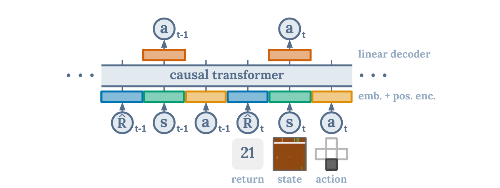

# 12.5 ：

<a id="article-start"></a>

，：，。DQN  Atari，PPO ，GRPO 。

。，，，。

：**，。**  **Offline Reinforcement Learning（Offline RL，）** 。


<div style="text-align: center; font-size: 0.9em; color: var(--vp-c-text-2); margin-top: -10px; margin-bottom: 20px;">
  <em> 1： RL、off-policy RL  RL 。 RL ， MDP 。：Levine et al., “Offline Reinforcement Learning: Tutorial, Review, and Perspectives on Open Problems”, Fig. 1。</em>
</div>

::: tip 
， [](#intuition-first)  [](#minimal-offline-practice)。“”，。
:::

##  {#intuition-first}

Offline RL ：

**，。**

，：

|                     |                  |  |                          |
| ----------------------- | -------------------------- | ------------------ | -------------------------------- |
| Online RL               |            |                  |                  |
| Off-policy RL           | replay buffer +      |                  | ，     |
| Imitation Learning / BC |              |                |                  |
| Offline RL              |              |                |  |
| Offline-to-Online RL    | ， |              | ，         |

：。，，。Q ，。

 RL “ Q ”，：

**，。**

## ：

 MDP ：

$$
\mathcal{M}=(\mathcal{S},\mathcal{A},p,r,\gamma)
$$

 RL ：

$$
J(\pi)=
\mathbb{E}_{\tau\sim p,\pi}
\left[
\sum_{t=0}^{\infty}\gamma^t r(s_t,a_t)
\right]
$$

 Offline RL  $\pi$ 。：

$$
\mathcal{D}
=
\{(s_t,a_t,r_t,s_{t+1},d_t)\}_{t=1}^{N},
\qquad
a_t\sim \pi_\beta(\cdot\mid s_t)
$$

 $\pi_\beta$  **behavior policy**，。、、、，。

::: details ：？
`D` 。， `s_t`、 `a_t`、 `r_t`、 `s_{t+1}`  `d_t`。

`pi_beta` “”。，`pi_beta` ；，`pi_beta` 。

 `pi`。： `pi` ， `D` 。

[](#intuition-first) / [](#article-start)
:::

 Q-learning， backup：

$$
y_t
=
r_t+\gamma(1-d_t)\max_{a'}Q_{\bar{\theta}}(s_{t+1},a')
$$

 online RL ，，，。 offline RL ，$\max_{a'}$ 。 Q ，。

 **extrapolation error**  **out-of-distribution action** 。

::: details ： max ？
Q “”。。

 `max_a Q(s, a)` ，。。，`max` ，。

 RL ：， Q。 RL ， bootstrapping 。
:::

：

**Online RL ；Offline RL 。**

## ： OOD  {#minimal-offline-practice}

。 [minimal_offline_rl_contextual_bandit.py](./snippets/minimal_offline_rl_contextual_bandit.py)。

 MDP， bandit。， RL ：**， Q 。**

：

```bash
python docs/chapter12_future_trends/offline-rl/snippets/minimal_offline_rl_contextual_bandit.py
```

：

```text
behavior_policy  return=-0.0480 support_gap=0.0000
oracle_policy    return= 0.0000 support_gap=unknown
naive_q_actor    return=-0.1137 support_gap=0.4819
cql_actor        return=-0.0420 support_gap=0.0112
td3bc_actor      return=-0.0260 support_gap=0.0520
```

 `support_gap` 。`naive_q_actor`  gap ， Q ，。`cql_actor`  `td3bc_actor` ，。

。

， Q ：

```python
q_data = q(state, action)
loss = ((q_data - reward) ** 2).mean()
```

，CQL ：， Q ，。

```python
q_random = q(repeated_state, random_action).reshape(batch_size, num_random_actions)
conservative_penalty = torch.logsumexp(q_random, dim=1).mean() - q_data.mean()
loss = mse_loss + alpha * conservative_penalty
```

 CQL ，：** Q ，。**

## ： RL 

，。


<div style="text-align: center; font-size: 0.9em; color: var(--vp-c-text-2); margin-top: -10px; margin-bottom: 20px;">
  <em> 2：D4RL  Maze2D 。，“”， RL 。：Fu et al., “D4RL: Datasets for Deep Data-Driven Reinforcement Learning”, Fig. 4。</em>
</div>

D4RL  RL [^d4rl]。“”：

|          |                        |                         |
| ---------------- | -------------------------- | --------------------------- |
| random           |                | ，        |
| medium           |                | ，  |
| expert           |                | ，            |
| medium-replay    |  replay buffer       |         |
| mixed / multiway | 、 |  stitching  |
| narrow demos     |                    | ，  |

 behavior cloning ：，。 Offline RL ：，，。

## ： RL 

 RL ，“”。

|               |                                             |                          |
| ----------------- | --------------------------------------------------- | -------------------------------- |
|           | BCQ[^bcq], BEAR[^bear], TD3+BC[^td3bc], AWAC[^awac] |          |
|       | CQL                                                 |  Q         |
|       | IQL                                                 |  max             |
|           | Decision Transformer                                |  Q，         |
|     | MOPO[^mopo], MOReL[^morel], COMBO[^combo]           | ，     |
| Offline-to-Online | AWAC, IQL fine-tuning                               | ， |
| LLM   | DPO                                               |    |

 CQL、IQL  Decision Transformer，：** Q、 OOD max、 RL 。**

```mermaid
flowchart TD
    subgraph problem ["： Q "]
        OOD["max_a Q(s,a) \n\n→  bootstrapping "]
    end

    subgraph solutions [""]
        S1["\nBCQ / TD3+BC / AWAC\n"]
        S2["\nCQL\n Q"]
        S3["\nIQL / Decision Transformer\n max"]
    end

    OOD --> S1
    OOD --> S2
    OOD --> S3

    S1 --> DPO["DPO (LLM  RL)\nReference Model ≈ "]
    S3 --> DPO

    style OOD fill:#fce4ec,stroke:#c62828
    style S1 fill:#e3f2fd,stroke:#1976d2
    style S2 fill:#fff3e0,stroke:#f57c00
    style S3 fill:#e8f5e9,stroke:#2e7d32
    style DPO fill:#f3e5f5,stroke:#7b1fa2
```

## CQL：

CQL（Conservative Q-Learning） Q [^cql]。

 Bellman error ：

$$
\mathcal{L}_{\text{TD}}(\theta)
=
\mathbb{E}_{(s,a,r,s')\sim\mathcal{D}}
\left[
\left(
Q_\theta(s,a)-
\left(r+\gamma V_{\bar{\theta}}(s')\right)
\right)^2
\right]
$$

CQL 。，：

$$
\mathcal{L}_{\text{CQL}}(\theta)
=
\mathcal{L}_{\text{TD}}(\theta)
+
\alpha
\left(
\mathbb{E}_{s\sim\mathcal{D}}
\left[
\log\sum_a \exp Q_\theta(s,a)
\right]
-
\mathbb{E}_{(s,a)\sim\mathcal{D}}
\left[
Q_\theta(s,a)
\right]
\right)
$$

 Q，。，CQL  Q ：**，。**


<div style="text-align: center; font-size: 0.9em; color: var(--vp-c-text-2); margin-top: -10px; margin-bottom: 20px;">
  <em> 3：CQL  Q-gap 。CQL  policy constraint 。：Kumar et al., “Conservative Q-Learning for Offline Reinforcement Learning”, Fig. 2。</em>
</div>

::: details ：CQL ？
`logsumexp`  `max`。 Q ，。

`E_D Q(s,a)` 。CQL ，。

`alpha` 。， OOD ；，，。
:::

，CQL ：

```python
q_data = q(state, data_action)
q_random = q(state_repeated, random_action).view(batch_size, num_random_actions)

td_loss = ((q_data - bellman_target) ** 2).mean()
cql_penalty = torch.logsumexp(q_random, dim=1).mean() - q_data.mean()
loss = td_loss + alpha * cql_penalty
```

## IQL： max

IQL（Implicit Q-Learning）：， $\arg\max$， value  Q[^iql]。

 expectile regression。 value ：

$$
\mathcal{L}_{V}(\psi)
=
\mathbb{E}_{(s,a)\sim\mathcal{D}}
\left[
L_2^\tau
\left(
Q_{\bar{\theta}}(s,a)-V_\psi(s)
\right)
\right]
$$

：

$$
L_2^\tau(u)=|\tau-\mathbf{1}(u<0)|u^2
$$

 $\tau>0.5$ ，$V(s)$  Q 。：**，？**


<div style="text-align: center; font-size: 0.9em; color: var(--vp-c-text-2); margin-top: -10px; margin-bottom: 20px;">
  <em> 4：IQL  expectile regression 。 τ 。：Kostrikov et al., “Offline Reinforcement Learning with Implicit Q-Learning”, Fig. 1。</em>
</div>

 Q  value  target：

$$
\mathcal{L}_{Q}(\theta)
=
\mathbb{E}_{(s,a,r,s')\sim\mathcal{D}}
\left[
\left(
Q_\theta(s,a)-r-\gamma V_\psi(s')
\right)^2
\right]
$$

 Q， advantage-weighted behavior cloning：

$$
\mathcal{L}_{\pi}(\omega)
=
-
\mathbb{E}_{(s,a)\sim\mathcal{D}}
\left[
\exp(\beta A(s,a))
\log \pi_\omega(a\mid s)
\right]
$$

：

$$
A(s,a)=Q_\theta(s,a)-V_\psi(s)
$$

：，；，。“ Q ”。

::: details ：IQL ？
IQL “”“”。

 Q-learning  `next_state`  max， OOD 。IQL  value target  expectile，。

 IQL ：，， CQL 。
:::

：

```python
diff = q_target(state, data_action) - value(state)
weight = torch.where(diff > 0, tau, 1.0 - tau)
value_loss = (weight * diff.pow(2)).mean()

q_target_value = reward + gamma * next_value
q_loss = (q(state, data_action) - q_target_value).pow(2).mean()

advantage = q(state, data_action) - value(state)
actor_weight = torch.exp(beta * advantage).clamp(max=100.0)
actor_loss = -(actor_weight * policy.log_prob(data_action, state)).mean()
```

## Decision Transformer：

Decision Transformer（DT）： Q ， Bellman backup，[^dt]。

：

$$
(\hat{R}_1,s_1,a_1,\hat{R}_2,s_2,a_2,\ldots,\hat{R}_T,s_T,a_T)
$$

 $\hat{R}_t$  return-to-go：

$$
\hat{R}_t=\sum_{t'=t}^{T}r_{t'}
$$

，Transformer ：

$$
\pi_\theta(a_t\mid \hat{R}_t,s_{\le t},a_{<t})
$$

，，“ 360 ”，。



<div style="text-align: center; font-size: 0.9em; color: var(--vp-c-text-2); margin-top: -10px; margin-bottom: 20px;">
  <em> 5：Decision Transformer  return、state、action  causal Transformer，。：Chen et al., “Decision Transformer: Reinforcement Learning via Sequence Modeling”, Fig. 1。</em>
</div>

，DT ：

-  BC ，。
-  DT “”，。

 DT 、、。：， target return 。

## ？

|                  |                 |                      |                          |
| -------------------- | ------------------------------- | ------------------------ | ---------------------------- |
| CQL                  | Q ，    | ，       | α ，       |
| IQL                  | 、          | 、、 |  |
| TD3+BC               |  baseline                 | ，     |              |
| AWAC                 |         | offline-to-online  |      |
| Decision Transformer | 、、 token  |  Transformer   |  return conditioning   |
| BC                   | 、  | 、               |              |

： baseline， BC、TD3+BC、IQL；， CQL；、，DT 。

##  DPO  LLM 

 9  DPO ，，[^dpo]。 Offline RL 。

 Offline RL ：

$$
(s,a,r,s')
$$

DPO ：

$$
(x,y_w,y_l)
$$

 $y_w$ ，$y_l$ 。DPO  Q ， Bradley-Terry ：

$$
\mathcal{L}_{\text{DPO}}
=
-
\mathbb{E}
\left[
\log\sigma
\left(
\beta
\log\frac{\pi_\theta(y_w\mid x)}{\pi_{\text{ref}}(y_w\mid x)}
-
\beta
\log\frac{\pi_\theta(y_l\mid x)}{\pi_{\text{ref}}(y_l\mid x)}
\right)
\right]
$$

 reference model “”。 CQL，：。

：

- CQL/IQL 。
- DT 。
- DPO 。
- ：**，、、。**

## ：？

 RL 。，； benchmark 。，。

：

1. ****： Offline RL  BC。
2. **FQE / OPE**：，。
3. ****：。
4. ****： shadow mode，， offline-to-online 。

： estimated Q， policy action 。，，。

##  QA

### Q1：Offline RL ？

：“？”

Offline RL ：“？”

，BC 。，BC ；Offline RL 。

### Q2：，？

“”。

， stitching 。D4RL  Maze2D / AntMaze ：，[^d4rl]。

，，， Offline RL 。，。

### Q3： Q-learning ？

 Bellman backup  `max_a Q(s, a)`  Q ， Q 。

 RL ，； RL ， target ，。

CQL  Q ，IQL  max。

### Q4：CQL、IQL、TD3+BC ？

：

1.  BC，“”。
2.  TD3+BC，。
3.  IQL， offline RL baseline。
4.  CQL，。

，IQL  TD3+BC 。

### Q5：Decision Transformer  CQL/IQL ？

“”。。

CQL/IQL  value-based / actor-critic ， RL benchmark。Decision Transformer  token ，、、， Transformer 。

 DT 。， target return 。

### Q6：Offline-to-Online ？

，。Offline-to-Online ：、，。

AWAC [^awac]。，。

### Q7：Offline RL ？

“”。、、、、。

Offline RL ，。，“”，。

### Q8：DPO  Offline RL？

，：，。

 RL ，DPO  CQL/IQL  $Q(s,a)$  RL。， Bellman backup。“ reference model ”。

：，。

## 

|                     |  RL                                                 |
| --------------------------------- | ----------------------------------------------------------------- |
| DQN （ 4 ）           |  RL  = " replay buffer"                 |
| PPO  KL （ 7 ）         |  RL （BCQ/TD3+BC）""        |
| DPO  reference model（ 9 ） | reference model  BCQ/TD3+BC           |
| GRPO  advantage（ 9 ）  | IQL  advantage-weighted BC  GRPO  advantage     |
| RLVR （ 9 ）        |  RL  reward ，              |
| （12.3 ）         |  RL  = ， |

：**DPO  LLM  RL**。DPO ，。 reference model  BCQ/TD3+BC ——。 IQL  advantage-weighted behavior cloning  9  GRPO ：""， GRPO ，IQL 。

， RL ：**（PPO）→ （GRPO/Iterative DPO）→ （CQL/IQL/DPO）**。，、，。，，。

## 

Offline RL “”，：**，。**

CQL ： Q。IQL ：。Decision Transformer ：。TD3+BC、AWAC ， baseline。

 Offline RL  DPO、GRPO ： RL ，，，、、。

---

****：

[^offline-tutorial]: Levine, S. et al. (2020). Offline Reinforcement Learning: Tutorial, Review, and Perspectives on Open Problems. <https://arxiv.org/abs/2005.01643>

[^offline-survey]: Prudencio, R. F., Maximo, M. R. O. A., Colombini, E. L. (2023). A Survey on Offline Reinforcement Learning: Taxonomy, Review, and Open Problems. _IEEE TNNLS_. <https://arxiv.org/abs/2203.01387>

[^d4rl]: Fu, J. et al. (2020). D4RL: Datasets for Deep Data-Driven Reinforcement Learning. <https://arxiv.org/abs/2004.07219>

[^bcq]: Fujimoto, S. et al. (2019). Off-Policy Deep Reinforcement Learning without Exploration. _ICML_. <https://arxiv.org/abs/1812.02900>

[^bear]: Kumar, A. et al. (2019). Stabilizing Off-Policy Q-Learning via Bootstrapping Error Reduction. _NeurIPS_. <https://arxiv.org/abs/1906.00949>

[^cql]: Kumar, A. et al. (2020). Conservative Q-Learning for Offline Reinforcement Learning. _NeurIPS_. <https://arxiv.org/abs/2006.04779>

[^iql]: Kostrikov, I. et al. (2022). Offline Reinforcement Learning with Implicit Q-Learning. _ICLR_. <https://arxiv.org/abs/2110.06169>

[^td3bc]: Fujimoto, S. and Gu, S. S. (2021). A Minimalist Approach to Offline Reinforcement Learning. _NeurIPS_. <https://arxiv.org/abs/2106.06860>

[^awac]: Nair, A. et al. (2020). Accelerating Online Reinforcement Learning with Offline Datasets. <https://arxiv.org/abs/2006.09359>

[^mopo]: Yu, T. et al. (2020). MOPO: Model-based Offline Policy Optimization. _NeurIPS_. <https://arxiv.org/abs/2005.13239>

[^morel]: Kidambi, R. et al. (2020). MOReL: Model-Based Offline Reinforcement Learning. _NeurIPS_. <https://arxiv.org/abs/2005.05951>

[^combo]: Yu, T. et al. (2021). COMBO: Conservative Offline Model-Based Policy Optimization. _NeurIPS_. <https://arxiv.org/abs/2102.08363>

[^dt]: Chen, L. et al. (2021). Decision Transformer: Reinforcement Learning via Sequence Modeling. _NeurIPS_. <https://arxiv.org/abs/2106.01345>

[^dpo]: Rafailov, R. et al. (2023). Direct Preference Optimization: Your Language Model is Secretly a Reward Model. _NeurIPS_. <https://arxiv.org/abs/2305.18290>
