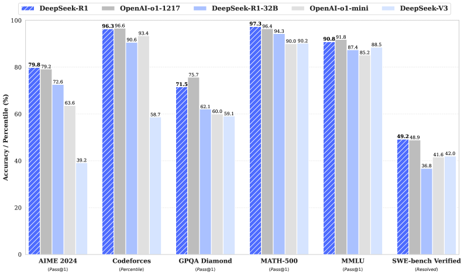

# 12.3 、

AlphaGo ——，，。"" RL 。2025-2026 ，：**，？**

，，，——。

##  RL：

（Self-Play）：**，，**。


<div style="text-align: center; font-size: 0.9em; color: var(--vp-c-text-2); margin-top: -10px; margin-bottom: 20px;">
  <em> 1：UCLA  UIUC  SPIN（Self-Play Fine-Tuning）。，""，。：<a href="https://arxiv.org/abs/2401.01335" target="_blank" rel="noopener noreferrer">SPIN Paper</a></em>
</div>

：

1. （）。
2. （），。
3.  reward ， PPO 。
4. ""，。

### 1. ： (Nash Equilibrium)

 RL ， $\max_\pi \mathbb{E}[R]$。，，**（MARL）** 。

- **（Zero-Sum Game）**： Dota 2  1v1， 1。
- ****：""（， 50% ），****。，****。
  $$
  V(\pi^*, \pi^*) \ge V(\pi, \pi^*) \quad \forall \pi
  $$
  ， $\pi^*$ ， $\pi$ ，（）。

### 2. ： (Fictitious Play)

" A"" A"，**（Policy Collapse）**：A  X ， A  Y  X， A  Z  Y， X ！

，，**（Fictitious Play）** **（Model Pool）**，：

```python
def self_play_training_loop(env, current_model, model_pool, total_iterations):
    """ Self-Play """

    for i in range(total_iterations):
        # 1.  80% ，20% 
        if np.random.rand() < 0.8:
            opponent = current_model
        else:
            opponent = random.choice(model_pool)

        # 2.  (Trajectories)
        trajectories = collect_self_play_data(env, current_model, opponent)

        # 3.  PPO 
        current_model.update_with_ppo(trajectories)

        # 4. ，""
        if i % save_interval == 0:
            model_pool.append(current_model.copy())

        # 5.  ELO 
        evaluate_elo_rating(current_model, model_pool)
```

## LLM ：Generator-Judge 

### 1. Generator-Judge  (Self-Rewarding LM)

。 RLHF  Reward Model（），（）。

2024 ，Meta  NYU  **Self-Rewarding Language Models**（）。：** Generator（） Judge（LLM-as-a-Judge，）**。


<div style="text-align: center; font-size: 0.9em; color: var(--vp-c-text-2); margin-top: -10px; margin-bottom: 20px;">
  <em> 2：Self-Rewarding Language Models 。（Iteration），（M1），（M2）， DPO （M3）。：<a href="https://arxiv.org/abs/2401.10020" target="_blank" rel="noopener noreferrer">Meta Paper</a></em>
</div>

****：

1. **Self-Instruction**： M1 。
2. **Self-Reward**： M1 "， 0-5 "，。
3. **Iterative DPO**： $(y_w, y_l)$， DPO ， M2。

，，**"（Reward ）"**！，。

### 2.  (Debate Training)

 LLM 。****，（）。：****。

****——，；，。"-"。

```python
def debate_training(question, model_a, model_b, judge, rounds=3):
    """ RL ：，，"""
    #  rollout  log_prob（）
    log_probs_a, log_probs_b = [], []

    answer_a = model_a.generate(question)
    answer_b = model_b.generate(question)

    for round_idx in range(rounds):
        # A B，（ log_prob）
        rebuttal_a, lp_a = model_a.generate_with_logprob(
            f": {question}\n: {answer_a}\n"
            f": {answer_b}\n。"
        )
        # B A，
        rebuttal_b, lp_b = model_b.generate_with_logprob(
            f": {question}\n: {answer_b}\n"
            f": {rebuttal_a}\n。"
        )
        log_probs_a.append(lp_a)
        log_probs_b.append(lp_b)
        answer_a, answer_b = rebuttal_a, rebuttal_b

    #  →  RL reward（：A  = -B ）
    score_a, score_b = judge.evaluate(question, answer_a, answer_b)
    reward_a = score_a - score_b
    reward_b = -reward_a

    # REINFORCE ：，
    # loss = -log_prob * reward（ reward → ）
    for lp in log_probs_a:
        loss_a = -lp * reward_a
    for lp in log_probs_b:
        loss_b = -lp * reward_b

    return reward_a  #  reward  self-play 
```

## Online Learning：

 RLHF（ PPO）""： $\rightarrow$  Reward Model $\rightarrow$  RM， $\rightarrow$ 。，，。

 **Online Learning（）**，****：

$$ \text{ } \pi*{\theta} \xrightarrow{\text{Self-Play }} \text{ } \tau \xrightarrow{\text{/}} \text{ } R \xrightarrow{\text{PPO/GRPO }} \text{ } \pi*{\theta'} \xrightarrow{\text{}} \cdots $$



<div style="text-align: center; font-size: 0.9em; color: var(--vp-c-text-2); margin-top: -10px; margin-bottom: 20px;">
  <em> 2：DeepSeek-R1 。（SFT + RL），DeepSeek-R1-Zero （Base Model）（Online RL），。：<a href="https://arxiv.org/abs/2501.12948" target="_blank" rel="noopener noreferrer">DeepSeek-R1 Paper</a></em>
</div>

**：**
 RLHF ，""。 Online Learning  Self-Play ，，。 DeepSeek-R1-Zero ，， SFT ，，""**（CoT）、、**。

## ： RL 

 Online Learning， **RL **—— RL 。

### ：——

""，**（Policy Collapse）**。，： A →  A  B →  A。 RL ****。

**（Population-Based Training）**： $K$  $\Pi = \{\pi_1, \pi_2, \ldots, \pi_K\}$，。：

$$\pi_{\text{opponent}} = \sum_{k=1}^{K} w_k \pi_k, \quad \sum_k w_k = 1$$

 $w_k$  $k$ 。 **PSRO（Policy Space Response Oracles）** ""——，。AlphaZero  OpenAI Five ：DeepSeek-R1  RL ，。

### ：——

 GRPO/DAPO  prompt ，—— RL **（Curriculum Learning）**。 prompt ， $p(d)$ 。""：

$$\mathcal{P}^*(d) \propto \mathcal{P}_0(d) \cdot (1 - p(d))$$

。 Proposer  RL " Solver "——Proposer  RL 。 9  GRPO ：GRPO  advantage （ prompt ，）， prompt 。

### ：—— RM 

** RL **，：

**： RM（RLHF， 8 ）**。 Reward Model， RM 。

**：（RLVR， 9 ）**。（、）， RM 。

**： LLM-as-Judge**。—— Self-Rewarding LM。，，。**STaR（Self-Taught Reasoner）** ：，（ reward），；（ reward），—— RL 。


<div style="text-align: center; font-size: 0.9em; color: var(--vp-c-text-2); margin-top: -10px; margin-bottom: 20px;">
  <em> 4：Quiet-STaR (Self-Taught Reasoner) 。 token ， (Thoughts)，（）。：<a href="https://arxiv.org/abs/2403.09629" target="_blank" rel="noopener noreferrer">Quiet-STaR Paper</a></em>
</div>

 RL ****：Generator ，Judge（）——"AI "。****（、）。** →  → **——，。

## 

，：

|        |                                  |                   |
| ---------- | ------------------------------------ | ------------------------------- |
|  | ， | （）  |
|  |    | 、            |
|  |    |  RL（ 12.2 ） |
|    | ""     | 、          |

****。 Generator  Judge ，——Generator ，Judge ""，Generator 。"AI "——，。

****。，——""。，。（Population Training）：""，，。

## 

。：

|             | /                              |
| ------------------------- | ---------------------------------------------------- |
| AlphaGo （ 5 ） | ——                       |
| GRPO （ 9 ）  | ""——         |
| （ 4 ）       | ""——           |
| PPO（ 7 ）            |                              |
| RLVR（ 9 ）           |  reward ， RM          |
| Agentic RL（ 9 ）     | —— |
| （12.1 ）     |                  |

：**GRPO **。GRPO ，——""。：，，（Generator vs Judge，Debater A vs Debater B）。

， 9  GRPO ，：**，**。

---

 [12.4 LLM  RL](../llm-multi-agent-rl)—— RL， PettingZoo 。

---

## 

- Chen Z, Deng Y, et al. "[SPIN: Self-Play Fine-Tuning Converts Weak Language Models to Strong Language Models](https://arxiv.org/abs/2401.01335)." ICML 2024. ——  RLHF ，""。

- Metak Q, Yu D, et al. "[Self-Rewarding Language Models](https://arxiv.org/abs/2401.10020)." 2024. —— Meta  NYU ， Generator  Judge。

- Zelikman E, et al. "[STaR: Self-Taught Reasoner](https://arxiv.org/abs/2203.14465)." NeurIPS 2022. —— ，。

- Lanctot M, et al. "[A Unified Game-Theoretic Approach to Multiagent Reinforcement Learning (PSRO)](https://arxiv.org/abs/1711.00832)." NeurIPS 2017. ——  RL ， Policy Space Response Oracles。

- Zhang R, Xu Z, et al. "[A Survey on Self-play Methods in Reinforcement Learning](https://arxiv.org/abs/2408.01072)." 2024. ——  RL ，、PSRO、。

- DeepSeek-AI. "[DeepSeek-R1: Incentivizing Reasoning Capability in LLMs via Reinforcement Learning](https://arxiv.org/abs/2501.12948)." 2025. ——  RL（ SFT ）。
