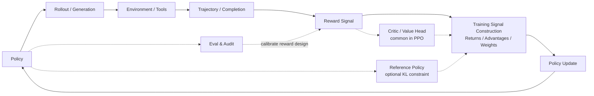

# Appendix A: Reinforcement Learning Training Debug Guide

You have written DQN, Actor-Critic, and PPO, and you have also seen the training pipelines for RLHF, GRPO, and Agentic RL. A very natural question arises at this point:

> Why does the same algorithm work in a paper, work in someone else's code, but become unstable as soon as you change the environment, swap the reward, or scale up the model?

This is not just your problem. The difficulty of reinforcement learning is never only "can we derive the formula?" The hard part is that training itself is a closed loop that changes its own data distribution: the policy is changing, the sampled data is changing, the reward model may be biased, and the value function is chasing a moving target. In supervised learning, a bad batch usually affects one gradient step; in RL, a bad policy collects bad data, and that bad data trains an even worse policy.

So this appendix is not a "catalog of common errors," nor does it only cover four failures. It is a debugging lesson: we first build a mental model, then use that model to examine various training anomalies.

After reading this section, you should be able to answer three questions:

1. When a training curve goes wrong, which part of the loop should you suspect first?
2. What is the relationship between Reward, Loss, KL, Entropy, Value Loss, GPU memory, and evaluation scores?
3. Facing an unstable RL experiment, how do you debug step by step instead of tuning hyperparameters blindly?

## Training as a Closed Loop

Let us first draw an abstract loop. Note that this is not the implementation diagram of any specific framework, nor does it mean all modern LLM RL must look exactly like this. It simply helps you see clearly: an RL training run roughly goes through "generate behavior, score, construct training signal, update policy."



Any broken link in this loop can eventually show up as "reward does not improve." But the fix is completely different depending on where the break is.

We need to distinguish three things.

**Reward signal** is the actual score computed during training. It may come from the environment itself, a hand-written reward function, a reward model, a verifier, or a weighted combination of several rules.

**Training signal construction** turns the reward into "what should be encouraged and what should be suppressed in this update." In PPO / Actor-Critic, this typically appears as returns, value targets, and advantages. The advantage can be roughly understood as "how much better is this action or response compared to the current expectation." If the actual return exceeds the Critic's predicted value, the advantage is positive, and the policy becomes more inclined to repeat this behavior; otherwise it gets suppressed. In GRPO / RLVR, the common approach is not to train a Critic, but to sample multiple responses for the same prompt and construct advantage-like training weights from the relative reward rankings within the group. TRL's GRPO documentation also breaks the process into generation, advantage computation, KL estimation, and loss calculation, but the advantage comes from within-group reward normalization rather than Critic predictions [^trlgrpo].

**Evaluation and audit** are side-channel supervision. They are used to select checkpoints, detect reward hacking, and decide whether to roll back. Under normal circumstances, they do not directly enter gradient updates. Evaluation results can remind you that "the reward design is wrong," but they are not the same as the reward signal used during training.

Therefore, this diagram is better thought of as a "unified debugging map" rather than "the only workflow for modern Agentic RL." PPO-RLHF looks more like the Critic + KL version in the diagram; GRPO/RLVR looks more like a "multiple generations + reward/verifier + within-group relative advantage" version; Agentic RL extends a single response into a multi-step tool trajectory, where the reward may come from the final environment state, a rule-based verifier, or human/model review. If the environment wiring is wrong, tuning the learning rate will not help; if the reward function is being gamed, continuing to train will only make the model better at cheating; if the Critic cannot learn, PPO's advantage becomes noise; if KL spikes, the policy has left the trust region; if the evaluation protocol is contaminated, all the beautiful curves may be illusions.

::: tip First rule
The first principle of RL debugging is not "tune parameters." It is "locate which link in the loop broke first."
:::

## First-Pass Diagnosis

When a training anomaly appears, the most common wrong reaction is to immediately change hyperparameters. For example, lowering the learning rate, increasing the batch size, adding a KL coefficient, or continuing to train more steps. This may seem proactive, but it introduces new variables and makes the original problem harder to locate.

This section describes a preliminary diagnostic process better suited for course experiments and research reproduction. Its goal is not to fix training immediately, but to first determine which stage the anomaly comes from: experiment configuration, evaluation protocol, reward signal, model outputs, or the optimization process itself.

### Record the experiment context

First, record the basic context of this experiment, including the config file, random seed, code version, checkpoint, training logs, and evaluation commands. RL experiments are highly sensitive to random seeds and implementation details. The same algorithm configuration can show significant differences under different seeds [^drltm]. If this information is not saved, subsequent analysis will struggle to distinguish "the algorithm is genuinely unstable" from "the experiment conditions changed."

### Separate training metrics from evaluation metrics

Training reward only indicates that the model is optimizing a reward signal; it does not directly prove task ability improvement. A more reliable approach is to simultaneously track three types of information:

- **Training metrics**: for example, training reward, policy loss, KL, entropy, etc., used to observe whether the optimization process is stable.
- **Evaluation metrics**: for example, held-out benchmarks, private test sets, task success rates, used to determine whether ability is improving.
- **Behavior samples**: actual model or agent outputs, used to determine whether it has learned incorrect patterns.

For example, in RLHF training, if reward increases while evaluation scores remain flat and response length keeps growing, this should usually not be interpreted as "training has not run long enough." Instead, suspect a length preference in the reward signal.

### Inspect model output samples

Curves are a compressed representation of the training process; samples can reveal specific behaviors. During diagnosis, at minimum, inspect three types of samples: high-reward samples, low-reward samples, and random samples from the latest checkpoint.

In language model training, reward hacking often first manifests as changes in text style: longer responses, more complex formatting, more polite language, but lower information density. In Agentic RL, it may also appear as increased tool call counts without the final environment state actually completing the task.

### Construct a minimal reproduction experiment

After confirming logs and samples, scale the experiment down to a quickly runnable version: a smaller model, a smaller batch, fewer prompts, and fewer training steps. The minimal reproduction experiment does not aim for final scores but answers basic questions:

- Can the implementation learn under simple settings?
- Does the reward have discriminative power?
- Is the evaluation protocol stable?
- If using PPO/Actor-Critic, can the value function fit a fixed rollout?
- If using GRPO/RLVR, is the reward ranking across multiple responses for the same prompt reasonable?

Many RL errors do not immediately crash the program. For example, a wrong `done` mask, reversed reward signs, padding tokens included in the loss, or changed evaluation temperature can all let training complete normally but learn wrong behaviors. Therefore, completing a minimal reproduction before large-scale training is a critical step in the debugging process.

## Diagnostic Order

The following sections will discuss different types of training problems separately. During actual diagnosis, it is recommended to investigate from outside in.

First, check the environment and data. Is the agent seeing the correct states? Are actions being executed correctly by the environment? Are terminal signals handled correctly? Do reward signs match expectations? If errors exist at this level, subsequent algorithm updates are merely optimizing on incorrect data.

Second, check the evaluation protocol. If sampling temperature, max output length, tool permissions, or test set splits have changed, evaluation results cannot be directly compared. If a public test set has been repeatedly used for hyperparameter tuning, it gradually loses its assessment value.

Third, check the reward signal. Is the reward too sparse? Are there extreme high-score outliers? Is it consistent with human judgment or independent evaluation? If the reward signal is unreliable, the more thoroughly you train, the more likely the model will optimize in the wrong direction.

Finally, enter the algorithm internals. PPO requires checking whether the policy update is too large; methods with a Critic require checking whether the value function is effective; GRPO/RLVR requires checking whether within-group reward comparisons are reasonable; Agentic RL also requires checking whether tool trajectories are consistent with the final environment state.

This ordering avoids suspecting all modules at once. First determine roughly which layer the anomaly belongs to, then enter the corresponding section for more detailed investigation.

## Environment and Data: First Confirm the World Is Real

The most easily overlooked bugs in reinforcement learning are often upstream of the algorithm.

For example, CartPole actions are discrete 0/1, but you passed in continuous actions; the action range in MuJoCo is `[-1, 1]`, but the policy output was not passed through tanh; in dialogue training, padding tokens were not masked, so the model is "learning" from filler positions; in an agent task, a tool returned failure but it was treated as a successful trajectory and written into the training set.

The common characteristic of these problems: training can run, curves will move, but the curves are meaningless.

### Minimal unit test

Before formal training, run at least four checks:

```python
def sanity_check_env(env, policy):
    obs, info = env.reset(seed=0)
    assert obs is not None

    action = policy.sample(obs)
    next_obs, reward, terminated, truncated, info = env.step(action)

    assert next_obs is not None
    assert isinstance(float(reward), float)
    assert isinstance(terminated, bool)
    assert isinstance(truncated, bool)

    return {
        "reward": reward,
        "done": terminated or truncated,
        "info_keys": list(info.keys()),
    }
```

Then do a cruder but very effective test: run 100 trajectories with a random policy and plot the reward distribution. Then run 100 trajectories with a hand-written "weak expert policy." If the expert policy is not clearly better than random, do not train the model yet. Debug the environment and reward first.

::: warning Common wiring mistakes
Many training failures that seem like algorithm problems are actually reward sign errors, unhandled terminal states, action scale mismatches, missing observation normalization, or reversed chosen/rejected labels in the dataset.
:::

## Evaluation Protocol: Do Not Let the Test Set Become the Training Set

RL projects are highly susceptible to "evaluation contamination." You may not have put the test set into the training data, but if you repeatedly use the test set to tune prompts, rewards, KL coefficients, and checkpoint selection, it has already been participating in training decisions.

This is especially severe in post-training and Agentic RL. The model may not have genuinely become stronger; it may just be better adapted to a particular public benchmark, a particular judge, or a particular output format.

A practical heuristic:

| Split           | Use                          | Look at often?        |
| --------------- | ---------------------------- | --------------------- |
| smoke set       | catch implementation errors  | yes                   |
| dev set         | tune parameters, tune reward | yes, but with records |
| public test     | observe trends               | sparingly             |
| private test    | release gate                 | rarely                |
| human audit set | calibrate reward and judge   | periodic spot-checks  |

The evaluation protocol must also be fixed: temperature, top_p, max_tokens, prompt templates, tool permissions, timeout rules, pass@1/pass@k should all be documented. The ALE evaluation protocol study also reminds us that environment randomness, starting states, and evaluation method changes can significantly affect RL conclusions [^ale].

## Reward Signal: Having a Reward Is Not Enough

The "reward" discussed here is not the act of "reward design," but the actual reward signal received by each transition, each response, or each trajectory during training. This signal must satisfy two conditions simultaneously: correct direction and sufficient density.

Correct direction means the reward genuinely encourages the behavior you want. Sufficient density means the model can see meaningful differences in the reward even during early training. If 99.9% of trajectories have reward 0, the policy gradient sees silence.

### Inspect the reward distribution

Before training, plot the reward histogram instead of jumping straight into training.

| Distribution                      | Likely problem                | Response                                               |
| --------------------------------- | ----------------------------- | ------------------------------------------------------ |
| almost all 0                      | reward too sparse             | add intermediate rewards, curriculum, exploration      |
| almost all 1                      | reward too loose              | increase task difficulty, decompose scoring dimensions |
| extreme long tail                 | few samples dominate gradient | reward clipping / normalization                        |
| sign confusion                    | unclear reward definition     | go back and inspect samples individually               |
| low correlation with human scores | unreliable proxy              | rewrite reward or add human calibration                |

In PPO, reward also affects advantage. When the reward scale is too large, advantage becomes a very sharp gradient signal, and the policy update may dash straight out of the trust region. Many high-quality implementations include reward normalization, advantage normalization, and gradient clipping. These implementation details themselves change algorithm behavior [^implementation][^whatmatters].

## Reward Hacking: The Model Learned Test-Taking Skills

Reward hacking is not the model "disobeying." On the contrary, the model is too good at optimizing the metric you gave it. The AI safety literature often calls this specification gaming: the system satisfies the formalized objective but violates the designer's true intent [^concrete][^weng].

The classic language model version: the reward model prefers detailed answers, so the model starts producing longer, more polite, emptier responses. Reward keeps climbing, but human audit deteriorates. Research on reward model overoptimization also shows that the proxy reward can continue improving while the true preference declines past a certain point [^overopt].

### Diagnostic triad

Reward hacking typically has three signals appearing simultaneously:

1. **Reward increases**: the training dashboard looks great.
2. **Side metrics change abnormally**: length, repetition rate, format templates, refusal rate, and tool call counts undergo systematic changes.
3. **Real evaluation declines**: human audit, private test set, and task success rate do not improve in sync.

```python
def audit_reward_hacking(samples):
    suspicious = []
    for item in samples:
        if item["reward"] > 0.9 and item["human_score"] < 0.4:
            suspicious.append(("reward-human mismatch", item["id"]))
        if item["response_len"] > item["baseline_len"] * 2:
            suspicious.append(("length inflation", item["id"]))
        if item["repeat_ratio"] > 0.2:
            suspicious.append(("repetition", item["id"]))
    return suspicious
```

When fixing this, do not just add one penalty term and stop. A more robust approach is to log reward components separately: accuracy, constraint satisfaction, safety, conciseness, formatting, and tool outcomes scored independently. Work like RewardBench also demonstrates that reward models themselves need evaluation; you cannot assume they always represent human preferences [^rewardbench].

## Policy Update: PPO's Seatbelt Can Still Fail

PPO's core intuition is "small updates." TRPO explicitly constrains policy change with a KL constraint; PPO approximates this goal with a clipped surrogate objective [^trpo][^ppo][^spinningup]. But clipping is not a magic shield.

If the learning rate is too high, PPO epochs are too many, the batch is too small, or the advantage scale is abnormal, the policy can still move too far in a single step.

### Watch three metrics

| Metric        | What to check                                 | What anomaly indicates                       |
| ------------- | --------------------------------------------- | -------------------------------------------- |
| KL divergence | distance between new and old/reference policy | policy drifting too fast                     |
| clip fraction | how many samples are clipped                  | PPO is braking frequently                    |
| entropy       | how much randomness remains in the policy     | premature convergence or random degeneration |

Policy collapse usually does not start from reward. It starts from KL, clip fraction, and entropy. Reward is a posterior symptom.

```python
def ppo_guardrail(metrics):
    if metrics["kl"] > metrics["target_kl"] * 2:
        return "stop update: KL too high"
    if metrics["clip_fraction"] > 0.4:
        return "reduce lr or PPO epochs"
    if metrics["entropy"] < metrics["entropy_floor"]:
        return "increase exploration or KL constraint"
    return "continue"
```

In RLHF, you also need to watch KL relative to the reference model. InstructGPT-style pipelines introduce a KL penalty precisely to prevent the RL phase from destroying the language capabilities learned during SFT [^instructgpt].

## Critic: The Failure Source in PPO / Actor-Critic

This section only applies to methods with a Critic or value head, such as Actor-Critic, PPO, and some PPO-RLHF implementations. Critic-free methods like GRPO/RLVR can skip this section and instead check within-group reward, KL, and loss construction.

In Actor-Critic, the Critic's job is to estimate state value. It does not directly output actions, so many people only look at policy loss during debugging. But if the Critic is wrong, the advantage will be wrong; if the advantage is wrong, the Actor will update in the wrong direction.

### Signals of a broken Critic

| Signal                                          | What it means                             |
| ----------------------------------------------- | ----------------------------------------- |
| value loss does not decrease over time          | Critic has not fitted the returns         |
| explained variance < 0                          | worse than predicting the mean            |
| policy reward oscillates                        | Actor is pushed around by noisy advantage |
| value prediction scale much smaller than return | reward scale or value target problem      |

Common fixes include: reducing reward scale, normalizing returns, adjusting critic learning rate up or down, increasing critic network capacity, checking bootstrap targets, and checking terminal masks.

A very practical check: fix a batch of rollouts, do not update the actor, and train only the Critic. See if it can fit the returns from that batch. If it cannot, fix the Critic first.

## Exploration: Too Certain and Too Random Are Both Wrong

Exploration problems have two opposite manifestations.

One is entropy quickly dropping to zero: the model prematurely commits to a particular action or response template, stuck in a local optimum. The other is entropy staying high: the policy behaves like a random walk, and reward is never absorbed into the parameters.

| Manifestation                    | Likely cause                                        | Fix                                                |
| -------------------------------- | --------------------------------------------------- | -------------------------------------------------- |
| entropy drops to zero fast       | reward too strong, KL too weak, temperature too low | add entropy bonus, lower lr, strengthen KL         |
| entropy stays high               | reward too sparse, lr too low, noisy advantage      | reward shaping, increase sampling, check advantage |
| diverse behavior but no progress | exploration is not differentiated by evaluation     | change reward or add curriculum                    |
| uniform behavior but high reward | possible reward hacking                             | spot-check high-reward trajectories                |

In language models, exploration is not just "action randomness." It also includes response length, reasoning paths, tool selection, and the boundary between refusing and not refusing. Looking at token entropy alone is insufficient; you must also look at behavioral-level diversity.

## Data Freshness: On-Policy Is Not a Slogan

PPO is an on-policy algorithm: it assumes the data used for updates comes from the "current nearby" policy. During training, we save old logprobs specifically to know how much the new policy differs from the sampling policy.

If rollout workers and the learner are out of sync, or if very old data is mixed into the buffer, you will see a strange phenomenon: loss can still be computed, gradients can still flow, but metrics fluctuate up and down, and clip fraction becomes hard to interpret.

During investigation, ask three questions:

1. Does each rollout record which policy version generated it?
2. Are the old logprobs used during updates consistent with the sampling policy?
3. How many update rounds has the policy gone through before the rollout enters training?

Agentic RL is more susceptible to this pitfall because a single trajectory can be very long, tool execution is slow, and sampling and training are inherently asynchronous. Do not only pursue throughput; also control data staleness.

## Numerical Stability: There Are Usually Warning Signs Before NaN

NaN rarely appears out of nowhere. It is usually preceded by grad norm spikes, extreme logprob values, reward outliers, value loss explosions, or mixed-precision overflow.

| Problem          | Check                       | Fix                         |
| ---------------- | --------------------------- | --------------------------- |
| grad norm spikes | p95 / max grad norm         | gradient clipping, lower lr |
| extreme logprobs | taking log of 0 probability | clamp, check mask           |
| fp16 overflow    | loss scale, NaN step        | bf16, dynamic loss scaling  |
| reward outliers  | reward max/min              | clipping, normalization     |
| value explosion  | value target distribution   | return normalization        |

Do not wait until the loss becomes NaN to stop training. The training script should save the experiment state and stop the current update when key metrics exceed bounds.

## System Resources: GPU Memory Is Only Part of the Ledger

RLHF/PPO consumes more resources than standard SFT because it may simultaneously require an actor, a critic, a reference model, and a reward model, plus storage for rollouts, logprobs, values, advantages, and long-sequence activations.

GPU memory mainly comes from four areas:

| Source          | Why it uses memory                   | Common handling                          |
| --------------- | ------------------------------------ | ---------------------------------------- |
| Model weights   | multiple models resident             | freeze, share, separate rollout/training |
| Optimizer state | Adam first/second moments            | ZeRO, FSDP, 8-bit optimizer              |
| Gradients       | more trainable params = more cost    | LoRA, freeze backbone                    |
| Activations     | larger batch and seq_len = more cost | checkpointing, shorter sequences         |

ZeRO shards optimizer states, gradients, and parameters across multiple GPUs [^zero][^deepspeedzero]; FSDP reduces per-GPU resident memory through parameter sharding and on-demand all-gather [^fsdp]; LoRA freezes the main model and only trains low-rank adapters [^lora]. These are not "advanced optimizations" but prerequisites for whether large-model RL training can even start.

But resource issues are not limited to OOM. Throughput drops, low GPU utilization, rollout workers waiting on the environment, or reward model scoring becoming a bottleneck can all slow down training, make data stale, and ultimately feed back into algorithm instability.

## Additional Pitfalls in RLHF and Agentic RL

RL for language models and agents has several extra categories of failure compared to classical control.

| Scenario   | Extra pitfall                     | Example                                                   |
| ---------- | --------------------------------- | --------------------------------------------------------- |
| RLHF       | Length preference                 | responses get longer but information density drops        |
| RLHF       | Refusal drift                     | safety reward too strong, model over-refuses              |
| RLHF       | Judge bias                        | LLM judge prefers a certain writing style                 |
| RLVR/GRPO  | Format hacking                    | model learns to output correct format but wrong reasoning |
| Agentic RL | Tool hacking                      | repeatedly calling tools to inflate process scores        |
| Agentic RL | Pseudo-success states             | text says done, but environment state unchanged           |
| Agentic RL | Long-trajectory credit assignment | hard to attribute final failure to a specific step        |

Therefore, Agentic RL evaluation cannot just look at final text; it must examine environment state, whether tool calls are legal, step count, cost, and failure recovery ability. RLHF evaluation cannot just look at the reward model; it must simultaneously consider human audit, private test sets, length, repetition rate, safety regression, and real task success rates.

## A Complete Troubleshooting Walkthrough

Suppose you see: reward increases, benchmark does not improve, outputs get longer and longer.

Do not immediately say "training did not converge." Trace along the loop:

1. **Evaluation protocol**: are the benchmark's temperature and max_tokens consistent with the baseline?
2. **Sample spot-check**: are the highest-reward samples longer, emptier, more templated?
3. **Reward decomposition**: does the reward contain hidden preferences for length, format, or polite language?
4. **KL and entropy**: has the policy drifted too far from the reference model, or collapsed into a mode?
5. **Fix experiment**: add a length penalty or information density metric, run a short training comparison.
6. **Go/no-go decision**: if reward drops but the private set improves, the previous reward was probably wrong.

Now consider another example: reward drops sharply, KL spikes, clip fraction stays at 0.5 for a long time.

Here, suspect overly aggressive policy updates first:

1. Roll back to the most recent healthy checkpoint.
2. Lower the learning rate.
3. Reduce PPO epochs.
4. Enable target KL early stopping.
5. Check advantage normalization and reward scale.

The two examples require completely different fixes. This is why "reward is not improving, what should I do?" is not a good question. A better question is: "which piece of evidence in the loop broke first?"

## Pre-Training, During Training, and Post-Training Checklists

### Before training

| Check item             | Question                                             |
| ---------------------- | ---------------------------------------------------- |
| Environment unit test  | do reset/step/done/reward match expectations?        |
| Random policy baseline | what is the random policy reward distribution?       |
| Weak expert baseline   | can a simple rule clearly beat random?               |
| Reward histogram       | is reward all 0, all 1, or extreme long tail?        |
| Eval config            | is the evaluation protocol fixed and saved?          |
| Memory estimate        | can the hardware handle model count, batch, seq_len? |

### During training

| Signal                          | Action                                                    |
| ------------------------------- | --------------------------------------------------------- |
| KL spikes                       | stop updates, lower lr or strengthen KL                   |
| Clip fraction persistently high | reduce PPO epochs or update step size                     |
| Entropy drops to zero fast      | check exploration and reward hacking                      |
| Value loss does not decrease    | train Critic alone on a fitting test                      |
| Reward rises, eval drops        | immediately spot-check high-reward samples                |
| Response length inflation       | check length preference                                   |
| OOM or throughput drops         | first reduce micro batch / seq_len, then deploy ZeRO/FSDP |

### After training

| Deliverable          | Why                                     |
| -------------------- | --------------------------------------- |
| Best eval checkpoint | the last step is not necessarily best   |
| Last checkpoint      | for reproducing training-tail issues    |
| Failed checkpoint    | for analyzing pre-crash symptoms        |
| Reward audit samples | to determine if reward hacking occurred |
| Multi-seed results   | to avoid accidental success             |
| Private set report   | to prevent public set overfitting       |

## Summary

Reinforcement learning debugging is not about memorizing a list of "failure names." It is about following the closed loop to find evidence.

The environment and data determine whether you are learning from the real world; the reward and evaluation determine whether the optimization direction matches your true goal; the policy update and Critic determine whether the gradients are stable; exploration determines whether the model can discover better behaviors; system resources determine whether training can continuously produce fresh data.

When you encounter an anomaly, do not first ask "what should I set the learning rate to?" First ask:

> Which curve broke first? Which link in the loop does it belong to? Is there a minimal experiment that can verify this hypothesis?

That is the beginning of RL training moving from "black-art hyperparameter tuning" to engineering.

## References

[^ppo]: Schulman et al., [Proximal Policy Optimization Algorithms](https://arxiv.org/abs/1707.06347), 2017.

[^spinningup]: OpenAI Spinning Up, [Proximal Policy Optimization](https://spinningup.openai.com/en/latest/algorithms/ppo.html).

[^trpo]: Schulman et al., [Trust Region Policy Optimization](https://arxiv.org/abs/1502.05477), 2015.

[^instructgpt]: Ouyang et al., [Training language models to follow instructions with human feedback](https://arxiv.org/abs/2203.02155), 2022.

[^trlgrpo]: Hugging Face TRL, [GRPO Trainer](https://huggingface.co/docs/trl/grpo_trainer).

[^drltm]: Henderson et al., [Deep Reinforcement Learning that Matters](https://arxiv.org/abs/1709.06560), 2018.

[^implementation]: Engstrom et al., [Implementation Matters in Deep RL: A Case Study on PPO and TRPO](https://openreview.net/forum?id=r1etN1rtPB), 2020.

[^whatmatters]: Andrychowicz et al., [What Matters In On-Policy Reinforcement Learning? A Large-Scale Empirical Study](https://arxiv.org/abs/2006.05990), 2020.

[^ale]: Machado et al., [Revisiting the Arcade Learning Environment: Evaluation Protocols and Open Problems for General Agents](https://arxiv.org/abs/1709.06009), 2018.

[^concrete]: Amodei et al., [Concrete Problems in AI Safety](https://arxiv.org/abs/1606.06565), 2016.

[^weng]: Lilian Weng, [Reward Hacking in Reinforcement Learning](https://lilianweng.github.io/posts/2024-11-28-reward-hacking/), 2024.

[^overopt]: Gao et al., [Scaling Laws for Reward Model Overoptimization](https://arxiv.org/abs/2210.10760), 2022.

[^rewardbench]: Lambert et al., [RewardBench: Evaluating Reward Models for Language Modeling](https://arxiv.org/abs/2403.13787), 2024.

[^zero]: Rajbhandari et al., [ZeRO: Memory Optimizations Toward Training Trillion Parameter Models](https://arxiv.org/abs/1910.02054), 2019.

[^deepspeedzero]: Microsoft DeepSpeed, [ZeRO Tutorial](https://www.deepspeed.ai/tutorials/zero/).

[^fsdp]: PyTorch Docs, [FullyShardedDataParallel](https://docs.pytorch.org/docs/stable/fsdp.html).

[^lora]: Hu et al., [LoRA: Low-Rank Adaptation of Large Language Models](https://arxiv.org/abs/2106.09685), 2021.
