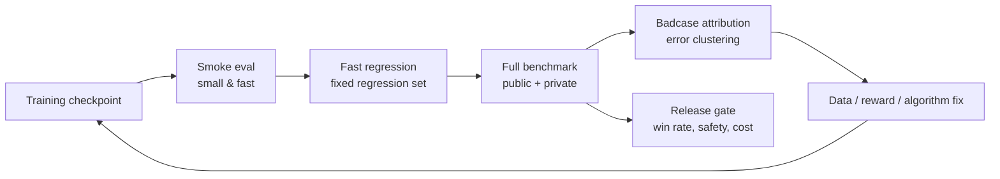

# B.3 RL Post-Training and Agentic RL Benchmarks

> Training curves tell you the optimizer is moving. Benchmarks tell you whether the model's capabilities actually improved.
>
> In RL post-training, rising reward does not necessarily mean task success. In Agentic RL, a single successful episode does not mean the agent reliably learned the task. This section focuses on one engineering question: once you have built [B.1 RL Training Systems](./rl-infrastructure) and [B.2 Agentic RL Infrastructure](./agentic-rl-infra), how should you design benchmarks to decide whether a checkpoint can continue training, can be deployed, and where the next round of data should be supplemented.

## Benchmarks Are Not Just Leaderboards

In industry, a benchmark is not simply running a public leaderboard. It is an **evaluation contract**. It must specify:

1. **Task distribution**: what tasks the model will encounter in production, and how easy/medium/hard tasks are distributed. For example, a code agent should not only test single-file bug fixes but also cover multi-file changes, test locating, and environment issues.
2. **Execution protocol**: temperature, sampling count, context length, tool permissions, time budget, and retry rules must all be fixed. Otherwise, the same model under different conditions yields incomparable scores.
3. **Scorer**: tasks with deterministic answers should prioritize rules, verifiers, unit tests, or environment state checks; open-ended dialog and writing tasks use LLM-as-Judge. The closer the scorer is to real task outcomes, the more reliable the benchmark.
4. **Control group**: clarify whether the new checkpoint is compared against SFT, the previous RL checkpoint, or the production model. Without a control group, a single score cannot demonstrate real improvement.
5. **Data splits**: training, development, public test, and private test sets must be isolated. The dev set can be used for iteration; the private test set is only for release gates — otherwise it quickly becomes contaminated by tuning.
6. **Failure taxonomy**: every badcase must be attributable to data, reward, algorithm, tools, evaluation, or safety. Only with attribution can errors become next-round data supplements, reward fixes, or release gates.

This is also the core insight from HELM: don't just look at one total score — decompose and report across scenarios, metrics, and model behaviors [^helm]. This matters even more for RL, because the model can easily optimize toward the reward you give rather than the capability you actually want.



A practical cadence: run small evaluations on every checkpoint, full public benchmarks nightly, and private sets + human spot-checks on release candidates. The private set must not be visible to training scripts, prompt tuning, or reward design — otherwise it degrades into a training set.

## Common Benchmark Quick Reference

The table below is organized by "most commonly used, easiest to integrate, best suited for engineering regression." Links prioritize official homepages, official repos, or official Hugging Face datasets. If a benchmark has both a dataset and a leaderboard, recording both in your evaluation config is recommended.

| Type                    | Benchmark              | URL                                                                                                                                                     | Primary Metric                            | What It Answers                                                                         |
| ----------------------- | ---------------------- | ------------------------------------------------------------------------------------------------------------------------------------------------------- | ----------------------------------------- | --------------------------------------------------------------------------------------- |
| Base LLM                | MMLU                   | [HF Dataset](https://huggingface.co/datasets/cais/mmlu)                                                                                                 | accuracy                                  | general knowledge and multi-subject MCQA[^mmlu]                                         |
| Base LLM                | MMLU-Pro               | [HF Dataset](https://huggingface.co/datasets/TIGER-Lab/MMLU-Pro), [GitHub](https://github.com/TIGER-AI-Lab/MMLU-Pro)                                    | accuracy                                  | harder multi-subject reasoning, replacing saturated MMLU[^mmlupro]                      |
| Base LLM                | GPQA                   | [HF Dataset](https://huggingface.co/datasets/Idavidrein/gpqa), [GitHub](https://github.com/idavidrein/gpqa)                                             | accuracy                                  | graduate-level science QA, deep reasoning and anti-search-leakage[^gpqa]                |
| Math / RLVR             | GSM8K                  | [HF Dataset](https://huggingface.co/datasets/openai/gsm8k)                                                                                              | exact match, pass@k                       | grade-school math multi-step reasoning, fast smoke eval[^gsm8k]                         |
| Math / RLVR             | MATH                   | [GitHub](https://github.com/hendrycks/math)                                                                                                             | exact match, pass@k                       | competition math and verifiable reasoning[^math]                                        |
| Code                    | HumanEval              | [GitHub](https://github.com/openai/human-eval)                                                                                                          | pass@1, pass@k                            | Python function generation and unit test pass rate[^humaneval]                          |
| Code                    | LiveCodeBench          | [Website](https://livecodebench.github.io/), [GitHub](https://github.com/LiveCodeBench/LiveCodeBench)                                                   | pass@1, pass@k                            | continuously updated code capability, reducing contamination[^livecodebench]            |
| Instruction Following   | IFEval                 | [Official Code](https://github.com/google-research/google-research/tree/master/instruction_following_eval)                                              | prompt-level / instruction-level accuracy | auto-checkable format, length, keyword constraints[^ifeval]                             |
| Preference / RM         | AlpacaEval             | [Website](https://tatsu-lab.github.io/alpaca_eval/), [GitHub](https://github.com/tatsu-lab/alpaca_eval)                                                 | win rate, LC win rate                     | open-ended instruction following and preference win rate[^alpacaeval]                   |
| Preference / RM         | RewardBench            | [HF Dataset](https://huggingface.co/datasets/allenai/reward-bench), [GitHub](https://github.com/allenai/reward-bench)                                   | pairwise accuracy                         | whether reward model actually prefers good answers[^rewardbench]                        |
| VLM                     | MMMU                   | [Website](https://mmmu-benchmark.github.io/), [GitHub](https://github.com/MMMU-Benchmark/MMMU), [HF Dataset](https://huggingface.co/datasets/MMMU/MMMU) | accuracy                                  | multi-subject, multi-chart, multimodal expert understanding[^mmmu]                      |
| VLM                     | MMBench                | [Website](https://opencompass.openxlab.space/omnimmbench), [GitHub](https://github.com/open-compass/MMBench)                                            | accuracy, circular eval accuracy          | fine-grained VLM capabilities: perception, attributes, relations, logic[^mmbench]       |
| VLM                     | MathVista              | [Website](https://mathvista.github.io/)                                                                                                                 | accuracy                                  | mathematical reasoning in figure, table, and geometry contexts[^mathvista]              |
| VLM                     | ChartQA                | [GitHub](https://github.com/vis-nlp/ChartQA)                                                                                                            | relaxed accuracy, exact match             | chart QA, numerical reading, trend understanding[^chartqa]                              |
| VLM                     | DocVQA                 | [Website](https://site.docvqa.org/datasets/docvqa)                                                                                                      | ANLS                                      | document image understanding, OCR, layout QA[^docvqa]                                   |
| Tool Calling            | BFCL                   | [Leaderboard](https://gorilla.cs.berkeley.edu/leaderboard), [Project](https://sky.cs.berkeley.edu/project/berkeley-function-calling-leaderboard/)       | AST match, executable accuracy            | function selection, parameter generation, multi-tool calling[^bfcl]                     |
| Tool Calling            | API-Bank               | [GitHub](https://github.com/AlibabaResearch/DAMO-ConvAI/tree/main/api-bank)                                                                             | API call accuracy, response quality       | end-to-end API retrieval, planning, and calling[^apibank]                               |
| Software Eng Agent      | SWE-bench              | [Website](https://www.swebench.com/), [GitHub](https://github.com/SWE-bench/SWE-bench)                                                                  | resolved rate, pass@1                     | real GitHub issue fixing and repo-level testing[^swebench]                              |
| Web Agent               | WebArena               | [Website](https://webarena.dev/), [GitHub](https://github.com/web-arena-x/webarena)                                                                     | task success                              | browser operations, forms, shopping, GitLab and other real web tasks[^webarena]         |
| General Agent           | GAIA                   | [HF Dataset](https://huggingface.co/datasets/gaia-benchmark/GAIA), [Leaderboard](https://huggingface.co/spaces/gaia-benchmark/leaderboard)              | final answer accuracy                     | combined search, files, multimodal, and reasoning[^gaia]                                |
| Workflow Agent          | Claw-Eval-Live         | [Project](https://claw-eval-live.github.io/), [Paper](https://arxiv.org/abs/2604.28139)                                                                 | pass rate, completion score               | enterprise workflow tasks refreshed quarterly with market demand[^clawevallive]         |
| Economic Agent          | ClawWork               | [GitHub](https://github.com/HKUDS/ClawWork), [Project](https://hkuds.github.io/ClawWork/)                                                               | net income, survival, task quality        | agent completing career tasks and earning income under cost constraints[^clawwork]      |
| Desktop Agent           | OSWorld                | [Website](https://os-world.github.io/)                                                                                                                  | task success                              | real desktop apps and OS tasks[^osworld]                                                |
| User-Interaction Agent  | tau-bench / tau2-bench | [Website](https://www.taubench.com/), [GitHub](https://github.com/sierra-research/tau2-bench)                                                           | pass^k, database state                    | customer service, booking, retail and other multi-turn tool-user interaction[^taubench] |
| Multi-Environment Agent | AgentBench             | [GitHub](https://github.com/THUDM/AgentBench)                                                                                                           | environment success rate                  | Web, database, CLI, games and other multi-environment agent capabilities[^agentbench]   |

## RL Post-Training Benchmarks

"RL post-training" here mainly refers to RLHF, RLAIF, DPO/IPO/KTO, PPO, GRPO, RLVR, and similar methods. The evaluation goal is not to prove the model is "smart" but to answer three questions:

- **Did capabilities improve**: are math, code, instruction following, factuality, and safety better than baseline?
- **Are preferences aligned**: do humans or target users prefer the new model?
- **Is the reward distorted**: do samples scored highly by the reward model / verifier actually have high quality?

### Capability Matrix

| Capability Line       | Common Benchmarks                    | Primary Metric                              | What It Answers                                         | Risk Points                                                                       |
| --------------------- | ------------------------------------ | ------------------------------------------- | ------------------------------------------------------- | --------------------------------------------------------------------------------- |
| Instruction Following | IFEval, MT-Bench, AlpacaEval         | rule satisfaction rate, pairwise win rate   | does the model follow constraints and match preferences | LLM judge may favor length, politeness, or confidence[^mtbench][^ifeval]          |
| Math & RLVR           | GSM8K, MATH, AIME-style private      | exact match, pass@k, verifier accuracy      | did verifiable reasoning improve                        | answer leakage, format reward exploited[^gsm8k][^math]                            |
| Code                  | HumanEval, MBPP, LiveCodeBench       | pass@1, pass@k, test pass rate              | is generated code actually runnable                     | public problem contamination, sample-test overfitting[^humaneval][^livecodebench] |
| General Coverage      | HELM-style multi-scenario            | accuracy, robustness, calibration, toxicity | did it only improve on one capability                   | many metrics, must specify primary[^helm]                                         |
| Reward Model          | RewardBench, internal preference set | pairwise accuracy, segment accuracy         | does reward align with human preference                 | RM training set and eval set from same source inflates scores[^rewardbench]       |

Don't simply weight these benchmarks into one "total score." A better approach is to set a **primary metric + regression gates**:

| Goal              | Example                                                                                    |
| ----------------- | ------------------------------------------------------------------------------------------ |
| Primary metric    | Math RLVR project → MATH / AIME pass@1; Code RL project → LiveCodeBench pass@1             |
| Hard gate         | safety violation rate must not increase; format failure rate must not exceed threshold     |
| Regression gate   | general dialog, short instructions, existing business tasks must not significantly degrade |
| Diagnostic metric | output length, refusal rate, repetition rate, KL, entropy, reward margin                   |

### Evaluation Protocol

The same model can produce entirely different conclusions under different evaluation protocols. RL post-training should fix at least these parameters:

```yaml
model: qwen-rl-step-1800
baseline: qwen-sft
sampling:
  temperature: 0.6
  top_p: 0.95
  n: 1
  max_tokens: 4096
judge:
  type: rule_then_llm_judge
  order_randomization: true
  tie_policy: count_as_half
split:
  dev: visible_for_iteration
  test_public: reported_every_night
  test_private: release_gate_only
```

If the task has deterministic answers, prioritize rules, unit tests, or verifiers. Only use LLM-as-Judge for open-ended dialog, writing, and preference evaluation — and always include order randomization, small-scale human spot-checks, and judge drift monitoring. Experience from MT-Bench and Chatbot Arena shows that LLM judges are useful but bring position bias, length bias, and model preference[^mtbench].

### Scorers and Toolchains

Once the evaluation protocol is set, the next step is not to find the "strongest judge" but to determine what type of evidence the task needs. Rules, tests, and environment state checks answer "was it completed"; LLM-as-Judge answers "is the quality what humans would want"; trajectory evaluation tools answer "how did the agent complete the task, or where did it fail." These names appear frequently in papers and projects and can be understood in four categories.

| Name       | Type                           | Problem Solved                                                                                                                                                                                  | Position in Project                                                |
| ---------- | ------------------------------ | ----------------------------------------------------------------------------------------------------------------------------------------------------------------------------------------------- | ------------------------------------------------------------------ |
| G-Eval     | LLM-as-Judge method            | uses a strong model to score open-ended outputs via rubric and evaluation steps; better than BLEU/ROUGE for subjective tasks like summarization, dialog, writing[^geval]                        | preference evaluation, open-ended quality scoring                  |
| MAJ-EVAL   | Multi-Agent-as-Judge method    | multiple reviewer personas discuss and score from different dimensions, reducing single-judge perspective bias[^majeval]                                                                        | high-risk open-ended evaluation, paper/report/complex task scoring |
| DeepEval   | LLM application eval framework | organize eval like writing tests; built-in G-Eval, RAG, agent task completion, tool correctness metrics[^deepeval]                                                                              | local regression testing, lightweight CI eval                      |
| agentevals | Agent trajectory eval tool     | tool-call trajectory reference matching, LLM judge, or trace-level scoring; LangChain version focuses on trajectory matching, OpenTelemetry version on production trace evaluation[^agentevals] | Agent regression testing, badcase diagnosis                        |

One common confusion: **G-Eval and MAJ-EVAL are scoring methods; DeepEval and agentevals are engineering tools.** The former answers "how to judge quality"; the latter answers "how to integrate judgment into the project." In RL post-training, neither replaces verifiers — if math, code, or database states can be deterministically verified, use deterministic verification first. LLM judges complement by covering semantic quality, user experience, and explanation completeness that are hard to express as rules.

### Sampling Count

A common misjudgment in RL post-training comes from `pass@k`. A model improving on `pass@8` may just be "better at trying multiple times," not stronger on `pass@1`. Reports should at least separate:

| Metric       | Meaning                            | When to Look                                          |
| ------------ | ---------------------------------- | ----------------------------------------------------- |
| `pass@1`     | single-attempt success rate        | default product experience, online quality            |
| `pass@k`     | at least one success in k attempts | search / rerank / self-consistency systems            |
| `majority@k` | success rate after majority voting | math, verifiable reasoning                            |
| `best-of-n`  | select best via reward / verifier  | checking whether reward actually selects good answers |

If the training goal is improving single-attempt usability, don't only report `pass@k`. If the product already does multi-candidate search, also report cost: how many extra tokens, verifier calls, and latency per point of improvement.

## Agentic RL Benchmarks

Agentic RL evaluates not just an answer but a **trajectory**:

```text
Initial state → Observation → Think/Plan → Tool call → Environment change → Re-observe → ... → Final state
```

Therefore, agent benchmarks must additionally define:

- How to reproduce the initial environment: browser, code repository, database, API, filesystem reproducibility.
- What tool permissions are available: internet access, file writing, test execution, paid API calls.
- What success criteria are: final answer, environment state diff, test pass, user simulator satisfaction.
- What the budget is: max steps, max time, max tokens, max tool calls.
- How to audit trajectories: every step's observation, action, tool result, and error recovery must be replayable.

### Benchmark Map

| Scenario                | Representative Benchmark      | What It Tests                                             | Scoring Method                                                       |
| ----------------------- | ----------------------------- | --------------------------------------------------------- | -------------------------------------------------------------------- |
| API / function calling  | API-Bank, BFCL-style          | parameter selection, call ordering, tool return handling  | JSON / API call exact match or execution results[^apibank]           |
| Real web tasks          | WebArena                      | multi-site browsing, forms, shopping, information lookup  | environment final state vs task answer[^webarena]                    |
| Software eng agent      | SWE-bench, SWE-bench Verified | real GitHub issue fixing                                  | repo test pass rate[^swebench]                                       |
| General assistant       | GAIA                          | search, reasoning, multimodal, tool combination           | final answer accuracy[^gaia]                                         |
| Dynamic workflow        | Claw-Eval-Live                | enterprise services, workspace repair, cross-system flows | fixed snapshot tasks + rule checks + structured judge[^clawevallive] |
| Economic survival       | ClawWork                      | task quality, cost control, long-term income              | income, API cost, balance, task quality[^clawwork]                   |
| Desktop / OS            | OSWorld                       | GUI operations, files, app workflows                      | state checks and task completion rate[^osworld]                      |
| User-tool multi-turn    | tau-bench                     | conversational business flow, rule following, tool use    | user simulator + database state[^taubench]                           |
| Multi-environment agent | AgentBench                    | Web, database, CLI, games and other environments          | per-environment success rate[^agentbench]                            |

When choosing benchmarks, first ask "where will my trained agent fail." If training a code-fixing agent, SWE-bench is more critical than GAIA. If training a customer service / booking / CRM agent, tau-bench-style user simulation and database state validation are closer to real business. If training a browser agent, WebArena's environment reproducibility matters more than plain Q&A.

### Agent Metrics

Agentic RL needs to simultaneously track outcomes, process, and cost.

| Metric               | Explanation                                            | Why It Matters                                                           |
| -------------------- | ------------------------------------------------------ | ------------------------------------------------------------------------ |
| `task_success`       | did the task ultimately complete                       | primary metric, directly corresponds to reward                           |
| `state_success`      | did environment state reach target                     | prevents getting the right answer without actually performing the action |
| `tool_success`       | were tool calls legal, parameters correct              | pinpoints tool-use capability                                            |
| `recovery_rate`      | can it recover from tool failure or observation errors | core capability for long-horizon tasks                                   |
| `steps_to_success`   | steps needed for success                               | measures efficiency and planning quality                                 |
| `cost_to_success`    | tokens, time, API cost                                 | deployment threshold                                                     |
| `safety_violation`   | overreach, leakage, destructive actions                | agents can cause more real-world side effects than plain LLMs            |
| `trajectory_quality` | is planning reasonable, excessive trial-and-error      | diagnostic signal, not sole reward                                       |

Process scoring is tempting but should not outweigh final outcomes. An agent that explains beautifully at every step but fails to complete the task is not a good agent. A safer approach: final state gets primary weight; process scoring is mainly for badcase attribution and training data generation.

### Rollout Cards: Turning Scores Back into Evidence

The most common problem with agent benchmarks is having only scores, not evidence. A table showing `task_success = 62%` without explaining whether failed runs were discarded, how timeouts were counted, whether tool errors were included in cost, or how multiple samples per task were aggregated — that score is hard to reproduce. **Rollout Cards** propose treating the rollout record itself as the basic evaluation unit rather than just publishing final scores [^rolloutcards].

A practical rollout card should preserve at least:

- **Raw trajectories**: every step's observation, action, tool result, errors, retries, and final output.
- **Reporting rules**: which runs were counted, which were skipped, how timeouts/crashes/empty responses were handled.
- **Cost and time**: tokens, tool calls, API costs, wall-clock time, and concurrency settings.
- **Scoring views**: how final answer score, environment state score, process score, and human spot-check results were computed.
- **Drops manifest**: failed, errored, and skipped samples must not disappear — list them separately.

This aligns with traditional RL intuition: a policy does not learn on isolated answers but exposes capabilities on trajectories/rollouts. For Agentic RL, rollout cards make "Model A is 3 points higher than Model B" into a question that can be investigated: did it actually learn to complete tasks better, or just learn to avoid failure samples? Is success rate up, or did cost double? Is the process more stable, or did reporting rules change?

## How to Run Three Standard Test Tracks

Reading papers and leaderboards can make benchmarks feel distant from training systems. When actually deploying, start with three minimum closed loops: base LLM, VLM, and tool-calling / agent. Each loop needs fixed protocols, machine-readable reports, badcase attribution, and next-round improvement actions.

### Base LLM: MMLU + GSM8K + IFEval

This track answers "did RL post-training damage base capabilities and instruction stability." A lightweight combination: MMLU-Pro or MMLU for knowledge coverage, GSM8K for verifiable reasoning, IFEval for format and constraints.

```yaml
suite: llm_core_regression_v1
model: qwen2.5-7b-grpo-step-1800
baseline: qwen2.5-7b-sft
generation:
  temperature: 0.0
  top_p: 1.0
  max_tokens: 2048
datasets:
  - name: mmlu_pro
    split: test
    metric: accuracy
  - name: gsm8k
    split: test
    metric: exact_match
  - name: ifeval
    split: test
    metric: prompt_level_accuracy
```

Suppose the evaluation output is:

```text
checkpoint: qwen2.5-7b-grpo-step-1800
baseline: qwen2.5-7b-sft
mmlu_pro_accuracy: 44.8% -> 44.1% (-0.7)
gsm8k_exact_match: 72.4% -> 77.9% (+5.5)
ifeval_prompt_accuracy: 63.0% -> 57.2% (-5.8)
response_length_mean: 612 -> 941 (+53.8%)
badcase_top:
  - ifeval_keyword_missing: 74 cases
  - ifeval_length_constraint_violation: 61 cases
  - gsm8k_final_answer_format_error: 19 cases
release_decision: block
```

This result shows math RLVR gains but significant instruction-following regression plus longer outputs. Next round should not just add more math problems:

- Decompose IFEval failures into "keyword, length, format, language" constraint categories and add to regression set.
- Split reward into "answer correct" and "final format correct" to avoid the model only learning long reasoning.
- Add short-answer retention set with `response_length_mean` upper limit or length-normalized judge.
- Add verifier for GSM8K format failures: full score only when the final answer is parseable.

### VLM: MMMU + MathVista + ChartQA

VLM evaluation must look beyond final text, because errors may come from OCR, visual grounding, visual relations, math reasoning, or answer format. A common combination: MMMU for multi-subject image-text understanding, MathVista for visual math, ChartQA for chart reading.

```yaml
suite: vlm_reasoning_regression_v1
model: qwen-vl-rl-step-900
baseline: qwen-vl-sft
generation:
  temperature: 0.0
  max_tokens: 1024
input:
  image_resolution: 1344
  preserve_aspect_ratio: true
metrics:
  - accuracy
  - relaxed_numeric_accuracy
  - ocr_error_rate
  - answer_parse_fail_rate
```

Suppose the output is:

```text
checkpoint: qwen-vl-rl-step-900
mmmu_val_accuracy: 42.0% -> 44.6% (+2.6)
mathvista_accuracy: 37.5% -> 38.1% (+0.6)
chartqa_relaxed_accuracy: 61.8% -> 54.7% (-7.1)
answer_parse_fail_rate: 3.2% -> 4.9% (+1.7)
badcase_top:
  - chart_axis_value_misread: 88 cases
  - table_header_binding_error: 43 cases
  - geometry_diagram_spatial_relation_error: 31 cases
release_decision: block_for_chart_tasks
```

This is not "VLM got worse overall" — it's specifically chart reading and table header binding that regressed. Next-round improvement should target visual input and task distribution:

- Add local cropping, axis reading, and table header alignment SFT/RLVR data for ChartQA-style tasks.
- Change numerical answer scoring to `exact + relaxed numeric` two-layer to avoid unit, decimal, and comma format false penalties.
- Record OCR/visual grounding errors separately for chart tasks; don't mix them with reasoning errors.
- If image resize was applied during training, check aspect ratio and resolution; chart tasks are usually more sensitive to compression than natural images.

### Tool Calling & Agent: BFCL + API-Bank + SWE-bench

Start tool calling with BFCL or API-Bank to confirm "function name, parameters, call ordering" reliability; then run end-to-end code agent on SWE-bench Verified or internal repo tasks. Don't start with only SWE-bench resolved rate, because low scores may just be broken tool-call JSON.

```yaml
suite: agent_tool_regression_v1
model: code-agent-rl-step-2400
baseline: code-agent-sft
tool_protocol:
  parallel_tool_calls: true
  max_tool_calls: 50
  max_wall_time_minutes: 20
datasets:
  - name: bfcl_v3
    metric: executable_accuracy
  - name: api_bank
    metric: api_call_accuracy
  - name: swebench_verified
    metric: resolved_rate
```

Suppose the output is:

```text
checkpoint: code-agent-rl-step-2400
bfcl_executable_accuracy: 82.1% -> 85.6% (+3.5)
api_bank_call_accuracy: 68.4% -> 66.9% (-1.5)
swebench_verified_resolved: 28.0% -> 32.4% (+4.4)
avg_tool_calls_successful_tasks: 18.6 -> 27.9 (+50.0%)
tool_error_recovery_rate: 41.2% -> 37.5% (-3.7)
safety_violation_rate: 0.3% -> 0.9% (+0.6)
release_decision: research_only
```

SWE-bench improved but cost and safety regressed noticeably. Next round should:

- When distilling successful trajectories, preserve shorter paths and penalize "repeated search, repeated file reads, unnecessary test re-runs."
- Make tool error recovery a separate curriculum: timeout, permission denied, empty result, JSON schema error sampled separately.
- Add rule gates for dangerous actions: deleting files, modifying CI, skipping tests, or expanding permissions must trigger rejection or human confirmation.
- Set `resolved_rate` and `cost_to_success` together as release gates to prevent the model from trading high cost for marginal success rate.

## How to Draw Paper-Style Radar Charts

Many papers use radar charts to show "model capability profiles." They're good for storytelling: one glance reveals whether a checkpoint got stronger at math but weaker at instruction following, or whether agent success rate went up but cost got worse. But radar charts are also easy to misuse, so do three things before drawing:

1. **Unify direction**: all axes must be "higher is better." For example, convert `safety_violation_rate` to `safety_score = 100 * (1 - violation_rate / max_bad_rate)`.
2. **Unify scale**: normalize all axes to 0-100. Accuracy can be multiplied by 100 directly; cost, latency, and tool call counts need min-max or threshold normalization.
3. **Keep raw tables**: radar charts are for display; the report must still include raw metrics so readers don't just look at the shape without numbers.

### Which Paper Figures to Reproduce

The two examples below are not "pick random metrics and draw a circle" but reproduce the structure of two common paper figure types, putting **reference paper, original figure, and new figure after running** side by side:

- **MMBench-style VLM 20-dimension capability radar**: MMBench Figure 1 plots 8 representative VLMs across 20 fine-grained capability axes such as action recognition, OCR, spatial relationship, physical relation, and identity reasoning[^mmbench]. This type of chart answers: which visual capabilities did VLM post-training actually strengthen, and which were dragged down by training side effects?
- **AgentBench-style multi-environment agent radar**: AgentBench evaluates agents across OS, DB, KG, DCG, LTP, HH, WS, WB interactive environments[^agentbench]. This chart answers: can an agent work across web, games, and home environments, or does it only know SQL / shell?

The values below are **hypothetical evaluation results** for demonstrating the reproduction method; to reproduce paper original figures, manually enter model scores from the paper's tables into the same dictionary, or read from official leaderboard/JSON results.

### How to Run

Save the script below as `scripts/plot_paper_style_radar.py`:

```bash
python -m pip install matplotlib
python scripts/plot_paper_style_radar.py
```

```python
from pathlib import Path
import math
import matplotlib.pyplot as plt

OUT = Path("docs/appendix_industrial_training/images")
OUT.mkdir(parents=True, exist_ok=True)

COLORS = ["#2b6cb0", "#c53030", "#2f855a", "#6b46c1"]


def closed(values):
    return values + values[:1]


def plot_paper_radar(title, metrics, series, output_path, subtitle=None):
    angles = [2 * math.pi * i / len(metrics) for i in range(len(metrics))]
    angles = closed(angles)

    fig, ax = plt.subplots(figsize=(7.6, 6.4), subplot_kw={"polar": True})
    fig.patch.set_facecolor("white")
    ax.set_facecolor("#fbfbfd")
    ax.set_theta_offset(math.pi / 2)
    ax.set_theta_direction(-1)
    ax.set_ylim(0, 100)
    ax.set_xticks(angles[:-1])
    ax.set_xticklabels(metrics, fontsize=9)
    ax.set_yticks([20, 40, 60, 80, 100])
    ax.set_yticklabels(["20", "40", "60", "80", "100"], fontsize=8, color="#64748b")
    ax.grid(color="#cbd5e1", linewidth=0.9)
    ax.spines["polar"].set_color("#94a3b8")

    for idx, (name, values) in enumerate(series.items()):
        color = COLORS[idx % len(COLORS)]
        values = closed(values)
        ax.plot(angles, values, color=color, linewidth=2.4, marker="o", markersize=3.2, label=name)
        ax.fill(angles, values, color=color, alpha=0.08)

    ax.set_title(title, y=1.12, fontsize=13, fontweight="bold")
    if subtitle:
        fig.text(0.5, 0.905, subtitle, ha="center", va="center", fontsize=9, color="#475569")
    ax.legend(loc="upper center", bbox_to_anchor=(0.5, -0.08), ncol=min(3, len(series)), frameon=False)
    fig.tight_layout(pad=2.0)
    fig.savefig(output_path, dpi=180, bbox_inches="tight")
    plt.close(fig)


mmbench_metrics = [
    "Identity\nReasoning",
    "Future\nPrediction",
    "Function\nReasoning",
    "Celebrity\nRecognition",
    "Attribute\nRecognition",
    "Attribute\nComparison",
    "Action\nRecognition",
    "Struct. Img-Text\nUnderstanding",
    "Spatial\nRelationship",
    "Social\nRelation",
    "Physical\nRelation",
    "Physical\nProperty",
    "OCR",
    "Object\nLocalization",
    "Natural\nRelation",
    "Image\nTopic",
    "Image\nStyle",
    "Image\nScene",
    "Image\nQuality",
    "Image\nEmotion",
]
mmbench_series = {
    "VLM-SFT": [68, 48, 61, 55, 66, 50, 74, 31, 38, 44, 55, 37, 62, 49, 60, 78, 64, 69, 35, 54],
    "VLM-RL": [72, 52, 66, 58, 70, 55, 78, 40, 47, 49, 60, 43, 55, 53, 64, 80, 66, 73, 38, 58],
    "VLM-RL + OCR mix": [73, 56, 67, 60, 72, 57, 79, 48, 51, 52, 63, 46, 69, 56, 66, 81, 68, 74, 45, 60],
}
plot_paper_radar(
    "MMBench-style 20-ability VLM radar",
    mmbench_metrics,
    mmbench_series,
    OUT / "radar-llm-core-regression.png",
    "Axes follow MMBench Figure 1; numbers are hypothetical post-training eval results.",
)

agentbench_metrics = ["OS", "DB", "KG", "DCG", "LTP", "HH", "WS", "WB"]
agentbench_series = {
    "Agent-SFT": [28.0, 41.0, 32.0, 45.0, 35.0, 22.0, 31.0, 18.0],
    "Agent-RL": [46.0, 49.0, 38.0, 43.0, 42.0, 20.0, 39.0, 24.0],
    "Agent-RL + guard": [43.0, 52.0, 45.0, 48.0, 51.0, 29.0, 44.0, 33.0],
}
plot_paper_radar(
    "AgentBench-style environment radar",
    agentbench_metrics,
    agentbench_series,
    OUT / "radar-code-agent-tool-bench.png",
    "Relative-to-best scores across AgentBench environments; numbers are hypothetical.",
)
```

### Example 1: Reproducing the MMBench 20-Dimension VLM Radar

**Reference paper**: Liu et al., _MMBench: Is Your Multi-modal Model an All-around Player?_ Figure 1 shows radar charts of 8 representative VLMs across 20 capability dimensions on MMBench-test[^mmbench].


_Figure 1: Screenshot of MMBench paper Figure 1. It decomposes model results into 20 fine-grained capability axes rather than reporting only overall accuracy. Source: MMBench paper[^mmbench]._

**How to produce a new chart**: first aggregate evaluation results by MMBench's L-3 ability categories, getting 20 capability scores per model; then fill these scores into `mmbench_series`. Below is an excerpt of hypothetical results; full 20-dimension values are in the script.

| Model            | Action | OCR | Spatial | Physical Relation | Identity | Image Quality |
| ---------------- | ------ | --- | ------- | ----------------- | -------- | ------------- |
| VLM-SFT          | 74     | 62  | 38      | 55                | 68       | 35            |
| VLM-RL           | 78     | 55  | 47      | 60                | 72       | 38            |
| VLM-RL + OCR mix | 79     | 69  | 51      | 63                | 73       | 45            |


_Figure 2: Our MMBench-style 20-dimension radar after running. `VLM-RL` expands on action, spatial, physical relation but contracts on OCR; after adding OCR/document/table retention data, `VLM-RL + OCR mix` restores the OCR axis while keeping most reasoning gains._

After producing this chart, report improvement actions should directly target the shortest axes:

- OCR declined: supplement ChartQA, DocVQA, UI screenshots, and table header alignment data.
- Spatial / physical relation improved but OCR declined: split reward so not all visual tasks only reward final answers.
- Image quality / image emotion consistently short: indicates data bias toward structured tasks, lacking subjective visual quality and emotion understanding samples.

### Example 2: Reproducing the AgentBench-Style Multi-Environment Radar

**Reference paper**: Liu et al., _AgentBench: Evaluating LLMs as Agents_ Figure 1(a) plots relative performance of typical LLMs across 8 environments as radar charts; Figure 1(b) provides overall score bar charts[^agentbench].


_Figure 3: Screenshot of AgentBench paper Figure 1. Left shows 8-environment radar; right shows overall score bar chart. Source: AgentBench paper[^agentbench]._

**How to produce a new chart**: AgentBench's different environments have different raw metrics, so first compute `relative_score = 100 * model_score / best_score_in_this_environment`, then draw radar. Here we use hypothetical results to demonstrate an agent post-training project.

| Model            | OS  | DB  | KG  | DCG | LTP | HH  | WS  | WB  |
| ---------------- | --- | --- | --- | --- | --- | --- | --- | --- |
| Agent-SFT        | 28  | 41  | 32  | 45  | 35  | 22  | 31  | 18  |
| Agent-RL         | 46  | 49  | 38  | 43  | 42  | 20  | 39  | 24  |
| Agent-RL + guard | 43  | 52  | 45  | 48  | 51  | 29  | 44  | 33  |


_Figure 4: Our AgentBench-style multi-environment radar. `Agent-RL` improved on OS, DB, WS but didn't improve HH and DCG; adding guard, error recovery curriculum, and cross-environment mixed trajectories makes the profile more "uniformly outward."_

Training actions corresponding to this chart are also direct:

- OS / DB improved significantly: code and structured tool trajectories are effective, keep this data.
- HH / WB still low: long-horizon state tracking, page observation, and error recovery are insufficient; supplement multi-turn interaction trajectories.
- DCG didn't improve or declined: possibly too much code-style data biasing the model toward local execution rather than strategic planning; next round should mix in game, planning, and exploration environments.

## Five Steps to Build Your Own Benchmark

Public benchmarks handle horizontal comparison; internal benchmarks handle real business. Building your own benchmark follows these five steps.

### 1. Define the Capability Matrix

Write the matrix before writing tasks. For example, a "code agent" could be decomposed:

| Task Type                      | Easy | Medium | Hard |
| ------------------------------ | ---- | ------ | ---- |
| Single-file bug fix            | 30   | 40     | 20   |
| Multi-file feature addition    | 10   | 30     | 30   |
| Test failure locating          | 20   | 30     | 20   |
| Dependency / environment issue | 10   | 20     | 20   |
| Code review and security fix   | 10   | 20     | 20   |

Each cell must have enough samples; otherwise the model may only improve on the densest task type.

### 2. Write Task Cards

Each task must be machine-reproducible. An agent task card might look like:

```yaml
id: codeagent-medium-042
split: private_release
domain: software_engineering
difficulty: medium
initial_state:
  repo: internal/payment-service
  commit: 8f31c2a
  setup: npm install
prompt: 'Fix the refund amount rounding error and add regression tests.'
allowed_tools:
  - shell
  - file_edit
  - test_runner
budget:
  max_steps: 40
  max_minutes: 20
  max_tokens: 60000
success_verifier:
  type: unit_tests
  command: npm test
process_checks:
  - no_unrelated_file_rewrite
  - no_snapshot_deletion
tags:
  - decimal
  - regression-test
  - money-safety
```

This card simultaneously serves training, evaluation, and badcase analysis. Without task cards, it's hard to reproduce "why did this checkpoint seem to get worse."

### 3. Design Scorers

Scorer priority is usually:

1. **Environment state checks**: database records, file diffs, web page state, test results.
2. **Rule scoring**: format, fields, values, key constraints.
3. **Reference answer comparison**: suited for short answers and enumerable tasks.
4. **LLM-as-Judge**: suited for open-ended tasks, but must be spot-checked.
5. **Human review**: expensive, used for calibrating judges and high-risk samples.

Agent benchmarks especially must avoid "only looking at final text." For example, a web agent saying "I've placed the order successfully" is meaningless — you must check the shopping cart, order status, or database records.

### 4. Decontamination and Versioning

RL projects easily contaminate evaluation sets: developers use test sets to tune prompts, data synthesis scripts rewrite questions from public benchmarks, or reward models have seen evaluation answers — all cause inflated scores.

At minimum, do four things:

- Run n-gram / embedding similarity checks between training data and evaluation questions.
- Use public sets only for trend observation; use private sets only for release gates.
- Version every benchmark update, e.g., `math-rlvr-v3.2`.
- Keep a fixed anchor set to determine whether a new benchmark version changed difficulty.

LiveCodeBench treats "continuous updates" and "reducing contamination" as core design principles for code evaluation; this approach also applies to internal RL benchmarks [^livecodebench].

### 5. Calibrate Difficulty

A good benchmark cannot be all tasks the model can do, nor all tasks it cannot. Pilot runs should include at least three baselines:

| Baseline                                  | Purpose                                   |
| ----------------------------------------- | ----------------------------------------- |
| SFT model                                 | determine whether RL actually adds value  |
| Previous production model                 | determine whether it can be deployed      |
| Strong closed-source or open-source model | determine ceiling and task discrimination |

If all models score near 0, tasks may be too hard or the scorer is broken. If all models score near 100%, the benchmark is outdated. A healthy internal benchmark should place the main model in the 40%-80% range so iteration differences are visible.

## Training Monitoring and Troubleshooting

Benchmarks answer "did the model improve"; training monitoring answers "why did it improve or degrade." During RL training, put the following metric categories on the same dashboard as benchmark reports.

| Metric            | Normal Trend                      | Danger Signal                                                 |
| ----------------- | --------------------------------- | ------------------------------------------------------------- |
| training reward   | slowly rising                     | reward up but benchmark down                                  |
| KL divergence     | fluctuating within range          | sudden spike, policy diverging from reference                 |
| entropy           | slowly declining                  | rapidly approaching 0, output mode collapse                   |
| response length   | matching task needs               | gaming judge via length or gaming format reward via shortness |
| verifier accuracy | consistent with human spot-checks | verifier-high samples look poor to humans                     |
| win rate          | steady improvement over baseline  | open-ended tasks improve but safety/factuality degrade        |
| cost / latency    | small changes                     | agent success rate up but cost doubled                        |

The most typical bad signal: **reward up, KL up, entropy down, benchmark primary metric down**. This usually means the model is not "about to learn" but has found a reward loophole. At this point, pause training, sample high-reward low-benchmark examples, and check reward, verifier, and judge.

A practical automated gate:

```text
If primary metric drops below historical best by >1% for 2 consecutive evals: pause training
If any safety metric regresses: pause and require human review
If reward rises but private set declines: rollback checkpoint, enter badcase attribution
If agent success rate rises but cost exceeds budget by 30%: don't deploy, research only
```

## How Badcases Feed Back into RL

Badcase analysis is not just pasting error screenshots into a document — it's converting failure samples into next-round training actions.

| Failure Type                                    | Possible Cause                            | Fix Action                                                |
| ----------------------------------------------- | ----------------------------------------- | --------------------------------------------------------- |
| Verifiable task wrong answer                    | reasoning insufficient, verifier too weak | supplement similar RLVR tasks, strengthen verifier        |
| Format correct but content wrong                | reward only checks format                 | split format reward and content reward                    |
| Judge likes verbose nonsense                    | LLM judge length bias                     | add length normalization and human calibration set        |
| Code passes sample tests but fails hidden tests | overfitting public samples                | add hidden tests and variant tests                        |
| Agent repeatedly calls same tool                | poor planning / state memory              | add trajectory-level SFT, penalize invalid repeated calls |
| Agent completes task but overreaches            | unclear tool permission design            | add permission checks, dangerous action rejection tasks   |
| New capability up but old capability down       | training data distribution shift          | mix in retention set, set regression gates                |

After each training round, at minimum output a report like:

```text
checkpoint: grpo-agent-step-2400
primary_metric: swebench_verified_pass@1 = 34.2% (+3.1)
regressions:
  - bfcl_call_accuracy: -1.8
  - avg_tool_calls_successful_tasks: +22%
badcase_clusters:
  - missing_repo_search_before_edit: 17 cases
  - tests_not_run_after_patch: 11 cases
  - tool_timeout_no_recovery: 8 cases
next_actions:
  - add 200 trajectories with mandatory test execution
  - add timeout recovery reward
  - keep previous checkpoint as release candidate
```

This way benchmarks are not just acceptance tools but part of the RL data flywheel: evaluation discovers systematic failures, badcase attribution generates new data or new reward, and the next training round begins.

## Summary

The core of RL post-training benchmarks is **distinguishing real capability, preference win rate, and reward distortion**; the core of Agentic RL benchmarks is **evaluating reproducible environments, tool trajectories, final states, and costs together**.

If you can only remember one principle: don't let training reward prove its own success. Let independent benchmarks, private regression sets, and replayable badcases speak together.

## References

[^helm]: Percy Liang et al. [Holistic Evaluation of Language Models](https://arxiv.org/abs/2211.09110), arXiv 2022.

[^mmlu]: Dan Hendrycks et al. [Measuring Massive Multitask Language Understanding](https://arxiv.org/abs/2009.03300), ICLR 2021.

[^mmlupro]: Yubo Wang et al. [MMLU-Pro: A More Robust and Challenging Multi-Task Language Understanding Benchmark](https://arxiv.org/abs/2406.01574), NeurIPS 2024 Datasets and Benchmarks Track.

[^gpqa]: David Rein et al. [GPQA: A Graduate-Level Google-Proof Q&A Benchmark](https://arxiv.org/abs/2311.12022), arXiv 2023.

[^mtbench]: Lianmin Zheng et al. [Judging LLM-as-a-Judge with MT-Bench and Chatbot Arena](https://arxiv.org/abs/2306.05685), NeurIPS 2023.

[^geval]: Yang Liu et al. [G-EVAL: NLG Evaluation using GPT-4 with Better Human Alignment](https://arxiv.org/abs/2303.16634), EMNLP 2023.

[^majeval]: Weiqi Wang et al. [Multi-Agent-as-Judge: Aligning LLM-Agent-Based Automated Evaluation with Multi-Dimensional Human Evaluation](https://arxiv.org/abs/2507.21028), arXiv 2025.

[^deepeval]: Confident AI. [DeepEval Documentation](https://deepeval.com/docs/introduction), accessed 2026-05-14.

[^agentevals]: LangChain. [agentevals: Readymade evaluators for agent trajectories](https://github.com/langchain-ai/agentevals), accessed 2026-05-14; AgentEvals. [Score Agent Behavior from OpenTelemetry Traces](https://aevals.ai/), accessed 2026-05-14.

[^ifeval]: Jeffrey Zhou et al. [Instruction-Following Evaluation for Large Language Models](https://arxiv.org/abs/2311.07911), arXiv 2023.

[^gsm8k]: Karl Cobbe et al. [Training Verifiers to Solve Math Word Problems](https://arxiv.org/abs/2110.14168), arXiv 2021.

[^math]: Dan Hendrycks et al. [Measuring Mathematical Problem Solving With the MATH Dataset](https://arxiv.org/abs/2103.03874), NeurIPS 2021.

[^humaneval]: Mark Chen et al. [Evaluating Large Language Models Trained on Code](https://arxiv.org/abs/2107.03374), arXiv 2021.

[^livecodebench]: Naman Jain et al. [LiveCodeBench: Holistic and Contamination Free Evaluation of Large Language Models for Code](https://arxiv.org/abs/2403.07974), arXiv 2024.

[^rewardbench]: Nathan Lambert et al. [RewardBench: Evaluating Reward Models for Language Modeling](https://arxiv.org/abs/2403.13787), arXiv 2024.

[^alpacaeval]: Yann Dubois et al. [AlpacaFarm: A Simulation Framework for Methods that Learn from Human Feedback](https://arxiv.org/abs/2305.14387), NeurIPS 2023.

[^mmmu]: Xiang Yue et al. [MMMU: A Massive Multi-discipline Multimodal Understanding and Reasoning Benchmark for Expert AGI](https://arxiv.org/abs/2311.16502), CVPR 2024.

[^mmbench]: Yuan Liu et al. [MMBench: Is Your Multi-modal Large Language Model an All-around Player?](https://arxiv.org/abs/2307.06281), ECCV 2024.

[^mathvista]: Pan Lu et al. [MathVista: Evaluating Mathematical Reasoning of Foundation Models in Visual Contexts](https://arxiv.org/abs/2310.02255), ICLR 2024.

[^chartqa]: Ahmed Masry et al. [ChartQA: A Benchmark for Question Answering about Charts with Visual and Logical Reasoning](https://arxiv.org/abs/2203.10244), ACL Findings 2022.

[^docvqa]: Minesh Mathew et al. [DocVQA: A Dataset for VQA on Document Images](https://arxiv.org/abs/2007.00398), WACV 2021.

[^bfcl]: UC Berkeley Sky Computing Lab. [Berkeley Function Calling Leaderboard](https://gorilla.cs.berkeley.edu/leaderboard), 2024.

[^apibank]: Minghao Li et al. [API-Bank: A Comprehensive Benchmark for Tool-Augmented LLMs](https://arxiv.org/abs/2304.08244), EMNLP 2023.

[^webarena]: Shuyan Zhou et al. [WebArena: A Realistic Web Environment for Building Autonomous Agents](https://arxiv.org/abs/2307.13854), ICLR 2024.

[^swebench]: Carlos E. Jimenez et al. [SWE-bench: Can Language Models Resolve Real-World GitHub Issues?](https://arxiv.org/abs/2310.06770), ICLR 2024.

[^gaia]: Grégoire Mialon et al. [GAIA: a Benchmark for General AI Assistants](https://arxiv.org/abs/2311.12983), ICLR 2024.

[^clawevallive]: Chenxin Li et al. [Claw-Eval-Live: A Live Agent Benchmark for Evolving Real-World Workflows](https://arxiv.org/abs/2604.28139), arXiv 2026.

[^clawwork]: HKUDS. [ClawWork: OpenClaw as Your AI Coworker](https://github.com/HKUDS/ClawWork), accessed 2026-05-14.

[^rolloutcards]: Charlie Masters, Ziyuan Liu, and Stefano V. Albrecht. [Rollout Cards: A Reproducibility Standard for Agent Research](https://arxiv.org/abs/2605.12131), arXiv 2026.

[^osworld]: Tianbao Xie et al. [OSWorld: Benchmarking Multimodal Agents for Open-Ended Tasks in Real Computer Environments](https://arxiv.org/abs/2404.07972), NeurIPS 2024.

[^taubench]: Shunyu Yao et al. [τ-bench: A Benchmark for Tool-Agent-User Interaction in Real-World Domains](https://arxiv.org/abs/2406.12045), arXiv 2024.

[^agentbench]: Xiao Liu et al. [AgentBench: Evaluating LLMs as Agents](https://arxiv.org/abs/2308.03688), ICLR 2024.
