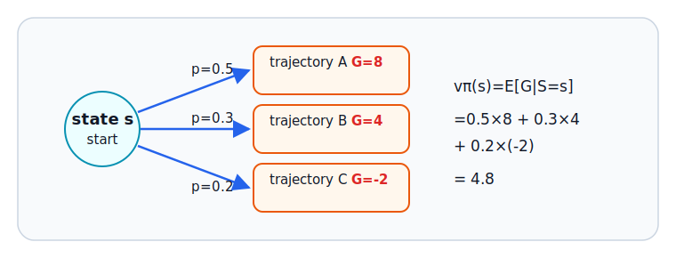

# E.2 Probability, Expectation, and Random Estimation

Data in reinforcement learning comes from random interaction: the policy may choose actions randomly, and the environment may return random feedback. To understand this randomness, we need probability theory. This section follows the natural order of probability: first sample spaces, events, and random variables; then probability, conditional probability, expectation, and variance; and finally Monte Carlo estimation, importance sampling, and the Bellman expectation equation.

## Roadmap

| Article                                                                             | Mathematical path                                                       | Role in reinforcement learning                               |
| ----------------------------------------------------------------------------------- | ----------------------------------------------------------------------- | ------------------------------------------------------------ |
| [E.2.1 Probability, Conditional Probability, and Expectation](./probability-basics) | sample space -> event -> random variable -> probability -> expectation  | Describe stochastic policies and stochastic environments     |
| [E.2.2 Random Variables, Returns, and State Values](./probability-value)            | random return -> conditional expectation -> variance                    | Define value functions and the stability of learning signals |
| [E.2.3 Variance, Monte Carlo, and Sample Averages](./probability-sampling)          | sample mean -> incremental average -> importance sampling               | Estimate unknown expectations from data                      |
| [E.2.4 Trajectory Probability, Baselines, and GAE](./probability-trajectory-td)     | trajectory probability -> baseline invariance -> accumulated TD errors  | Connect policy gradients with advantage estimation           |
| [E.2.5 Bellman Expectation Equation](./probability-bellman-advanced)                | take expectations over actions, rewards, and next states layer by layer | Derive the full Bellman expectation equation                 |
| [E.2.6 Summary, Formulas, and Exercises](./probability-formulas-exercises)          | formula review -> common pitfalls -> exercises                          | Review and check understanding                               |
