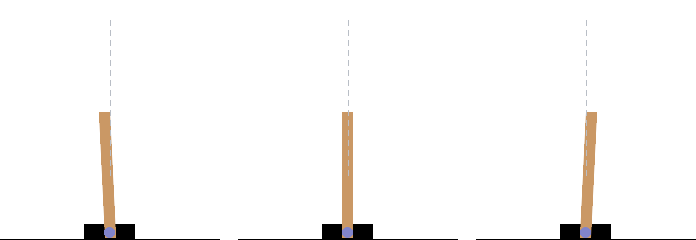
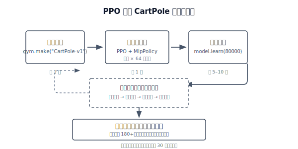
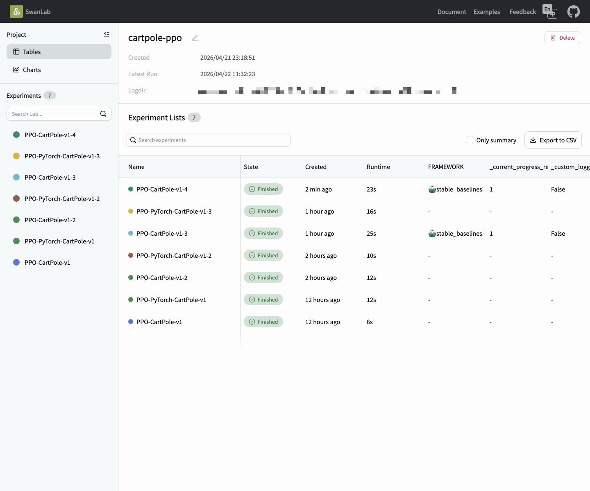
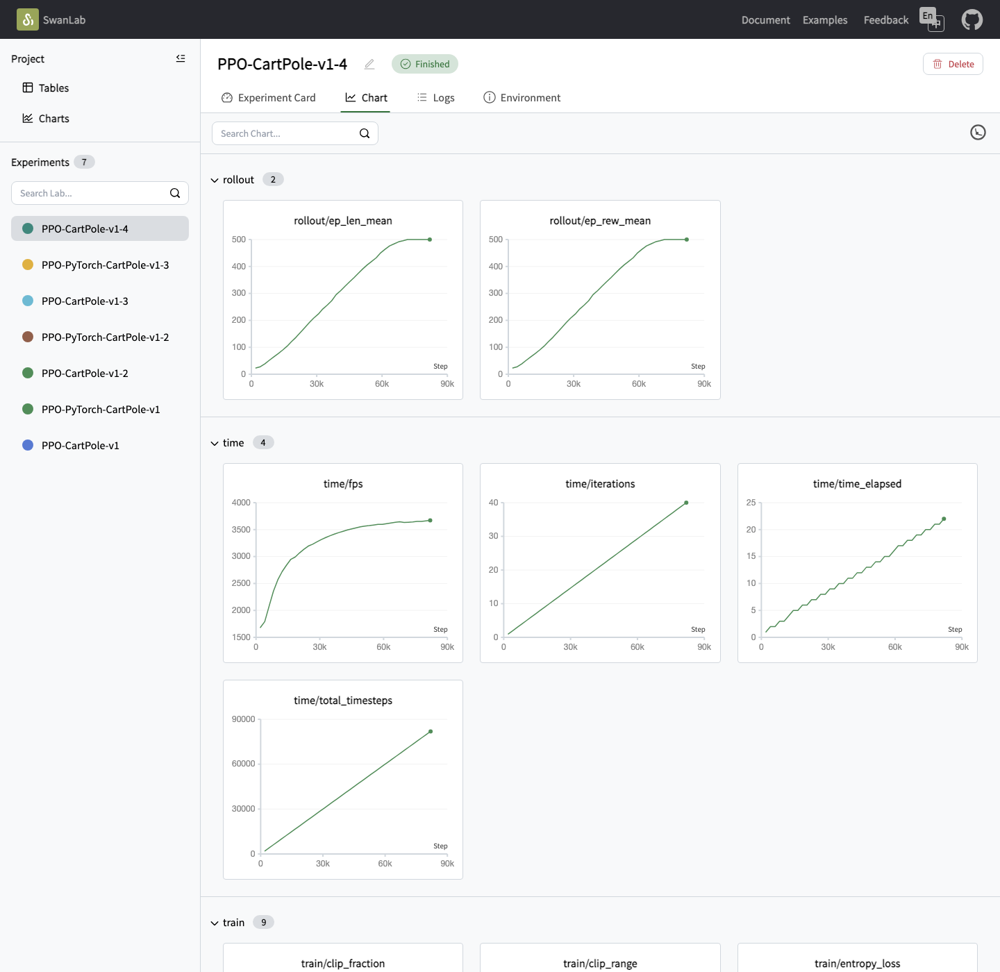

# Chapter 1: A First Taste of Classic RL — CartPole

> **Goal of this chapter**: run your first RL training script from scratch and build an intuition for how an agent learns a policy by trial and error. No theory prerequisites are required.

> 📁 **Chapter code**: [1-ppo_cartpole.py](https://github.com/letslego/hands-on-modern-rl/blob/main/code/chapter01_cartpole/1-ppo_cartpole.py) · [2-pytorch_ppo.py](https://github.com/letslego/hands-on-modern-rl/blob/main/code/chapter01_cartpole/2-pytorch_ppo.py) · [requirements.txt](https://github.com/letslego/hands-on-modern-rl/blob/main/code/chapter01_cartpole/requirements.txt)

## 1.1 Hands-On: Run CartPole Training

With the preface behind us, we can start hands-on. Recall the core RL setup: an agent interacts with an environment, repeatedly tries actions, receives reward signals, and gradually learns what decisions work best under different states.

So what counts as a "good decision"? We begin with a classic task: CartPole. Just like `print("Hello World")` is the first step in programming, balancing a pole with a few dozen lines of code is the standard first step into reinforcement learning.



<div style="text-align: center; font-size: 0.9em; color: var(--vp-c-text-2); margin-top: -10px; margin-bottom: 20px;">
  <em>Figure 1-1: three typical CartPole poses (slight left tilt, near upright, slight right tilt). The dashed line indicates the vertical reference. A high-scoring policy does not freeze the pole perfectly; it keeps correcting with small oscillations.</em>
</div>

You might ask: what hardware do you need to train such an agent?

In practice, this task is very light-weight. A normal laptop or desktop (Intel Mac, Apple Silicon, Windows/Linux) can run it:

- **No GPU required**: the compute is small; CPU training is enough.
- **Tiny memory footprint**: typically around 100MB–200MB during runtime.
- **Very small model**: the default `MlpPolicy` has two 64-unit layers, only a few thousand parameters.

We will use Gymnasium (the current standard RL environment API) as the training arena, and Stable Baselines3 (SB3) as the algorithm library. If PyTorch is the parts to build a car, SB3 is a well-assembled engine: it packages PPO into a few lines of code.

This chapter does not require calculus or linear algebra. We will go straight into code and train a CartPole agent.



<div style="text-align: center; font-size: 0.9em; color: var(--vp-c-text-2); margin-top: -10px; margin-bottom: 20px;">
  <em>Figure 1-2: the full PPO training loop on CartPole. On a personal computer this typically finishes in under 30 seconds.</em>
</div>

### Step 1: Install Dependencies

First, open a terminal and install the environment and algorithm libraries:

```bash
pip install "gymnasium[classic-control]" stable-baselines3
```

> Note: `stable-baselines3` depends on PyTorch. Since PyTorch is relatively large, this can take a while to download. This is the only heavy dependency install in Chapter 1.

### Step 2: Run Training

Install the full requirements first:

```bash
pip install -r requirements.txt
```

This repo provides two CartPole implementations. **Either one is fine as your first run**:

- [1-ppo_cartpole.py](https://github.com/letslego/hands-on-modern-rl/blob/main/code/chapter01_cartpole/1-ppo_cartpole.py): an SB3 PPO wrapper, best for a first successful run.
- [2-pytorch_ppo.py](https://github.com/letslego/hands-on-modern-rl/blob/main/code/chapter01_cartpole/2-pytorch_ppo.py): a from-scratch PPO implementation in pure PyTorch, for understanding details.

Both scripts log metrics to SwanLab. After training, they can also run a visual demo window via `--gui`:

```bash
# Option A: SB3 wrapper (recommended first)
python 1-ppo_cartpole.py
python 1-ppo_cartpole.py --gui

# Option B: pure PyTorch version (if you want implementation details)
python 2-pytorch_ppo.py
python 2-pytorch_ppo.py --gui
```

After you run it, you will see training logs scrolling in the terminal. When training finishes, the model is saved under `output/`.

About `--gui`: training always runs headless (no rendering), so training speed is unaffected. `--gui` only controls whether a CartPole window is shown during the post-training demo. With GUI, each frame waits for screen refresh (roughly 16ms), so demos run slower; without GUI, the demo is pure computation and finishes in a few seconds.

### Step 3: Where to View SwanLab Training Curves

Both scripts default SwanLab to `mode="local"`, so the most common workflow is to view a local dashboard. After training, run:

```bash
swanlab watch swanlog
```

Then open either address in your browser:

- `http://127.0.0.1:5092`
- `http://localhost:5092`

You will usually first see a SwanLab project page like this:



<div style="text-align: center; font-size: 0.9em; color: var(--vp-c-text-2); margin-top: -10px; margin-bottom: 20px;">
  <em>After visiting <code>http://127.0.0.1:5092</code>, you typically land on a project page. The left sidebar lists experiments. Click one, then switch to the <code>Chart</code> tab to view curves.</em>
</div>

Inside an experiment, you will see a chart page like this:



<div style="text-align: center; font-size: 0.9em; color: var(--vp-c-text-2); margin-top: -10px; margin-bottom: 20px;">
  <em>This is the page after entering an experiment and clicking <code>Chart</code>. Metrics are grouped under tabs like <code>rollout</code>, <code>time</code>, and <code>train</code>.</em>
</div>

The first curve to look at is usually `rollout/ep_rew_mean`, the mean episode return. If it keeps rising, the agent is improving.

If you later switch SwanLab to cloud mode, the entry point is the SwanLab web console:

- `https://swanlab.cn`

After logging in, you can view the same curves in your project/experiment pages. We start with local mode so you can see results without creating an account.

If you want to understand what each curve means, continue to the next section: [Training Metrics](./metrics).

```python
# SB3 version shown below; the pure PyTorch version logs the same metrics but expands the PPO loop in full.
import gymnasium as gym
from stable_baselines3 import PPO
from swanlab.integration.sb3 import SwanLabCallback

env = gym.make("CartPole-v1")
model = PPO("MlpPolicy", env, verbose=1)

# Train (SwanLab logs reward curves and other metrics)
model.learn(
    total_timesteps=80000,
    callback=SwanLabCallback(
        project="cartpole-ppo",
        experiment_name="PPO-CartPole-v1",
        mode="local",
    ),
)

# Evaluate and save
mean_reward, std_reward = evaluate_policy(model, env, n_eval_episodes=10)
print(f"Training finished! Mean reward: {mean_reward} +/- {std_reward}")
model.save("output/ppo_cartpole")

# Demo (with --gui use render_mode="human"; otherwise run headless)
vis_env = gym.make("CartPole-v1", render_mode="human")  # or None
for episode in range(5):
    obs, info = vis_env.reset()
    ...
```

With just a few dozen lines of code, you have trained an agent that learns balance control by trial and error. What is happening inside this black box? The next sections, "Core Concepts" and "Training Metrics", will unpack it step by step.
