# 1.2 Reward, Entropy, Value Loss, and KL

> 📁 **Chapter Code**: [1-ppo_cartpole.py](https://github.com/letslego/hands-on-modern-rl/blob/main/code/chapter01_cartpole/1-ppo_cartpole.py) · [2-pytorch_ppo.py](https://github.com/letslego/hands-on-modern-rl/blob/main/code/chapter01_cartpole/2-pytorch_ppo.py) · [requirements.txt](https://github.com/letslego/hands-on-modern-rl/blob/main/code/chapter01_cartpole/requirements.txt)

## Observing the Training Process

When observing the console output during training,
you will notice the training script continuously prints various metrics.
The excerpt below is taken from a real training log
(2026-04-21, local backup in `code/chapter01_cartpole/swanlog/`):

```
------------------------------------------------------------
  Iteration  1/20 | Episodes:  98 | Mean Reward:   20.8 | KL: 0.0047 | clip%: 6.2%
  Iteration  7/20 | Episodes:  10 | Mean Reward:  196.5 | KL: 0.0027 | clip%: 6.0%
  Iteration 13/20 | Episodes:   4 | Mean Reward:  410.0 | KL: 0.0075 | clip%: 10.6%
  Iteration 18/20 | Episodes:   4 | Mean Reward:  500.0 | KL: 0.0050 | clip%: 4.5%
  Iteration 19/20 | Episodes:   4 | Mean Reward:  500.0 | KL: 0.0041 | clip%: 4.0%
  Iteration 20/20 | Episodes:   4 | Mean Reward:  500.0 | KL: 0.0005 | clip%: 0.0%
------------------------------------------------------------
Training complete! 20-episode evaluation: 500.0 +/- 0.0
```

These values contain rich training information.
The following content is divided into two parts:
the **Quick Understanding** section focuses on the most critical metrics, answering "did training succeed?";
the **Detailed Explanation** section breaks down every metric individually, providing complete mathematical definitions and interpretation guidelines.
For a first reading, we recommend starting with the quick section to build an overall impression before consulting the detailed explanations.

---

## Quick Understanding

Training PPO once produces over a dozen metrics,
but to judge whether training succeeded, you only need to focus on the following four.

### Episode Mean Reward

_Mean reward_ is the most direct metric for judging training effectiveness.
In CartPole, the agent receives a +1 reward for every step it keeps the pole balanced,
and the total number of steps at the end of an episode equals the cumulative reward for that episode, with an upper limit of 500 points.
The "episodes" in the training log and the `ep` prefix in metric names
both refer to **episode**:
a complete attempt from `reset` until the pole falls, the cart goes out of bounds, or the 500-step limit is reached.
Since individual episode scores can fluctuate significantly
(the same policy might score 480 in one episode and only 200 in the next),
in practice we typically average the scores over the most recent episodes,
denoted `ep_rew_mean` (_rollout episode reward mean_),
to more stably reflect the agent's true current level.

The reward curve obtained after training is shown below,
displaying the training process of SB3 PPO (blue) and our custom PyTorch PPO (orange)
on the same CartPole task:

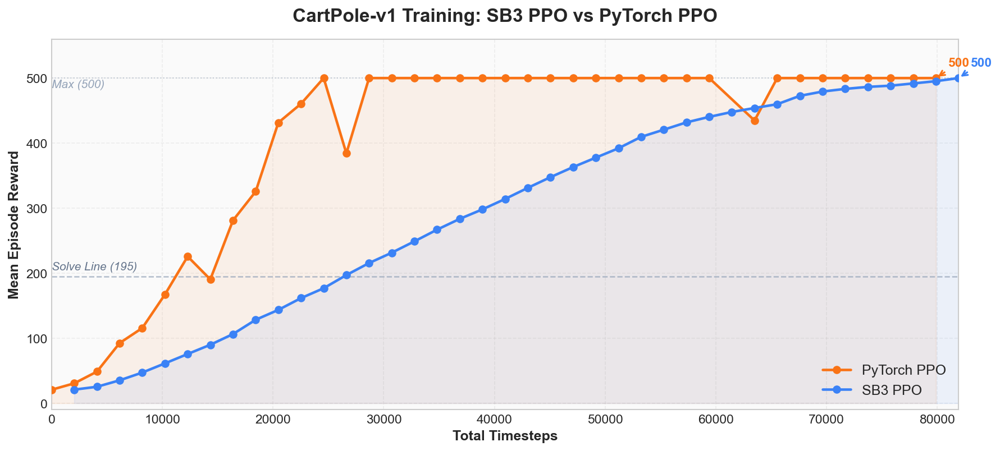

<div style="text-align: center; font-size: 0.9em; color: var(--vp-c-text-2); margin-top: -10px; margin-bottom: 20px;">
  <em>Figure 1-3: Episode mean reward climbs from around 20 to the maximum score of 500. The blue line is SB3 PPO, the orange line is the custom PyTorch PPO. The dashed line marks the 195-point solving threshold.</em>
</div>

Three phases are clearly visible from the figure:

1. **Initial phase (0 ~ 5K Total Timesteps)**:
   Both curves hover around `20 ~ 50`,
   comparable to a _random policy_,
   indicating the model has not yet learned an effective balancing strategy.
2. **Rapid improvement phase (5K ~ 25K Total Timesteps)**:
   Reward quickly climbs from under 100 to above 300,
   crossing the 195-point solving threshold (dashed line in the figure),
   indicating the policy has begun to master balance control.
   PyTorch PPO (orange) converges faster due to its linear learning rate decay.
3. **Convergence phase (after 25K Total Timesteps)**:
   Reward enters the `400 ~ 500` range,
   eventually stabilizing at the maximum `500`.
   Both implementations ultimately achieve an evaluation result of `500.0 +/- 0.0`.

In summary: **a curve that continuously rises and then stabilizes indicates successful training.**
If the curve remains flat throughout or suddenly drops precipitously,
the training process has a problem.

### Policy Entropy

_Policy entropy_ measures the agent's uncertainty in action selection.
Entropy comes from information theory and here reflects the randomness of the policy:
high entropy indicates the agent is still exploring broadly (action distribution near uniform),
while low entropy indicates the agent is converging on the optimal action (action distribution becoming concentrated).

A healthy policy entropy curve should **decline slowly from high to low**,
forming a "scissor cross" with the reward curve --
reward rising while entropy falling is a hallmark of reinforcement learning training.
If entropy drops rapidly to 0 early in training,
the policy has prematurely converged to a possibly suboptimal action pattern,
known as _premature convergence_.

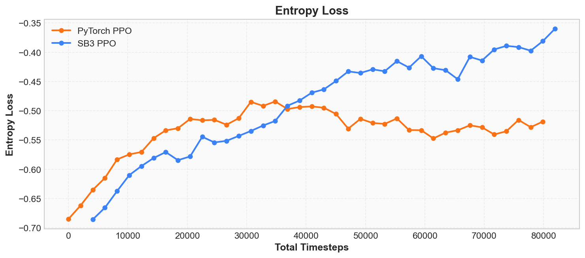

<div style="text-align: center; font-size: 0.9em; color: var(--vp-c-text-2); margin-top: -10px; margin-bottom: 20px;">
  <em>Figure 1-4: Policy entropy declines slowly from high to low, forming a "scissor cross" with the rising reward -- a healthy training signal.</em>
</div>

### Value Loss

PPO internally contains a _Critic_ component
whose task is to predict the _state value function_ --
that is, "the total reward expected from the current state onward."
_Value loss_ measures the discrepancy between the Critic's predictions and the actual returns.

Early in training, the Critic has not yet learned to accurately assess state values (value_loss is large).
As training progresses, the Critic's predictions gradually approach the actual returns (value_loss decreases step by step).

Note:
**value_loss decreasing does not equate to the policy improving.**
It only indicates that the Critic's assessments are more accurate.
The policy's own performance should be judged by mean reward.
If value_loss fails to decrease over a long period or even increases,
it typically means the Critic cannot keep up with the pace of policy changes.

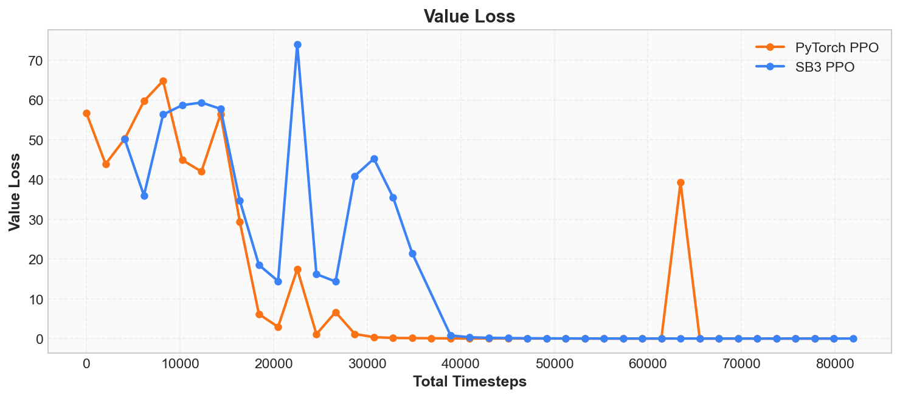

<div style="text-align: center; font-size: 0.9em; color: var(--vp-c-text-2); margin-top: -10px; margin-bottom: 20px;">
  <em>Figure 1-5: Value Loss decreases step by step, indicating the Critic's state value predictions are becoming increasingly accurate.</em>
</div>

### KL Divergence and Clip Fraction

PPO's core idea is "only make small modifications to the policy each time."
To judge whether the modification magnitude is appropriate, we need to monitor two metrics:
_approximate KL divergence_ and _clip fraction_.

KL divergence measures the degree of difference between the old and new policies.
KL = 0 means no change at all; the larger the KL, the more the policy has changed.
During normal training, KL should stay below `0.001 ~ 0.02`;
exceeding `0.03` means the policy update is too large, with a risk of collapse.

Clip fraction represents the proportion of samples in the current update
that triggered PPO's clipping mechanism.
You can think of it as the "safety valve trigger rate."
Normally this value should be in the `5% ~ 15%` range;
occasional spikes are normal fluctuations, but sustained values above `30%` indicate the policy is changing too aggressively.

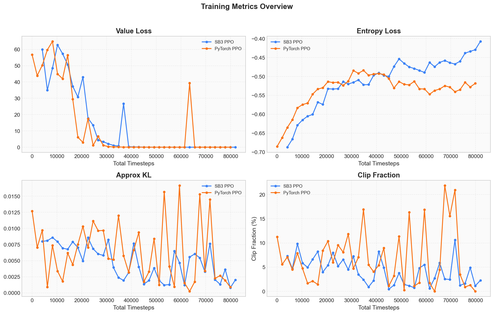

<div style="text-align: center; font-size: 0.9em; color: var(--vp-c-text-2); margin-top: -10px; margin-bottom: 20px;">
  <em>Figure 1-6: Value Loss decreasing, Entropy declining, KL consistently below 0.01, Clip Fraction peaking around 10% and dropping to zero in later stages -- classic healthy PPO signals.</em>
</div>

The four panels above comprehensively display the core signals of the training process:
**Value Loss is decreasing, Entropy is declining,
KL divergence never spirals out of control, and Clip Fraction is not persistently high** --
this is the typical signature of PPO's "continuous updates with controlled magnitude."

### SB3 Log Format

When using `1-ppo_cartpole.py` (Stable-Baselines3 version),
the console output format is as follows:

```
-----------------------------------------
| time/              |                  |
|    fps             | 5342             |
|    iterations      | 1                |
|    time_elapsed    | 3                |
|    total_timesteps | 2048             |
| train/             |                  |
|    entropy_loss    | -0.683           |
|    learning_rate   | 0.0003           |
|    loss            | 0.0124           |
|    policy_gradient_loss | -0.0187     |
|    value_loss      | 8.2741           |
-----------------------------------------
```

How to read this: first check `total_timesteps` to confirm training progress,
then use `value_loss` and `entropy_loss` to assess training status.
The SB3 version, under the 80K-step training configuration,
achieves an evaluation result of `500.0 +/- 0.0`,
with all 5 demonstration episodes scoring `500.0`.

After training completes, run the following command to view the full curves in a browser:

```bash
swanlab watch swanlog
```

### Three Questions Worth Pondering

While observing the curves, try answering the following three questions
to deepen your understanding of the essential characteristics of reinforcement learning training.

<details>
<summary><strong>Question 1: Why is the initial score so low?</strong></summary>

Because the agent has not yet learned any policy.
The mean reward for iteration 1 is only `20.8`,
comparable to a random policy.
CartPole-v1 has a maximum of 500 steps (max score 500),
while a random policy can only sustain about 20 steps on average.

</details>

<details>
<summary><strong>Question 2: Why is the curve jagged rather than smoothly rising?</strong></summary>

Reinforcement learning training uses random sampling,
so the reward curve is not monotonically increasing.
Even in this generally stable training run,
rewards fluctuated:
iteration 9 was `319.0`, iteration 10 dropped to `276.9`,
iteration 11 continued falling to `238.9`,
but iteration 13 bounced back to `410.0`.
Such local reversals are normal;
as long as the overall trend is upward, training is still progressing effectively.

</details>

<details>
<summary><strong>Question 3: What happens if we change <code>total_timesteps</code> to 5000?</strong></summary>

Training will end prematurely,
and the agent may not have reached the "stable 500-point" convergence phase.
From this training data,
truly stable high scores began around iteration 13.
With reduced training time,
the most common outcome is the model hovering between `100 ~ 300` points --
occasionally sustaining long episodes, but with unstable performance overall.

</details>

> **Hands-on experiment**: Change `total_timesteps` to 5000, 10000, and 50000 respectively,
> compare the performance differences after three training runs,
> and get an intuitive feel for the relationship between "training steps" and "learning effectiveness."

---

## Detailed Explanation: Breaking Down Each Metric

The "Quick Understanding" section above covered the four most critical metrics.
The following content will expand on **all** metrics recorded by SwanLab one by one,
including mathematical definitions, interpretation methods, and warning signs.
This section can serve as a reference manual to consult whenever you have questions about a specific metric.

In our training script, SwanLab records comprehensive training metrics,
divided into three major categories:

| Category                         | Metric                 | Meaning                       |
| -------------------------------- | ---------------------- | ----------------------------- |
| **Rollout (Policy Performance)** | `ep_rew_mean`          | Episode mean reward           |
|                                  | `ep_len_mean`          | Episode mean length           |
| **Train (Training Process)**     | `value_loss`           | Critic prediction error       |
|                                  | `entropy_loss`         | Policy randomness             |
|                                  | `policy_gradient_loss` | Policy loss                   |
|                                  | `approx_kl`            | Old vs. new policy difference |
|                                  | `clip_fraction`        | Clip trigger ratio            |
|                                  | `explained_variance`   | Critic fit quality            |
|                                  | `learning_rate`        | Current learning rate         |
|                                  | `loss`                 | Total loss (SB3)              |
|                                  | `clip_range`           | Clip range                    |
|                                  | `n_updates`            | Gradient update count         |
| **Time (Progress Tracking)**     | `total_timesteps`      | Cumulative interaction steps  |
|                                  | `iterations`           | PPO iteration count           |
|                                  | `fps`                  | Steps per second (SB3)        |
|                                  | `time_elapsed`         | Elapsed time (SB3)            |

Below is a comparison of real training curves from SB3 PPO and our custom PyTorch PPO
on the same CartPole task
(both approximately 80K Total Timesteps, 40 iterations):


<div style="text-align: center; font-size: 0.9em; color: var(--vp-c-text-2); margin-top: -10px; margin-bottom: 20px;">
  <em>Figure 1-7: Reward curve comparison between SB3 PPO and custom PyTorch PPO on CartPole. Both converge to 500 points.</em>
</div>

### Episode Reward

_Episode reward_ is the sum of all step rewards within an episode.
In CartPole, each step gives a fixed reward of +1,
so the episode reward equals the total number of steps the pole remained balanced.
In SwanLab this is recorded as `rollout/ep_rew_mean`,
the average reward across all episodes within each _Rollout_
(the process of the policy interacting with the environment to collect data):

$$G = \sum_{t=0}^{T} r_t = T$$

where $T$ is the number of steps when the episode ends.
In CartPole-v1, the upper limit for $T$ is 500.

From the comparison figure above, both implementations converge to 500 points
after approximately 25K~80K Total Timesteps:
PyTorch PPO (orange) first reaches the maximum score around 25K steps,
while SB3 PPO (blue) stabilizes at 500 around 80K steps.
Both follow similar convergence paths, but the PyTorch version converges faster due to linear learning rate decay.

This is the core metric for measuring reinforcement learning agent performance.
A healthy curve should exhibit the following characteristics:

- **Overall upward trend**: the policy is improving.
  If it stays flat from start to finish, training is not working.
- **Rising fast then slowing down**:
  early on, the room for improvement from "completely random" to "basically balanced" is large, so the curve is steep;
  later, improvements become increasingly difficult, and the curve flattens.
- **Eventually stabilizing**:
  the policy converges to a good level,
  and the curve fluctuates slightly around some value.
  The fluctuations come from sampling randomness.

If the curve shows the following anomalies, something is wrong with training:

| Anomaly                                        | Possible Cause                                   | Severity |
| ---------------------------------------------- | ------------------------------------------------ | -------- |
| Sudden crash to 0                              | Policy collapse, learning rate too large         | Critical |
| Never moves (stuck around 20)                  | Policy not learning, poor hyperparameters        | Critical |
| Severe oscillation without convergence         | Training instability, sparse reward signal       | Moderate |
| Stabilizes around 100 without further progress | Insufficient exploration, stuck in local optimum | Moderate |

### Episode Length Mean

`rollout/ep_len_mean` in SwanLab records
the average number of steps across all episodes in each Rollout.
In CartPole,
since each step gives a fixed reward of +1,
episode length and episode reward are numerically identical --
an episode with 200 steps has a reward of 200.

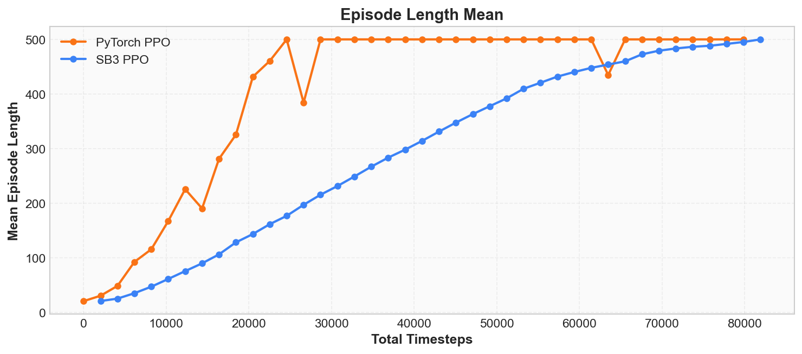

<div style="text-align: center; font-size: 0.9em; color: var(--vp-c-text-2); margin-top: -10px; margin-bottom: 20px;">
  <em>Figure 1-8: Episode mean length and episode mean reward are numerically identical in CartPole.</em>
</div>

If the values are the same, why track this metric separately?
Because **not all environments have rewards equivalent to step counts**.
In later chapters we will encounter more complex environments, where you will find:

- **Non-uniform rewards**: some steps give +0.1, others give +10,
  so reward and length no longer correspond one-to-one.
- **Penalty mechanisms**: certain steps may deduct points (e.g., -5 for hitting a wall),
  in which case high reward may correspond to short episodes.
- **Task objectives**: some tasks require finishing as quickly as possible
  (reaching the goal in minimum steps),
  so long episodes are actually undesirable.

In these scenarios,
_episode length mean_ becomes an important signal
independent of episode reward.
We recommend developing the habit of observing both metrics simultaneously from now on.

### Entropy

The `entropy_loss` in the training log corresponds to the concept of _policy entropy_.
Entropy comes from information theory and measures the degree of uncertainty in a distribution.
For a discrete policy, entropy is defined as:

$$H(\pi) = -\sum_{a} \pi(a | s) \log \pi(a | s)$$

In CartPole there are only two actions (push left and push right), so:

- When uniformly distributed $\pi(\text{left}) = \pi(\text{right}) = 0.5$,
  entropy is maximized at $H = \ln 2 \approx 0.69$.
- When the policy is deterministic $\pi(\text{left}) = 1, \pi(\text{right}) = 0$,
  entropy is minimized at $H = 0$.


<div style="text-align: center; font-size: 0.9em; color: var(--vp-c-text-2); margin-top: -10px; margin-bottom: 20px;">
  <em>Figure 1-9: Policy entropy decreases step by step from $\ln 2 \approx 0.69$, reflecting the transition from random exploration to deterministic decision-making.</em>
</div>

During training, the decrease in entropy from high to low
reflects the process of the policy transitioning from "broad exploration" to "increasing certainty."
If you view Episode Reward and Entropy simultaneously in SwanLab,
you will see the former rising and the latter falling --
the two curves form a scissor cross,
which is a hallmark of reinforcement learning training.

However, lower entropy is not always better.
If entropy drops rapidly to near 0 early in training,
the policy has prematurely converged to a possibly suboptimal action pattern,
known as _premature convergence_.
Reinforcement learning algorithms typically mitigate this problem through _entropy regularization_,
which we will discuss in detail in Chapter 6.

> **Hands-on experiment**: Run [2-pytorch_ppo.py](https://github.com/letslego/hands-on-modern-rl/blob/main/code/chapter01_cartpole/2-pytorch_ppo.py),
> view `rollout/ep_rew_mean` and `train/entropy_loss` simultaneously in SwanLab,
> and observe how the two curves change.

### Value Loss

The `value_loss` in the training log is the loss of the Critic network.
The Critic's job is to predict the _state value function_ $V(s)$,
which represents "the total reward expected from the current state onward."
_Value loss_ measures the gap between the Critic's predictions and the actual returns:

$$\mathcal{L}_{\text{value}} = \frac{1}{|B|} \sum_{i \in B} \left(V(s_i) - G_i\right)^2$$

where $V(s_i)$ is the Critic's predicted value for state $s_i$,
$G_i$ is the actual cumulative reward from that state,
and $B$ is the current batch of samples.


<div style="text-align: center; font-size: 0.9em; color: var(--vp-c-text-2); margin-top: -10px; margin-bottom: 20px;">
  <em>Figure 1-10: Value Loss decreases from high values step by step. The Critic's predictions increasingly match the actual returns.</em>
</div>

Early in training, the Critic has not yet learned to accurately evaluate positions
(value_loss is large).
As training progresses, the Critic's predictions become more accurate
(value_loss decreases step by step).

Note:
**value_loss decreasing does not mean the policy is improving.**
It only indicates the Critic's evaluations are more accurate.
The policy's own performance should be judged by Episode Reward.
If value_loss fails to decrease over a long period or even increases,
it typically means the Critic is not keeping up with the policy's changes.

### Explained Variance

_Explained variance_ is another angle on Critic fit quality.
It is defined as:

$$EV = 1 - \frac{\text{Var}(G - V(s))}{\text{Var}(G)}$$

where $G$ is the actual return and $V(s)$ is the Critic's prediction.
Intuitively:

- **EV = 1**: the Critic's predictions perfectly match the actual returns, with no error.
- **EV = 0**: the Critic's predictions are as bad as simply guessing the mean -- it has learned nothing.
- **EV < 0**: the Critic's predictions are worse than guessing the mean.

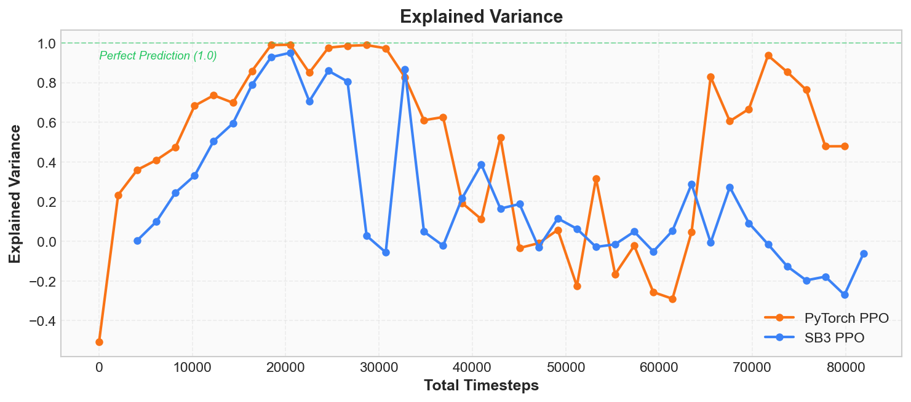

<div style="text-align: center; font-size: 0.9em; color: var(--vp-c-text-2); margin-top: -10px; margin-bottom: 20px;">
  <em>Figure 1-11: Explained Variance trending toward 1 indicates high Critic prediction quality; fluctuations after convergence are normal in low-variance scenarios.</em>
</div>

Early in training, EV may be negative (the Critic's predictions are worse than just taking the mean).
As training progresses, EV gradually increases,
reaching above 0.9 during the phase of rapid policy improvement.
However, you may notice a seemingly anomalous phenomenon:
**after the policy converges (all episodes score 500), EV actually fluctuates or even drops**.
This is because when all returns are identical (variance approaches 0),
the Critic's tiny prediction errors are amplified by the denominator.
This does not mean the Critic has gotten worse -- Value Loss will drop to near 0, indicating the predictions themselves are fine;
it is just that EV as a metric becomes unstable in low-variance scenarios.

It and Value Loss are two perspectives on the same problem:
Value Loss measures "the magnitude of absolute error,"
while Explained Variance measures "the degree of improvement over a mean baseline."
**For judging Critic quality, we recommend primarily using Value Loss, supplemented by EV.**

### Policy Gradient Loss

The `policy_gradient_loss` in the log is the policy network's loss.
Recall the PPO clipped objective introduced in the "Core Principles" section:

$$\mathcal{L}_{\text{policy}} = -\min(r_t \hat{A}_t, \text{clip}(r_t, 1-\epsilon, 1+\epsilon) \hat{A}_t)$$

The magnitude of this value itself is not very important;
what matters is its sign and trend:

- During healthy training,
  this value typically fluctuates within a small range (e.g., -0.01 to -0.02).
- If it suddenly becomes a very large positive or negative number,
  it may indicate a problem with the policy update.

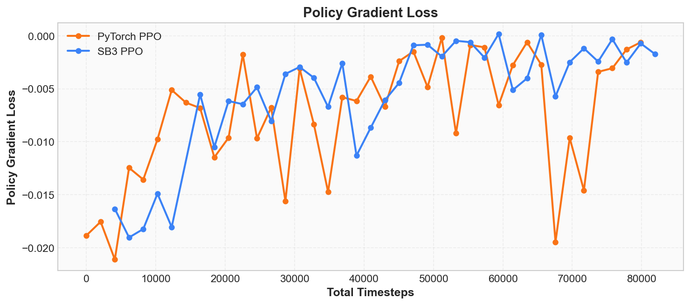

<div style="text-align: center; font-size: 0.9em; color: var(--vp-c-text-2); margin-top: -10px; margin-bottom: 20px;">
  <em>Figure 1-12: Policy Gradient Loss fluctuates within a small range with no extreme values -- the policy update is stable.</em>
</div>

### Total Loss

SB3's log has a `loss` field
(our custom PPO does not record this separately,
because its value can be computed from other metrics).
It is a weighted sum of the policy loss, value loss, and entropy regularization term:

$$\mathcal{L}_{\text{total}} = \mathcal{L}_{\text{policy}} + c_1 \cdot \mathcal{L}_{\text{value}} - c_2 \cdot H(\pi)$$

where $c_1 = 0.5$ (value loss coefficient)
and $c_2 = 0.01$ (entropy coefficient).
This value is the objective the optimizer actually minimizes.
It does not require special attention on its own --
if the individual component metrics are all healthy, the total loss will naturally be healthy as well.
But if you only want to look at a single curve for a quick judgment,
the Total Loss trend can serve as a composite signal.

### Approx KL and Clip Fraction

These two metrics are PPO's exclusive **safety monitors**.
Recall the "Core Principles" section:
PPO's core idea is "only change the policy a little bit each time,"
and these two metrics answer the question --
"how much was changed? Was it too much?"

**Approx KL** measures the degree of difference between the policy before and after the update,
using an approximation of the _KL divergence_ (Kullback-Leibler Divergence):

$$\text{KL}(\pi_{\text{old}} \| \pi_{\text{new}}) \approx \mathbb{E}\left[\log \frac{\pi_{\text{old}}(a|s)}{\pi_{\text{new}}(a|s)}\right]$$

Intuitively: KL = 0 means the old and new policies are identical;
the larger the KL, the further the updated policy has diverged.
PPO's design goal is to keep this value within a very small range,
ensuring each update is a small adjustment rather than a drastic change.

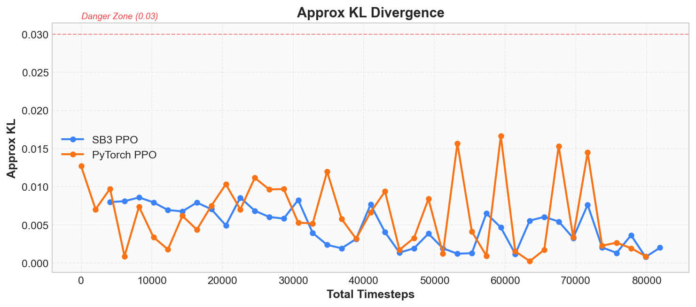

<div style="text-align: center; font-size: 0.9em; color: var(--vp-c-text-2); margin-top: -10px; margin-bottom: 20px;">
  <em>Figure 1-13: Approx KL for SB3 PPO (blue) and custom PyTorch PPO (orange) stays below 0.02 overall, well under the 0.03 warning threshold, indicating each policy update is small -- consistent with PPO's "fine-tuning" design.</em>
</div>

**Clip Fraction** represents the proportion of samples in this update round
that actually triggered PPO's clipping mechanism
(i.e., the _importance sampling ratio_ $r_t$ exceeded the $[1-\epsilon, 1+\epsilon]$ range):

$$\text{ClipFrac} = \frac{1}{|B|} \sum_{i \in B} \mathbb{1}[|r_t - 1| > \epsilon]$$

You can think of the clipping mechanism as a "safety valve" --
it automatically cuts off when the policy changes too much.
Clip Fraction is the proportion of times the safety valve was triggered.
Normally this value should be in a low range; occasional spikes to 15%~20% are normal,
indicating the safety valve is working but not persistently hindering training.

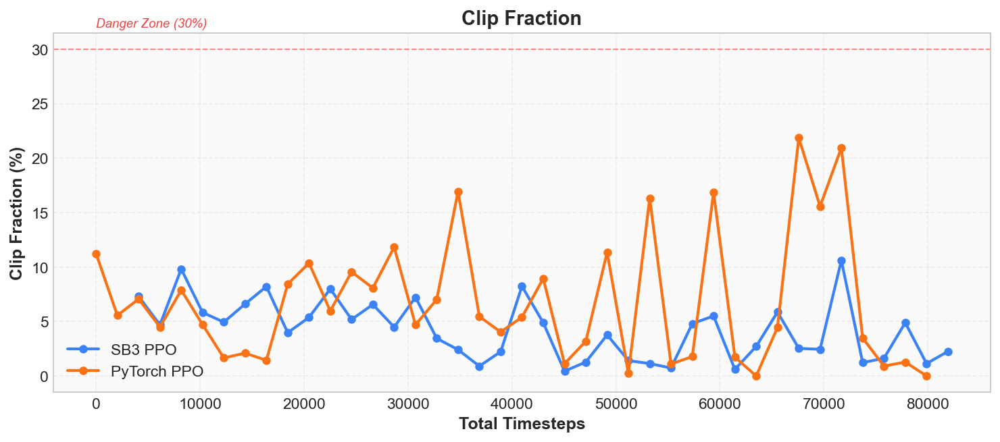

<div style="text-align: center; font-size: 0.9em; color: var(--vp-c-text-2); margin-top: -10px; margin-bottom: 20px;">
  <em>Figure 1-14: Clip Fraction for SB3 PPO and PyTorch PPO occasionally spikes but does not persist at high levels -- the safety valve is working normally.</em>
</div>

| Metric            | Healthy Range | Warning Signal  | Meaning                                                                                |
| ----------------- | ------------- | --------------- | -------------------------------------------------------------------------------------- |
| **Approx KL**     | 0.001 ~ 0.02  | > 0.03          | Single-step policy change too large, risk of collapse                                  |
| **Clip Fraction** | 0% ~ 20%      | Sustained > 30% | Too low means clip range is too wide; too high means policy changes are too aggressive |

> **Hands-on experiment**: Open [2-pytorch_ppo.py](https://github.com/letslego/hands-on-modern-rl/blob/main/code/chapter01_cartpole/2-pytorch_ppo.py),
> find the `clip_eps` parameter, change it from `0.2` to `0.5`, and re-run.
> You will see Clip Fraction drop sharply (the clip range is so wide it almost never triggers),
> while Approx KL increases (the policy is "running unchecked" without constraint).

### Learning Rate

The `learning_rate = 0.0003` in the log is the Adam optimizer's _learning rate_,
which controls the step size of each parameter update:

$$\theta \leftarrow \theta - \alpha \nabla_\theta \mathcal{L}$$

A learning rate that is too large (e.g., 0.01)
makes each update step too big, and the policy easily collapses;
a learning rate that is too small (e.g., 0.000001)
makes each update step insufficient, and training converges extremely slowly.
SB3's default of 0.0003 works well for simple tasks like CartPole.

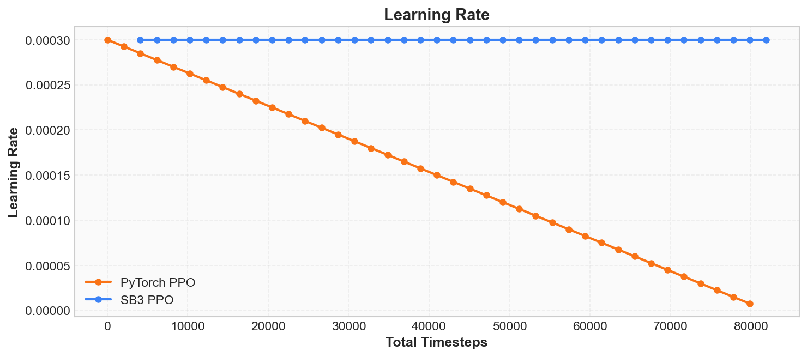

<div style="text-align: center; font-size: 0.9em; color: var(--vp-c-text-2); margin-top: -10px; margin-bottom: 20px;">
  <em>Figure 1-15: SB3 (blue) uses a constant learning rate, while custom PPO (orange) uses linear decay -- both can make CartPole converge.</em>
</div>

The difference between the two curves is visible in the figure:
**SB3 uses a constant learning rate** (always 0.0003),
**while our custom PPO uses linear decay** (linearly decreasing from 0.0003 to 0).
Both strategies allow CartPole to converge,
but linear decay provides gentler updates in later training stages,
helping the policy stabilize.
In subsequent chapters we will see that
learning rate scheduling strategy has a significant impact on training effectiveness.

> **Hands-on experiment**: Open [2-pytorch_ppo.py](https://github.com/letslego/hands-on-modern-rl/blob/main/code/chapter01_cartpole/2-pytorch_ppo.py),
> change the learning rate from `3e-4` to `3e-2` (100x larger), and re-run.
> You will see the training curve oscillate violently or even collapse.

### Clip Range

`train/clip_range` is the $\epsilon$ value in PPO's clipping interval $[1-\epsilon, 1+\epsilon]$,
defaulting to 0.2.
It is a _hyperparameter_ that remains constant during training.
This value determines the clipping "threshold" --
it only becomes meaningful when analyzed together with Clip Fraction
(see the hands-on experiment above).

### N Updates

`train/n_updates` records the total number of _gradient updates_
the optimizer has executed from the start of training to the present.
It is a monotonically increasing counter, computed as:

$$n_{\text{updates}} = \text{iterations} \times \text{epochs} \times \frac{\text{steps\_per\_rollout}}{\text{batch\_size}}$$

In our configuration (10 epochs, 2048 steps, batch_size=64),
each iteration performs $10 \times 2048 / 64 = 320$ updates.
This metric is primarily used to confirm that training progress matches expectations --
if it suddenly stops increasing, training has stalled.

### Time Metrics (Progress Tracking)

The four metrics under the `time/` prefix are all progress information,
not training diagnostic metrics:

| Metric            | Meaning                      | Notes                                                                    |
| ----------------- | ---------------------------- | ------------------------------------------------------------------------ |
| `total_timesteps` | Cumulative interaction steps | Each interaction with the environment (executing one action step) adds 1 |
| `iterations`      | PPO iteration count          | Each "collect data -> update policy" cycle counts as one iteration       |
| `fps`             | Steps per second             | Measures training speed (SB3 only)                                       |
| `time_elapsed`    | Elapsed time (seconds)       | Time from training start to now (SB3 only)                               |

These can be used to estimate remaining training time.
For example, with `fps = 5000` and 10000 steps remaining, approximately 2 seconds are needed.

### Eval Metrics (Post-Training Evaluation)

Our custom PPO runs a 20-episode independent evaluation after training completes
(no exploration, pure deterministic policy), recording two metrics:

| Metric             | Meaning                                 |
| ------------------ | --------------------------------------- |
| `eval/mean_reward` | Mean score over 20 episodes             |
| `eval/std_reward`  | Standard deviation of 20 episode scores |

Eval metrics are fundamentally different from the training-time `rollout/ep_rew_mean` --
during training the agent is still exploring (the policy is stochastic),
while evaluation uses a _deterministic policy_ (choosing the action with the highest probability).
Therefore, eval metrics better reflect the agent's actual capability.
In this CartPole training run, the eval result was `500.0 +/- 0.0`,
indicating the agent has fully mastered balance control.

---

## Metric Quick Reference

### Core Metrics (Training Diagnostics)

| Metric                   | SwanLab Key                  | Mathematical Definition                                                    | Healthy Behavior                       | Warning Signal                                                |
| ------------------------ | ---------------------------- | -------------------------------------------------------------------------- | -------------------------------------- | ------------------------------------------------------------- |
| **Episode Reward**       | `rollout/ep_rew_mean`        | $G = \sum_{t=0}^{T} r_t$                                                   | Continuously rising -> stabilizing     | Crashes to 0 / never moves                                    |
| **Episode Length**       | `rollout/ep_len_mean`        | Mean of episode step counts                                                | Trend consistent with Reward           | Trend diverges from Reward                                    |
| **Entropy**              | `train/entropy_loss`         | $H = -\sum_a \pi(a\|s) \log \pi(a\|s)$                                     | Gradually decreasing from high         | Drops to 0 too fast / never decreases                         |
| **Value Loss**           | `train/value_loss`           | $\frac{1}{\|B\|}\sum(V(s_i) - G_i)^2$                                      | Gradually decreasing                   | Never decreases / increases instead                           |
| **Explained Variance**   | `train/explained_variance`   | $1 - \frac{\text{Var}(G-V)}{\text{Var}(G)}$                                | Trending toward 1                      | Consistently <= 0                                             |
| **Policy Gradient Loss** | `train/policy_gradient_loss` | $-\min(r_t \hat{A}_t, \text{clip}(r_t, 1-\epsilon, 1+\epsilon) \hat{A}_t)$ | Fluctuating in small range             | Sudden extreme values                                         |
| **Total Loss**           | `train/loss`                 | $\mathcal{L}_{\text{policy}} + 0.5 \mathcal{L}_{\text{value}} - 0.01 H$    | Composite signal of healthy components | Sudden spike                                                  |
| **Approx KL**            | `train/approx_kl`            | $\mathbb{E}[\log \pi_{\text{old}}(a\|s) - \log \pi_{\text{new}}(a\|s)]$    | 0.001 ~ 0.02                           | > 0.03 policy update too aggressive                           |
| **Clip Fraction**        | `train/clip_fraction`        | $\frac{1}{\|B\|}\sum \mathbb{1}[\|r_t - 1\| > \epsilon]$                   | 0% ~ 20%                               | > 30% changes too aggressive                                  |
| **Learning Rate**        | `train/learning_rate`        | $\theta \leftarrow \theta - \alpha \nabla \mathcal{L}$                     | SB3 constant; PyTorch linear decay     | Larger -> training collapses; smaller -> converges too slowly |

### Auxiliary Metrics (Progress Tracking)

| Metric              | SwanLab Key            | Meaning                                                 |
| ------------------- | ---------------------- | ------------------------------------------------------- |
| **Clip Range**      | `train/clip_range`     | Clipping parameter $\epsilon$, constant during training |
| **N Updates**       | `train/n_updates`      | Cumulative gradient update count                        |
| **Total Timesteps** | `time/total_timesteps` | Cumulative environment interaction steps                |
| **Iterations**      | `time/iterations`      | PPO iteration count                                     |
| **FPS**             | `time/fps`             | Steps per second (SB3 only)                             |
| **Time Elapsed**    | `time/time_elapsed`    | Training time elapsed (SB3 only)                        |
| **Eval Mean**       | `eval/mean_reward`     | Post-training deterministic policy evaluation score     |
| **Eval Std**        | `eval/std_reward`      | Evaluation score standard deviation                     |

## Chapter Summary

In Chapter 1, we accomplished four things:

1. **Ran our first RL training**:
   Completed CartPole policy learning within seconds.
2. **Learned to observe the training process**:
   Mastered the interpretation of core metrics including Episode Reward, Entropy, Value Loss, and KL divergence,
   and can distinguish between healthy training curves and warning signs.
3. **Understood the basic RL framework**:
   State, action, reward, policy --
   these four elements form the common skeleton of all reinforcement learning problems.
4. **Deconstructed the SB3 implementation**:
   Implemented a complete PPO algorithm in pure PyTorch --
   Actor-Critic network, Rollout collection, GAE advantage estimation, PPO clipped update --
   achieving performance on par with SB3.

It is worth noting:
throughout the training process, we never provided the agent with
explicit rules like "push right when the pole tilts right."
The agent learned entirely through trial and error,
autonomously acquiring a balancing strategy from the +1 feedback signal at each step.

## Panoramic Navigation: Two Routes in RL

The CartPole training we just completed uses the PPO algorithm.
We will not dive into its implementation details yet,
but first understand where it sits in the landscape of reinforcement learning algorithms.

All reinforcement learning algorithms answer the same question:
"how do we make the agent choose actions that maximize cumulative reward?"
But there are two fundamentally different approaches:

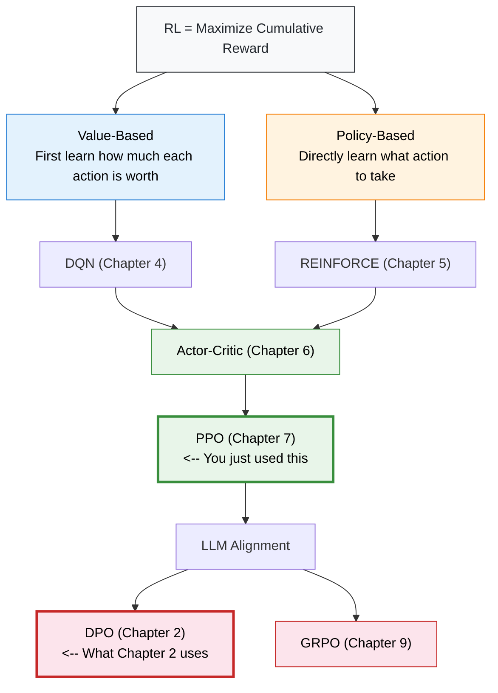

- **Value-Based** (blue): first learn "the value of each action" (Q-value),
  then choose the action with the highest value. The representative algorithm is DQN in Chapter 4.
- **Policy-Based** (orange): skip value estimation
  and directly learn the policy of "what action to take given a state."
  The representative algorithm is REINFORCE in Chapter 5.
- The two routes converge in the **Actor-Critic** architecture --
  Actor learns the policy, Critic learns the value function.
  This is the foundational architecture of PPO.
- In the LLM era,
  DPO bypasses the reward model in PPO,
  and GRPO bypasses the Critic network --
  the pipeline becomes more streamlined, but the underlying logic remains unchanged.

This diagram will reappear at the beginning of each subsequent chapter.
For now, just remember one key point:
**The PPO we used in this chapter is the product of the two routes converging.
The DPO we will introduce in Chapter 2 is a simplified version of PPO for the LLM era.**

In the next chapter, we will see that reinforcement learning is not limited to making a cart balance a pole --
it can also make large language models learn to align with human preferences.
The core loop still consists of the same four elements: state, action, reward, and policy.

## References

[^1]: Mnih, V., et al. (2013). Playing Atari with Deep Reinforcement Learning. _arXiv preprint_. [arXiv:1312.5602](https://arxiv.org/abs/1312.5602)

[^2]: Raffin, A., et al. (2021). Stable-Baselines3: Reliable Reinforcement Learning Implementations. _Journal of Machine Learning Research_, 22(268), 1-8.

[^3]: Sutton, R. S., et al. (1999). Policy Gradient Methods for Reinforcement Learning with Function Approximation. _Advances in Neural Information Processing Systems_, 12.
