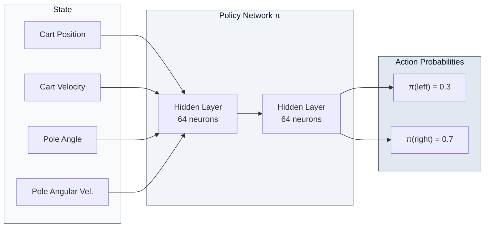
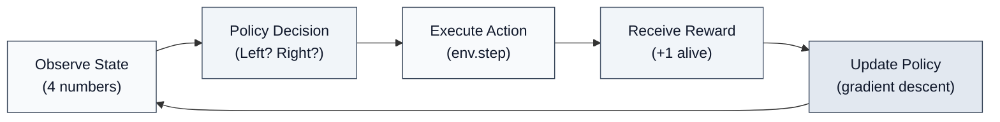
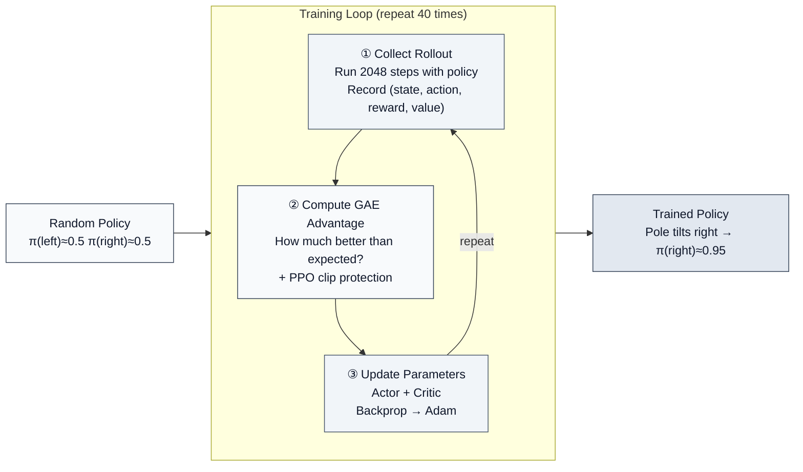

# 1.1 State, Action, Reward, and Policy

> 📁 **Chapter code**: [1-ppo_cartpole.py](https://github.com/letslego/hands-on-modern-rl/blob/main/code/chapter01_cartpole/1-ppo_cartpole.py) · [2-pytorch_ppo.py](https://github.com/letslego/hands-on-modern-rl/blob/main/code/chapter01_cartpole/2-pytorch_ppo.py) · [requirements.txt](https://github.com/letslego/hands-on-modern-rl/blob/main/code/chapter01_cartpole/requirements.txt)

In the previous section, you ran CartPole end to end and watched an agent improve from random actions to stable balancing. But running code is not the same as understanding reinforcement learning.

RL as a learning paradigm has a foundation that differs from supervised and unsupervised learning. Long before the term "reinforcement learning" became standard, the core idea was already present in behavioral psychology: **trial-and-error learning**. Edward Thorndike's Law of Effect (early 20th century) captured the intuition: behaviors that lead to satisfying outcomes are reinforced; behaviors that lead to annoying outcomes are weakened. Decades later, Andrew Barto and Richard Sutton formalized these ideas into the modern RL framework with the Markov Decision Process (MDP) and four core objects: **state, action, reward, and policy** (Sutton & Barto, 1998).

This framework is extremely general. It applies not only to CartPole, but also to Go (Silver et al., 2016), robotics control (Levine et al., 2016), and post-training for large language models (Ouyang et al., 2022). Different tasks change the concrete meaning of "state/action/reward", but the underlying structure stays the same.

In this section we return to CartPole and unpack its:

1. state representation
2. action space
3. reward mechanism
4. decision policy

### 1.1.1 State: What Does the Agent Observe?

At every step, CartPole provides the agent with a 4-dimensional observation vector. These bounds are not manually defined; they are built into the Gymnasium environment. A few lines of code reveal them:

```python
import gymnasium as gym
import numpy as np

env = gym.make("CartPole-v1")
print(f"Observation upper bound: {env.observation_space.high}")
print(f"Observation lower bound: {env.observation_space.low}")
print(
    f"Termination thresholds: position ±{env.unwrapped.x_threshold}, "
    f"angle ±{env.unwrapped.theta_threshold_radians:.4f} rad "
    f"(≈ ±{np.degrees(env.unwrapped.theta_threshold_radians):.0f}°)"
)
```

Example output:

```
Observation upper bound: [4.8         inf 0.41887903  inf]
Observation lower bound: [-4.8         -inf -0.41887903 -inf]
Termination thresholds: position ±2.4, angle ±0.2094 rad (≈ ±12°)
```

Organized into a table, this is the 4-dimensional observation vector the agent receives each frame:

| Index | Meaning               | Space bounds                   | Typical range            |
| ----- | --------------------- | ------------------------------ | ------------------------ |
| 0     | cart position         | -4.8 to 4.8                    | -4.8 to 4.8              |
| 1     | cart velocity         | unbounded (`inf`)              | about -3 to +3           |
| 2     | pole angle            | -0.4189 to 0.4189 rad (≈ ±24°) | about -0.21 to +0.21 rad |
| 3     | pole angular velocity | unbounded (`inf`)              | about -3 to +3           |

::: warning Why are velocities `inf`?
Cart velocity and pole angular velocity have no hard caps — they are computed by the physics engine each frame and can theoretically take any value. Gymnasium therefore uses `inf` as the bound. In practice, episodes terminate quickly (the pole falls and triggers a reset), so these values typically stay in the **-3 to +3** range, far from "infinity."
:::

These 4 numbers form a complete description of the current situation. The agent cannot access the environment's internal state-transition rules or physics parameters; all information it uses for decisions is encoded in this 4D observation.

In reinforcement learning, "state" is a numerical description of the environment's current situation. Different tasks have different state representations — the state in chess is the piece distribution across the board, in autonomous driving it is camera images and radar data, and in CartPole it is these 4 numbers. In fact, the choice of state representation has a profound impact on RL algorithm performance. In early research, states were typically hand-crafted features (such as robot joint angles and angular velocities). With the rise of deep learning, researchers began using high-dimensional raw observations (such as pixels) directly as states, letting neural networks learn useful feature representations on their own (Mnih et al., 2013). This is a trend we will see repeatedly throughout this book — from hand-crafted features to learned features.

### 1.1.2 Action: What Can the Agent Do?

CartPole's action space is as simple as it gets: two discrete actions.

| Action | Meaning             |
| ------ | ------------------- |
| 0      | push the cart left  |
| 1      | push the cart right |

There is no "do nothing" and no continuous magnitude (no "push lightly vs. strongly"). This limited, discrete set of actions is the most common type of action space in RL (called a `Discrete` action space). However, not all tasks have such simple action spaces. In Chapter 11, we will encounter continuous action spaces — such as controlling a robot's joint angles — which require fundamentally different handling. In fact, the type of action space (discrete vs. continuous) largely determines the choice of algorithm. Q-learning-style algorithms are naturally suited to discrete action spaces, while policy gradient methods (like the PPO we use here) can handle both — which is one reason PPO is widely adopted in industry.

### 1.1.3 Reward: What Is Being Optimized?

::: tip Reward rules

- **Each surviving step → +1 point** (including the terminating step)
- **Episode termination conditions**: pole angle exceeds ±12°, or cart position exceeds ±2.4
- **Maximum score = 500 points** (CartPole-v1's step limit)
  :::

The two termination thresholds (±2.4 and ±12°) also come from the environment itself, as verified by the printout above: `env.unwrapped.x_threshold` returns 2.4, and `env.unwrapped.theta_threshold_radians` returns approximately 0.2094 rad (i.e., 12°). The 500-step limit can be confirmed via `env.spec.max_episode_steps`:

```python
print(f"Max episode steps: {env.spec.max_episode_steps}")  # Output: 500
```

This design appears simple, but it embodies a deep insight. Richard Sutton proposed the famous "Reward Hypothesis" in his classic textbook: all goals can be described as "maximizing the expected cumulative reward signal" (Sutton & Barto, 2018). In CartPole, this reward signal is +1 per step — as long as the pole has not fallen, the agent receives a positive reward.

However, this seemingly intuitive reward design actually hides a core challenge: **the reward signal is delayed and sparse**. The agent receives +1 at each step, but it cannot directly determine which specific step's decision caused the episode to terminate early or continue. It only knows "this episode lasted 50 steps in total"; whether pushing left or pushing right at step 23 was better requires inference across many rounds of interaction.

This property — "the reward signal only reflects overall outcome quality, without indicating which specific step's decision was better" — is one of the core features that distinguishes RL from supervised learning. In supervised learning, each training sample has a clear label as the correct answer; in RL, there is only the final total return, and the agent must infer the intermediate process through repeated interaction. Consider learning to ride a bicycle: the learner does not master it because someone precisely instructs "left foot 30%, right foot 20%" at every moment, but rather gradually perceives through repeated attempts which actions help maintain balance.

### 1.1.4 Policy: The Rule for Choosing Actions

Stringing together the three elements above gives us the core concept of RL — **Policy**.

A policy is "the rule for choosing action $a$ in state $s$." In CartPole, the policy answers the question: **"Given the current cart position, velocity, pole angle, and angular velocity, should I push left or right?"**

Mathematically, a policy is a mapping from states to action probability distributions: $\pi(a|s)$. In a discrete action space, it outputs the probability of each action being selected. At the start of training, $\pi(\text{left}) \approx 0.5, \pi(\text{right}) \approx 0.5$ (random initialization); after training, $\pi$ learns to output $\pi(\text{right}) \approx 0.95$ when the pole tilts right.



You might ask: **Does a policy have to be a neural network?**

The answer is **no**. A policy is simply a mapping rule from states to actions; it can take any form. In fact, before deep learning became dominant, RL policies had three classic forms:

- **Tabular Policy**: Build a table that hard-codes the optimal action for each state. For example, in chess, one could theoretically use a table to record the optimal move for every board position. However, when the state space is large (Go has approximately $10^{170}$ possible positions), the storage requirements of a table far exceed the capacity of any physical device.
- **Linear Policy**: Use a linear function $\pi(a|s) = \text{softmax}(W \cdot s + b)$ to map states to action probabilities. Computationally simple and convenient for theoretical analysis, but limited to learning linear decision boundaries — insufficient for nonlinear relationships like "the combination of pole angle and angular velocity determines which way to push."
- **Neural Network Policy**: Use multiple nonlinear transformations to fit $\pi(a|s)$. This is the small 4→64→64→2 network we saw in Section 1.1.6. It can be trained end-to-end with gradient descent and is guaranteed by the universal approximation theorem — as long as the network is wide enough, it can approximate any continuous function.

For the simple CartPole task, all three policy types can work. But when the state space grows from 4 dimensions to 84×84×4 pixels (Atari games [^1]), or to tens of thousands of text tokens (large language models), tabular and linear policies are no longer viable — the state space is too large to store or learn effectively.

Notably, the evolution of policy representation methods parallels the evolution of feature extraction methods in computer vision. Before 2012, image features were mainly hand-crafted (SIFT, SURF, HOG); after AlexNet, there was a gradual shift toward automatic learning by neural networks. RL policies underwent a similar transition from hand-crafted (tabular and linear) to end-to-end learning (neural networks). The key driver of this shift was also the growth of data and compute power — when the state space is large enough and training data is sufficient, the advantages of neural network policies become undeniable.

Therefore, **neural networks have become the standard choice in modern RL not because they are the only option, but because they are the only general solution that can handle high-dimensional, complex states.** From CartPole to Atari to LLMs, all policies in this book are implemented as neural networks — but their core idea is the same: input a state, output action probabilities, and optimize via gradient descent.

### 1.1.5 Summary: The RL Core Loop

Combining the four elements above gives us the core loop of reinforcement learning:



In CartPole, this loop means:

1. **Observe state**: The environment tells the agent the current 4 numbers (position, velocity, angle, angular velocity)
2. **Policy decision**: The policy network computes the probabilities of "push left" and "push right" from these 4 numbers
3. **Execute action**: Randomly select an action according to the probabilities and pass it to the environment
4. **Receive reward**: If the pole hasn't fallen, receive +1 point and the next 4 numbers
5. **Update policy**: Based on this episode's performance (total score), adjust the policy network's parameters

This loop applies not only to CartPole — it applies to all RL problems. Replace "cart position" with "board layout," "push left/right" with "move position," and "+1 alive" with "win/lose," and this loop becomes the training process for a Go AI. Replace "4 numbers" with "camera pixels," "push left/right" with "steering angle," and this loop becomes the training process for autonomous driving.

Different tasks only change the specific definitions of state, action, and reward; the underlying structure is always these four elements.

### 1.1.6 Opening the Black Box: What Does SB3 Hide?

So far, we have successfully run CartPole training, read the training curves, and identified state, action, reward, and policy — the four core elements of RL. But throughout this exploration, one component has remained a black box: the line `model.learn(total_timesteps=80000)`. It is just a few characters, yet it completes the entire learning process from random initialization to an optimal policy in seconds.

SB3 encapsulates a great deal of engineering detail — this encapsulation allows us to avoid complex math and lengthy code in Chapter 1. But without understanding its internal mechanisms, the content in later chapters on policy gradients (Chapter 5) and PPO (Chapter 7) will seem to appear out of nowhere. Just as you can drive a car without understanding every engine component — but if you want to build one yourself, you need to open the hood.

Therefore, before concluding this chapter, we need to understand the internal structure of this black box.

The logic behind `model.learn()` can be decomposed into three components: **an Actor-Critic network for decision-making and evaluation, a Rollout loop for collecting experience data, and PPO update rules for adjusting network parameters based on return signals.** We have implemented it in its entirety using pure PyTorch; the code is in [2-pytorch_ppo.py](https://github.com/letslego/hands-on-modern-rl/blob/main/code/chapter01_cartpole/2-pytorch_ppo.py). Let us examine the core logic of each component.

#### 1.1.6.1 Actor-Critic Network: Both Decision-Making and Evaluation

In Section 1.1.4, we said that the policy $\pi$ is a function that "takes a state as input and outputs action probabilities." For a long time, researchers used only a single policy network for decision-making — this is how policy gradient methods worked (Williams, 1992). However, pure policy gradient methods have a significant weakness: high variance. Gradients trained on the same batch of data may point in completely different directions, leading to unstable training. To address this problem, researchers introduced a "critic" to reduce variance — this is the origin of the Actor-Critic architecture (Sutton et al., 2000; Mnih et al., 2016).

The core idea of Actor-Critic is a division of labor:

- **Actor**: The policy network; takes a state as input and outputs the probability of each action.
- **Critic**: Takes a state as input and outputs a score — "the expected total future reward starting from this state."

```python
class ActorCritic(nn.Module):
    def __init__(self, obs_dim=4, act_dim=2, hidden=64):
        super().__init__()
        self.actor = nn.Sequential(
            nn.Linear(obs_dim, hidden), nn.ReLU(),
            nn.Linear(hidden, hidden), nn.ReLU(),
            nn.Linear(hidden, act_dim),
        )
        self.critic = nn.Sequential(
            nn.Linear(obs_dim, hidden), nn.ReLU(),
            nn.Linear(hidden, hidden), nn.ReLU(),
            nn.Linear(hidden, 1),
        )

    def forward(self, x):
        logits = self.actor(x)       # action scores
        value = self.critic(x)       # state value
        return logits, value
```

Actor and Critic use **separate hidden layers** to avoid gradient conflicts. The Actor outputs logits (e.g., [0.3, 0.7]), which are converted to probabilities via softmax — "30% push left, 70% push right." The Critic outputs a scalar representing "how good the current situation is."

An important detail: **orthogonal initialization**. The Actor's output layer uses a very small gain (0.01), making the initial policy close to a uniform distribution (50/50), ensuring sufficient exploration early in training. This is fully consistent with SB3's default behavior.

#### 1.1.6.2 Collecting Trajectories (Rollout): One Round of Agent-Environment Interaction

With the network, the next step is to let it interact with the environment and collect training data. This process is called a **Rollout**:

```python
def collect_rollout(model, env, num_steps=2048):
    obs, _ = env.reset()
    transitions = []

    for _ in range(num_steps):
        obs_tensor = torch.FloatTensor(obs)
        with torch.no_grad():
            action, log_prob, value = model.get_action(obs_tensor)

        next_obs, reward, terminated, truncated, _ = env.step(action.item())

        transitions.append({
            "obs": obs, "action": action.item(),
            "log_prob": log_prob.item(), "value": value.item(),
            "reward": float(reward),
            "terminated": terminated,  # pole fell; episode ends naturally
            "truncated": truncated,    # step limit reached (pole still up)
            "next_obs": next_obs if truncated and not terminated else None,
        })

        obs = next_obs
        if terminated or truncated:
            obs, _ = env.reset()

    return transitions, last_bootstrap
```

This code has a **critical engineering detail**: it distinguishes between `terminated` (the pole fell, the episode ends naturally) and `truncated` (the 500-step limit is reached, but the pole is still balanced). This distinction significantly affects training performance — if truncated episodes are treated the same as `terminated`, the value function would be incorrectly set to zero at truncation points, and the agent would learn that "reaching 500 steps is bad," making it impossible to converge to the optimal policy. This is one of the common pitfalls in RL engineering practice; the accompanying code handles it correctly.

Another noteworthy aspect: the sampling method in the accompanying code does not directly choose the most probable action, but **samples according to probabilities**:

```python
dist = torch.distributions.Categorical(logits=logits)
action = dist.sample()  # sample according to probabilities, not argmax
```

Even if the network outputs a 90% probability of pushing right, there is still a 10% chance of choosing left. This randomness ensures continued exploration, corresponding to the "policy entropy" we discussed in Section 1.2.

#### 1.1.6.3 GAE Advantage Estimation: How Much Better Than Expected?

After collecting data, PPO needs to answer a question: **How much better than "average" was each action?** This is the concept of "advantage."

In fact, the concept of "advantage" can be traced back to the TD error in Temporal Difference Learning (Sutton, 1988). The TD error measures "how much better the actual reward was than expected." However, single-step TD error relies more on value function estimation and typically has low variance but high bias; Monte Carlo or long multi-step returns rely more on actual sampled returns and typically have low bias but high variance. Schulman et al. proposed GAE (Generalized Advantage Estimation) in 2016, which uses a parameter $\lambda$ to smoothly trade off between bias and variance:

```python
def compute_gae(model, transitions, last_bootstrap, gamma=0.99, lam=0.95):
    for step in reversed(range(len(transitions))):
        t = transitions[step]
        if t["terminated"]:
            # True termination: V(s') = 0
            delta = rewards[step] - values[step]
            gae = delta
        elif t["truncated"]:
            # Time truncation: bootstrap with V(next_obs)
            delta = rewards[step] + gamma * bootstrap_values[step] - values[step]
            gae = delta
        else:
            # Normal step
            delta = rewards[step] + gamma * next_value - values[step]
            gae = delta + gamma * lam * gae  # propagate

        next_value = values[step]
```

Intuitively, `delta` answers the question: "The reward received at this step + the expected value of the next step - the expected value of this step." If `delta > 0`, this step was better than expected; if `delta < 0`, it was worse than expected. GAE combines multi-step deltas through `gamma * lam * gae` to form a more stable, lower-variance advantage estimate. When $\lambda = 0$, GAE reduces to single-step TD error (low variance but high bias); when $\lambda = 1$, GAE reduces to Monte Carlo return (low bias but high variance). In practice, $\lambda = 0.95$ is commonly used to balance the two.

#### 1.1.6.4 PPO Update: Clipping for Stable Training

The final step is to use advantages to update the network. Before PPO, policy gradient methods faced a fundamental dilemma: too small a learning rate meant training was too slow, while too large a learning rate could cause the policy to collapse in a single step. In 2015, Schulman et al. proposed TRPO (Trust Region Policy Optimization), which constrains the KL divergence between the old and new policies to limit the magnitude of each update. TRPO has good theoretical properties but is complex to implement — requiring natural gradient and conjugate gradient computation. In 2017, Schulman et al. further proposed PPO (Proximal Policy Optimization), which replaces the KL constraint with a simple clipping trick, maintaining training stability while greatly simplifying the implementation:

```python
def ppo_update(model, optimizer, transitions, advantages, returns, clip_eps=0.2):
    for epoch in range(10):  # train on the same data for 10 epochs
        for batch in mini_batches:
            logits, values = model(batch_obs)
            new_log_probs = dist.log_prob(batch_actions)

            # Ratio: probability ratio of new vs. old policy
            ratio = exp(new_log_probs - old_log_probs)

            # PPO clipped objective: limit ratio to [0.8, 1.2]
            surr1 = ratio * advantages
            surr2 = clamp(ratio, 1-clip_eps, 1+clip_eps) * advantages
            policy_loss = -min(surr1, surr2).mean()

            # Critic also needs to learn
            value_loss = ((values - returns) ** 2).mean()

            # Entropy bonus: encourage exploration
            entropy = dist.entropy().mean()

            loss = policy_loss + 0.5 * value_loss - 0.0 * entropy
            loss.backward()
            optimizer.step()
```

The meaning of clipping is straightforward: if the difference between the new and old policies already exceeds 20% (`clip_eps=0.2`), further change in that direction is no longer encouraged. It is like a driving instructor who does not let a student make large steering adjustments at once, but instead allows only small corrections each time.

Each PPO update step also records two health metrics: **KL divergence** (measuring the difference between old and new policies) and **clip fraction** (the proportion of samples that were clipped). These two metrics are visible in the SwanLab dashboard — excessively large KL divergence indicates too-large single-step updates, and an excessively high clip fraction indicates overly rapid policy changes; both warrant attention.

#### 1.1.6.5 The Complete Pipeline

We have now seen three components: the Actor-Critic network, Rollout collection, and PPO updates. The complete runnable code is in [2-pytorch_ppo.py](https://github.com/letslego/hands-on-modern-rl/blob/main/code/chapter01_cartpole/2-pytorch_ppo.py). The core skeleton is:



```python
model = ActorCritic()
optimizer = Adam(model.parameters(), lr=3e-4)
env = gym.make("CartPole-v1")

for iteration in range(40):
    # Step 1: Collect experience data (2048 steps)
    transitions, bootstrap = collect_rollout(model, env, 2048)

    # Step 2: Compute GAE advantages
    advantages, returns = compute_gae(model, transitions, bootstrap)

    # Step 3: PPO update (train on the same data for 10 epochs)
    metrics = ppo_update(model, optimizer, transitions, advantages, returns)
```

These three steps looping together constitute the essence of `model.learn(total_timesteps=80000)`. SB3 wraps this loop into a single line of code and provides a comprehensive set of well-validated default hyperparameters (learning rate, batch size, clip range, GAE parameters, etc.), enabling users to complete training without worrying about underlying details.

Our [2-pytorch_ppo.py](https://github.com/letslego/hands-on-modern-rl/blob/main/code/chapter01_cartpole/2-pytorch_ppo.py) implements the same logic in pure PyTorch — independent Actor-Critic networks, orthogonal initialization, correct truncation handling, GAE advantage estimation, PPO clipping, and SwanLab metric logging — achieving results comparable to SB3, with all 20 evaluation episodes scoring a perfect 500.

> **Hands-on experiment**: Run both scripts simultaneously and compare SB3 and the from-scratch PPO training curves in SwanLab:
>
> ```bash
> python 1-ppo_cartpole.py      # SB3 version
> python 2-pytorch_ppo.py       # from-scratch version
> swanlab watch swanlog          # view comparison curves
> ```

Looking back at this section, the `model.learn()` line you wrote in Section 1.1 is powered by repeatedly executing the three-step loop above: collect data, compute advantages, and update parameters. Starting from random initialization, the policy network adjusts its decision preferences with each iteration — actions that yield higher returns are gradually reinforced, while actions that cause the pole to fall are gradually suppressed. The entire process requires no manually specified decision rules; the only drivers of learning are the reward signal and gradient descent. This is the fundamental working principle of reinforcement learning.

> **Key insight**: From now on, when you see `model.learn()` or `trainer.train()` in any RL library, it should no longer feel mysterious. Their core skeleton is the same three-step loop as above — the differences lie only in the details of "how to compute advantages" and "how to limit update magnitude." All subsequent chapters in this book are essentially answering these two questions.

## References

[^1]: Mnih, V., et al. (2013). Playing Atari with Deep Reinforcement Learning. _arXiv preprint_. [arXiv:1312.5602](https://arxiv.org/abs/1312.5602)

[^2]: Raffin, A., et al. (2021). Stable-Baselines3: Reliable Reinforcement Learning Implementations. _Journal of Machine Learning Research_, 22(268), 1-8.

[^3]: Williams, R. J. (1992). Simple statistical gradient-following algorithms for connectionist reinforcement learning. _Machine Learning_, 8(3-4), 229-256. [DOI](https://doi.org/10.1007/BF00992696)

[^4]: Sutton, R. S., & Barto, A. G. (2018). _Reinforcement Learning: An Introduction_ (2nd ed.). MIT Press.

[^5]: Schulman, J., et al. (2017). Proximal Policy Optimization Algorithms. _arXiv preprint_. [arXiv:1707.06347](https://arxiv.org/abs/1707.06347)

[^6]: Schulman, J., et al. (2016). High-Dimensional Continuous Control Using Generalized Advantage Estimation. _ICLR 2016_.

[^7]: Silver, D., et al. (2016). Mastering the Game of Go with Deep Neural Networks and Tree Search. _Nature_, 529(7587), 484-489.

[^8]: Ouyang, L., et al. (2022). Training language models to follow instructions with human feedback. _NeurIPS 2022_.
