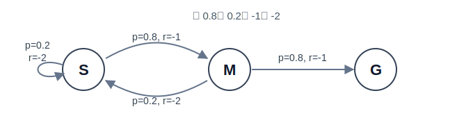
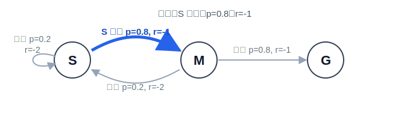
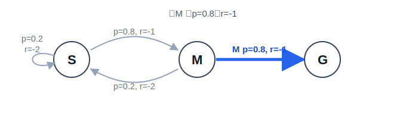
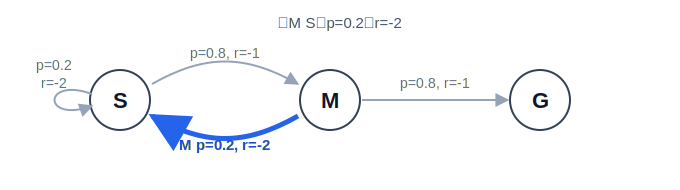

# 3.4 DP, MC, and TD: Three Methods for Value Estimation

## Section Preview

**Key Ideas**

- Value table: In a finite-state problem, start by storing a current estimate $V(s)$ for every state.
- DP, MC, TD: Three ways to update the same value table, differing only in where the update "target" comes from.
- TD error: Use "one-step real reward + the next state's table value" to measure how wrong the current prediction is.

In the previous section, we explained what $V^\pi(s)$ means: starting from state $s$, continue following policy $\pi$, and ask how much return you can expect on average in the future. If we push this concept down to implementation, it becomes a **value table**. Each row corresponds to a state, and each cell stores the current estimate:

| State | Current estimate of $V(s)$ |
| ----- | -------------------------- |
| $S$   | 0                          |
| $M$   | 0                          |
| $G$   | 0                          |

Learning a value function is, in essence, repeatedly editing this table. The real question is not "what is the definition of a value function", but:

**When we update a particular entry, what number should we write into it?**

In the previous section, we saw how the Bellman equation characterizes state values. Suppose the current state is $s$, the policy is $\pi$, and the true state value is $V^\pi(s)$. If the value table were already accurate, then $V^\pi(s)$ would satisfy:

$$
V^\pi(s)
=
\mathbb{E}_\pi\left[
R_{t+1}+\gamma V^\pi(S_{t+1})
\mid S_t=s
\right].
$$

This equation is a self-consistency relation: the left-hand side is the true value of the current state, and the right-hand side is the expectation of "one-step reward plus the true value of the next state". Put differently, if the table were correct, then recomputing the value from the next step should agree with the number already stored in the table.

But at the start of learning, what we have is not $V^\pi$, but an imperfect estimate table $V$. So in algorithms, we read the Bellman equation as an update rule: compute the right-hand side using whatever information we currently have, call it the update target (target), and then move the old $V(s)$ toward this target. This target is not an extra assumption; it is simply the Bellman right-hand side made computable under the information we currently possess.

In this section we will explain DP, MC, and TD from the perspective of "editing the table". First, let us clarify one term: the **environment model** is the mathematical description of the environment's rules. That is, after taking action $a$ in state $s$, with what probability do we reach each next state $s'$, and what average reward do we get? In symbols, this is the transition probability $P(s'\mid s,a)$ and the reward function $R(s,a)$. DP knows these rules and can compute a Bellman target directly from the model; MC does not know the model, so it must wait until an entire episode ends and then use the full return to edit the table; TD also does not know the model, but it does not wait for termination: after a single step it updates using "immediate reward + the next state's current table value". All three methods estimate the same value table; they differ only in where their update targets come from.

> Once we know that a value function should satisfy a Bellman relation, how do we actually compute these values in finite-state problems? If the environment model is unknown, can we still update values using only sampled experience?

::: info Core Concepts
DP, MC, and TD are all updating a value table. DP computes targets from known rules, MC computes targets from full-episode realized returns, and TD computes targets from one-step realized rewards plus the next cell's current estimate.
:::

**Core Formulas**

$$
V_{k+1}(s)
\leftarrow
\sum_a\pi(a\mid s)
\left[
R(s,a)+\gamma\sum_{s'}P(s'\mid s,a)V_k(s')
\right]
\quad \text{(DP policy evaluation: iterate the value table when the model is known)}
$$

$$
V(s)\leftarrow V(s)+\alpha\left[G_t-V(s)\right]
\quad \text{(MC update: correct the current estimate using the full return)}
$$

$$
V(s)\leftarrow V(s)+\alpha\left[r+\gamma V(s')-V(s)\right]
\quad \text{(TD(0) update: bootstrap immediately after one step)}
$$

$$
\delta=r+\gamma V(s')-V(s)
\quad \text{(TD error: the gap between the one-step Bellman target and the old prediction)}
$$

> **Read the formulas as "editing the table":**
>
> - $V(s)$: the current number stored in the cell for state $s$.
> - $V_k(s)$: the old number in that cell during the $k$-th sweep.
> - $P(s'\mid s,a)$, $R(s,a)$: environment rules used by DP to compute targets.
> - $G_t$: the full return observed after an episode ends (MC).
> - $r+\gamma V(s')$: the one-step target constructed immediately after a transition (TD).
> - $\alpha$: how far we move the old number toward the target.
> - $\delta$: the discrepancy between the TD target and the old table value.

<span id="policy-evaluation"></span>

## How a Value Table Gets Updated

In the previous section, the value function answered: "Starting from this state, about how much is the future worth?" Now let us narrow the question further. Suppose the policy $\pi$ is given. We treat it as the object to be evaluated and ask what score each state should receive when the agent follows this policy under the current rules. For example, in a corridor the agent may be biased toward moving right; in GridWorld it may pick directions by some fixed rule. What we care about is:

Starting from state $s$ and continuing to follow this policy, what return do we expect on average?

That number is $V^\pi(s)$.

The previous section already gave the mathematical definition:

$$
V^\pi(s)=\mathbb{E}_\pi[G_t\mid S_t=s],
\qquad
G_t=R_{t+1}+\gamma R_{t+2}+\gamma^2R_{t+3}+\cdots.
$$

$V^\pi(s)$ is the average of all possible future returns after "start from $s$ and act according to $\pi$". But this definition is not yet an executable update step. To compute it exactly, one would need to enumerate all possible trajectories starting from $s$, the probability of each trajectory, and the corresponding full return. In most practical problems, that is impossible.

This is exactly what Sutton and Barto call the prediction problem in Chapter 6: given a policy $\pi$, estimate its value function $v_\pi$[^4]. During learning, an algorithm does not directly observe the true $v_\pi$, because it is a conditional expectation: an average over all possible future returns given that we start from $s$ and keep acting according to $\pi$, not the return from a single specific trajectory. In practice, the algorithm can only sample a limited number of trajectories; it cannot exhaust all possibilities. So it maintains a current estimate $V$ and then uses newly obtained information to gradually correct it.

This requires a crucial intermediary: use a **currently available estimator** to stand in for the unknown true $v_\pi$ and to correct $V(S_t)$. Sutton and Barto simply call this estimator the target.

The core difference among the three classic methods is precisely how they construct this target.

**DP** assumes the full environment model is known. It uses the Bellman expectation equation to expand all action branches under the policy and all next-state branches under the dynamics, and then computes the expectation directly. Because the model provides the probability and reward of every branch, DP does not need to sample real experience. A single sweep over the state table completes one round of updates.

**MC** does not assume the model is known. It waits until an entire episode ends, then uses the realized total return $G_t$ as the target. $G_t$ is a sample of the true return from that state on this particular trajectory, not a model-based expectation. Consequently, MC updates can only be performed after the episode terminates.

**TD** also does not know the model, but it does not wait for the episode to end. After each step, it combines the observed immediate reward $R_{t+1}$ with the current estimate of the next state $V(S_{t+1})$ to form the target, namely $R_{t+1} + \gamma V(S_{t+1})$.

TD can do this because returns have a recursive structure[^1]:

$$
G_t = R_{t+1} + \gamma G_{t+1}.
$$

$G_{t+1}$ is the full return starting from the next state. At time $t+1$, $G_{t+1}$ has not yet been realized, so TD substitutes the current estimate in the table, $V(S_{t+1})$:

$$
\text{target}_{\mathrm{TD}} = R_{t+1}+\gamma V(S_{t+1}).
$$

This substitution is called bootstrapping. It allows TD to update step by step, and it also introduces the bias we will discuss later.

Although the targets differ, all three methods fit into one unified update template: move the current estimate toward the target.

$$
V(s)\leftarrow V(s)+\alpha\left[\text{target}-V(s)\right].
$$

$V(s)$ is the old number in the table, $\text{target}$ is the new estimate computed this time, and $\alpha$ controls the step size. $\text{target}-V(s)$ measures "how wrong the old table appears to be according to this new information"; multiplying by $\alpha$ gives how much we actually change the entry. When $\alpha=1$, we overwrite the old value directly; when $\alpha$ is smaller, we take only a small step toward the target.

So the focus of this section is not to memorize three separate algorithms, but to compare three ways of constructing targets. **All three methods edit the same value table; they differ only in the source of the target.**

Let us start with a small corridor. It has only three states, but it already captures the key idea of "averaging under the policy":



| Current state | Action | Policy prob. | Next state | Reward |
| ------------- | ------ | ------------ | ---------- | ------ |
| $S$           | Left   | 0.2          | $S$        | $-2$   |
| $S$           | Right  | 0.8          | $M$        | $-1$   |
| $M$           | Left   | 0.2          | $S$        | $-2$   |
| $M$           | Right  | 0.8          | $G$        | $-1$   |
| $G$           | End    | 1.0          | None       | $0$    |

Here $S$ is the start, $M$ is the middle cell, and $G$ is the terminal cell; reaching $G$ ends the episode. Moving right costs 1 point; moving left represents going the wrong way and costs more, namely 2 points. From $S$, moving left hits a wall and leaves the agent in $S$; from $M$, moving left sends the agent back to $S$.

::: details Why not give +1 per step here?
Start with the intuition: this corridor task is not trying to say "walking itself should be rewarded". It is trying to say **"reach the goal as quickly as possible"**. Each extra step consumes time, energy, or opportunity cost. So we write ordinary forward motion as $r=-1$, and wrong-way motion as a higher cost $r=-2$.

If we set every step reward to $+1$, **the meaning of return changes**. Reaching the goal in one step yields $+1$, reaching it in two steps yields $+2$, and taking a long detour before reaching the goal could yield an even larger cumulative return. Then maximizing return no longer implies choosing the shortest route. In tasks without a strict step limit, the agent may even learn to pace back and forth, because **"taking more steps" itself adds more reward**.

So in examples of the form "reach the goal then terminate", it is common to use negative per-step rewards. Maximizing return is not seeking more punishment; it is choosing the **less negative** outcome among negative numbers: $-2$ is better than $-10$. In other words, in this example you can read the value as **"how much future cost remains to be paid from the current position until termination"**. The closer you are to the terminal state, the less future penalty you will incur, and thus the closer the value is to $0$.

Of course, rewards do not have to be negative. One can also design tasks as "give $+1$ at the terminal state and $0$ otherwise". That is a different expression of the same goal. Here we use negative step rewards so that the value updates in DP, MC, and TD more clearly illustrate:

**how algorithms propagate future step costs backward into earlier states.**
:::

To perform policy evaluation, **we fix a policy**: **at both $S$ and $M$, move right with probability $0.8$ and left with probability $0.2$**. Most of the time it heads toward the goal, but occasionally it steps backward. As a result, $V(M)$ is no longer simply "one step away", because from $M$ the policy may go left and return to $S$; likewise, $V(S)$ is no longer just "two steps from the goal", because from the start the agent might first hit the wall.

Next we will not solve the values in closed form. Instead, we will start from an initial table and see how to edit $V(S)$ and $V(M)$ toward the values induced by this fixed policy. The next three sections each ask only one question:

On the same table, how do DP, MC, and TD construct $\text{target}$?

## Dynamic Programming

The previous section derived the Bellman expectation equation:

$$
V^\pi(s) = r_\pi(s) + \gamma \sum_{s'} P_\pi(s' \mid s) V^\pi(s').
$$

Here $r_\pi(s)$ is the expected immediate reward under policy $\pi$ at state $s$, and $P_\pi(s' \mid s)$ is the state-to-state transition probability under the policy. Dynamic programming (DP) starts from this equation and uses a key assumption: **the environment model is known**. The algorithm knows which next states each action can lead to, the corresponding transition probabilities $P(s' \mid s,a)$, and the average reward $R(s,a)$ for that step.

When the model is known, we can directly plug in concrete values of $R(s,a)$ and $P(s' \mid s,a)$. For the corridor state $S$:

$$
r_\pi(S) = \underbrace{\pi(\text{R} \mid S)}_{0.8} \cdot \underbrace{R(S, \text{R})}_{-1} + \underbrace{\pi(\text{L} \mid S)}_{0.2} \cdot \underbrace{R(S, \text{L})}_{-2} = -1.2.
$$

$$
P_\pi(M \mid S) = \underbrace{\pi(\text{R} \mid S)}_{0.8} \cdot \underbrace{P(M \mid S, \text{R})}_{1} + \underbrace{\pi(\text{L} \mid S)}_{0.2} \cdot \underbrace{P(M \mid S, \text{L})}_{0} = 0.8,
$$

and the other branch $P_\pi(S \mid S) = 0.2$ follows from normalization.

In general,

$$
r_\pi(s) = \sum_a \pi(a \mid s) R(s,a), \quad P_\pi(s' \mid s) = \sum_a \pi(a \mid s) P(s' \mid s,a).
$$

Substituting into the Bellman equation yields the fully expanded form:

$$
\text{target}_{\mathrm{DP}}(s)=
\sum_a\pi(a\mid s)
\left[
R(s,a)+\gamma\sum_{s'}P(s'\mid s,a)V_k(s')
\right].
$$

This expression has two layers: the outer layer weights actions according to the policy $\pi$, and the inner layer weights next states according to the transition probabilities. The meanings of the symbols are:

| Symbol                           | Meaning                                                                       |
| -------------------------------- | ----------------------------------------------------------------------------- |
| $\text{target}_{\mathrm{DP}}(s)$ | The new target value we are about to write into the cell for state $s$.       |
| $a$                              | An action available in state $s$, e.g., left or right.                        |
| $\pi(a\mid s)$                   | The probability that the fixed policy chooses action $a$ at state $s$.        |
| $R(s,a)$                         | The average reward obtained for taking action $a$ in state $s$.               |
| $s'$                             | A possible next state after taking the action.                                |
| $P(s'\mid s,a)$                  | The probability of reaching $s'$ after taking action $a$ in state $s$.        |
| $V_k(s')$                        | The value estimate for the next state $s'$ in the old table during sweep $k$. |
| $\gamma$                         | Discount factor: how much we discount the next state's value.                 |

First focus on the bracketed term:

$$
R(s,a)+\gamma\sum_{s'}P(s'\mid s,a)V_k(s').
$$

It asks: **if we take action $a$ now, what immediate reward do we get, and what is the average old value we expect to attach afterward?** The inner sum $\sum_{s'}$ averages over the possible next states of the environment.

Now look at the outer layer:

$$
\sum_a\pi(a\mid s)[\cdots].
$$

It asks: **the current policy chooses different actions with different probabilities, so we must also average the consequences of those actions according to the policy.** This is the DP policy-evaluation target.

Notice there is no $\max_a$ here. DP policy evaluation is not choosing the best action for the agent; it is evaluating a given policy $\pi$. Whatever distribution the policy uses over actions, we average accordingly.

Now apply this target formula to the corridor example. The state transition itself has no randomness: **choose Right and you move right**; **choose Left and you either hit the wall or move back to $S$ according to the rules**. The randomness comes from the policy: in the same state, it goes right with probability $0.8$ and left with probability $0.2$. Since DP is evaluating this policy, it cannot look only at "the better branch"; it must mix the two action consequences according to their probabilities.

Set $\gamma=1$. In actual computation, we start from the full summation and substitute the corridor's actions, probabilities, rewards, and next states. Because the transition is deterministic, in the inner $\sum_{s'}$ the true next state has probability 1 and all others have probability 0. For example, when taking **Right from $S$**, only $P(M\mid S,\text{R})=1$, so that branch leaves $V_{\text{old}}(M)$.

For $S$, the action set contains only "Right" and "Left", so the outer $\sum_a$ expands into two terms:

$$
\begin{aligned}
\text{target}_{\mathrm{DP}}(S)
&=\sum_a\pi(a\mid S)
\left[
R(S,a)+\sum_{s'}P(s'\mid S,a)V_{\text{old}}(s')
\right]\\
&=\pi(\text{R}\mid S)
\left[R(S,\text{R})+P(M\mid S,\text{R})V_{\text{old}}(M)\right]\\
&\quad+\pi(\text{L}\mid S)
\left[R(S,\text{L})+P(S\mid S,\text{L})V_{\text{old}}(S)\right]\\
&=0.8[-1+1\cdot V_{\text{old}}(M)]+0.2[-2+1\cdot V_{\text{old}}(S)].
\end{aligned}
$$

The same applies to $M$, except that Right reaches the terminal state $G$ and Left returns to $S$:

$$
\begin{aligned}
\text{target}_{\mathrm{DP}}(M)
&=\sum_a\pi(a\mid M)
\left[
R(M,a)+\sum_{s'}P(s'\mid M,a)V_{\text{old}}(s')
\right]\\
&=\pi(\text{R}\mid M)
\left[R(M,\text{R})+P(G\mid M,\text{R})V_{\text{old}}(G)\right]\\
&\quad+\pi(\text{L}\mid M)
\left[R(M,\text{L})+P(S\mid M,\text{L})V_{\text{old}}(S)\right]\\
&=0.8[-1+1\cdot V_{\text{old}}(G)]+0.2[-2+1\cdot V_{\text{old}}(S)].
\end{aligned}
$$

You can also read these expansions as a branch table:

| State to update | Right branch                | Left branch                 | Weighted write-back |
| --------------- | --------------------------- | --------------------------- | ------------------- |
| $S$             | $0.8[-1+V_{\text{old}}(M)]$ | $0.2[-2+V_{\text{old}}(S)]$ | New $V(S)$          |
| $M$             | $0.8[-1+V_{\text{old}}(G)]$ | $0.2[-2+V_{\text{old}}(S)]$ | New $V(M)$          |

This table is straightforward to read. The following four figures bold the corresponding branches:

| Branch                                                        | Figure                                                                                                                                           |
| ------------------------------------------------------------- | ------------------------------------------------------------------------------------------------------------------------------------------------ |
| **From $S$, go Right**: pay $-1$, arrive at $M$               |  |
| **From $S$, go Left**: pay $-2$, hit the wall and stay at $S$ |    |
| **From $M$, go Right**: pay $-1$, arrive at terminal $G$      |  |
| **From $M$, go Left**: pay $-2$, return to $S$                |    |

In each sweep, we read the old table, weight branch outcomes by the policy probabilities, and compute the new table.

Start from an all-zero table:

| Initial old table | $V(S)$ | $V(M)$ | $V(G)$ |
| ----------------- | ------ | ------ | ------ |
| Sweep 0           | 0      | 0      | 0      |

Substitute the old-table values into the expansions above. In the first sweep, $V_0$ is all zeros, so the target reduces to the average immediate action costs:

$$
\begin{aligned}
V_1(S) &= 0.8[-1+V_0(M)] + 0.2[-2+V_0(S)] \\
       &= 0.8(-1+0) + 0.2(-2+0) \\
       &= -1.2.
\end{aligned}
$$

$$
\begin{aligned}
V_1(M) &= 0.8[-1+V_0(G)] + 0.2[-2+V_0(S)] \\
       &= 0.8(-1+0) + 0.2(-2+0) \\
       &= -1.2.
\end{aligned}
$$

In the second sweep, treat the first-sweep results as the old table:

| Old table after sweep 1 | $V(S)$ | $V(M)$ | $V(G)$ |
| ----------------------- | ------ | ------ | ------ |
| Sweep 1                 | -1.2   | -1.2   | 0      |

Now each branch includes not only the immediate reward but also the old value of the next state:

$$
\begin{aligned}
V_2(S) &= 0.8[-1+V_1(M)] + 0.2[-2+V_1(S)] \\
       &= 0.8[-1+(-1.2)] + 0.2[-2+(-1.2)] \\
       &= -2.4.
\end{aligned}
$$

$$
\begin{aligned}
V_2(M) &= 0.8[-1+V_1(G)] + 0.2[-2+V_1(S)] \\
       &= 0.8(-1+0) + 0.2[-2+(-1.2)] \\
       &= -1.44.
\end{aligned}
$$

Do it once more using the second-sweep results:

| Old table after sweep 2 | $V(S)$ | $V(M)$ | $V(G)$ |
| ----------------------- | ------ | ------ | ------ |
| Sweep 2                 | -2.4   | -1.44  | 0      |

$$
\begin{aligned}
V_3(S) &= 0.8[-1+V_2(M)] + 0.2[-2+V_2(S)] \\
       &= 0.8[-1+(-1.44)] + 0.2[-2+(-2.4)] \\
       &= -2.832.
\end{aligned}
$$

$$
\begin{aligned}
V_3(M) &= 0.8[-1+V_2(G)] + 0.2[-2+V_2(S)] \\
       &= 0.8(-1+0) + 0.2[-2+(-2.4)] \\
       &= -1.68.
\end{aligned}
$$

Put the table after each sweep side by side, and the direction of change is clear:

| Sweep     | $V(S)$ | $V(M)$ | $V(G)$ |
| --------- | ------ | ------ | ------ |
| 0         | 0      | 0      | 0      |
| 1         | -1.2   | -1.2   | 0      |
| 2         | -2.4   | -1.44  | 0      |
| 3         | -2.832 | -1.68  | 0      |
| Converged | -3.375 | -1.875 | 0      |

Compared with a one-way corridor, this example better reveals what DP is doing. It is not merely "pushing the terminal value backward"; at each state it computes the **average consequences of acting according to the current policy**. Going Right is usually better, but the policy occasionally goes Left; the cost of detours and wall hits must also appear in the value table. As sweep after sweep proceeds, the numbers for $S$ and $M$ stabilize. The final result is not an optimal value function, but the value function of this fixed policy.

After policy evaluation, DP can continue with policy improvement. Then the question becomes: if we try action $a$ first in state $s$ and then continue following the original policy $\pi$, how good is that action? When the model is known, the action value can be computed directly from $V^\pi$:

$$
Q^\pi(s,a)=R(s,a)+\gamma\sum_{s'}P(s'\mid s,a)V^\pi(s'),
$$

and we pick the action with the highest score:

$$
\pi'(s)=\arg\max_a Q^\pi(s,a).
$$

These are the two steps of policy iteration: evaluate the current policy, then improve it based on the value table. Note that both evaluation and improvement rely on the same strong assumption: the environment model $P$ and $R$ must be known. In real-world robotics control, game tasks, and large-model generation, we typically do not have such a complete manual. So DP is best viewed as a theoretical baseline: it tells us how values would be computed if we knew everything.

## Monte Carlo

Monte Carlo (MC) is the second table-editing method: **when the environment model is unknown, use the realized return of a full episode as the target**.

The Monte Carlo method is a broad class of numerical techniques that approximate complex problems through random sampling and large-scale simulation. Its core idea is: **approximate probabilities with frequencies, and approximate expectations with sample means**. Historically, it originated in the 1940s Manhattan Project, when mathematicians such as John von Neumann and Stanislaw Ulam proposed it to simulate hard problems like neutron diffusion; the codename "Monte Carlo" refers to the famous casino and symbolizes randomness. In reinforcement learning, MC means: let the agent actually run many episodes following the policy, and use the full return realized on each trajectory to estimate state values.

DP's expansion requires knowledge of $P(s'\mid s,a)$ and $R(s,a)$ in order to average over all actions and next states. MC removes that assumption: **the environment model is unknown**.

When the model is unknown, we cannot enumerate branches and compute expectations. But the agent can still interact with the environment, act according to the policy, and observe real trajectories. After a trajectory ends, the discounted return starting from time $t$,

$$
G_t = R_{t+1} + \gamma R_{t+2} + \gamma^2 R_{t+3} + \cdots
$$

is a realized sample. MC uses it as the target:

$$
\text{target}_{\mathrm{MC}} = G_t.
$$

After visiting the same state many times, the average of these full returns approaches $V^\pi(s)$. In code, we do not necessarily store all past returns and then average them; we can instead move the old value one step toward the current return:

$$
V(s)\leftarrow V(s)+\alpha\left[G_t-V(s)\right].
$$

Here $G_t-V(s)$ is the gap between "the return that actually happened this time" and "the old estimate in the table". If this return is higher than the old estimate, the entry is increased; if it is lower, the entry is decreased.

In this left-right corridor, starting from $S$ no longer yields a single trajectory. One episode may be smooth:

$$
S\xrightarrow{-1}M\xrightarrow{-1}G.
$$

Or it may include wall hits from going left, or returns from $M$ back to $S$. For example, a sampled episode might produce:

$$
S\xrightarrow{-2}S\xrightarrow{-1}M\xrightarrow{-2}S\xrightarrow{-1}M\xrightarrow{-1}G.
$$

The state transitions for each step are:

| Step | One-step transition      | Figure                                                                                                                                                             |
| ---- | ------------------------ | ------------------------------------------------------------------------------------------------------------------------------------------------------------------ |
| 1    | **$S\xrightarrow{-2}S$** |  |
| 2    | **$S\xrightarrow{-1}M$** |     |
| 3    | **$M\xrightarrow{-2}S$** |  |
| 4    | **$S\xrightarrow{-1}M$** |     |
| 5    | **$M\xrightarrow{-1}G$** |     |

MC updates only after the episode ends. It traverses the trajectory backward, accumulating returns from each visited position to the terminal state. With $\gamma=1$, the targets for each visit in this trajectory are:

| Visit position | State | Rewards actually obtained afterward | MC target $G_t$ |
| -------------- | ----- | ----------------------------------- | --------------- |
| Step 1         | $S$   | $-2,-1,-2,-1,-1$                    | $-7$            |
| Step 2         | $S$   | $-1,-2,-1,-1$                       | $-5$            |
| Step 3         | $M$   | $-2,-1,-1$                          | $-4$            |
| Step 4         | $S$   | $-1,-1$                             | $-2$            |
| Step 5         | $M$   | $-1$                                | $-1$            |

Only then do we plug these full returns into the update rule. Each row uses the same formula:

$$
V(s)\leftarrow V(s)+\alpha\left[G_t-V(s)\right].
$$

Initialize the value table to all zeros, set learning rate $\alpha=0.5$, and use every-visit MC (update on every visit). The update becomes:

$$
V(s) \leftarrow V(s) + 0.5\left[G_t - V(s)\right].
$$

$G_t$ is the full return from that visit position to the terminal state. For the first visit to $S$, the subsequent rewards are $-2,-1,-2,-1,-1$, so $G_t=-7$; for the second visit to $S$, the rewards after that position are $-1,-2,-1,-1$, so $G_t=-5$.

| Updated state | MC target | Old value | New value                      |
| ------------- | --------- | --------- | ------------------------------ |
| 1st $S$       | $-7$      | 0         | $0+0.5(-7-0)=-3.5$             |
| 2nd $S$       | $-5$      | -3.5      | $-3.5+0.5[-5-(-3.5)]=-4.25$    |
| 1st $M$       | $-4$      | 0         | $0+0.5(-4-0)=-2$               |
| 3rd $S$       | $-2$      | -4.25     | $-4.25+0.5[-2-(-4.25)]=-3.125$ |
| 2nd $M$       | $-1$      | -2        | $-2+0.5[-1-(-2)]=-1.5$         |

The MC target $G_t$ covers all rewards from the current visit to the terminal state. Before an episode ends, the full return from an intermediate state is not yet determined, so we cannot compute $G_t$ and therefore cannot update the value estimate for that state. Only after the episode ends, when all rewards along the trajectory are known, can we compute $G_t$ backward from the end and then update each visit.

MC uses the realized full return as its target. With a fixed policy and sufficient sampling, the sample mean converges to the true expectation. Therefore, the MC target is unbiased.

However, $G_t$ contains all the randomness from the current time to termination. The longer the trajectory, the larger the variance in returns across samples, and the more trajectories are needed to average out this variability. Moreover, many tasks do not have a natural terminal state; waiting for a full return can make the learning signal arrive too late.

## Temporal Difference

Temporal difference (TD) is the third table-editing method: **it does not know the rules, and it does not wait for the episode to end; it updates after every single step**[^3].

"Temporal difference" literally means "difference across time": we update the value table using the difference between the current prediction and a new estimate after one step. TD requires neither a full known model like DP nor waiting for an episode to terminate like MC.

From MC to TD, we remove yet another assumption: **we no longer wait for the full return $G_t$**. MC needs a complete episode before it can update; TD updates every step using the immediate reward and the current estimate of the next state.

TD is grounded in the Bellman equation. The previous section derived:

$$
V^\pi(s) = \mathbb{E}_\pi\left[R_{t+1} + \gamma V^\pi(S_{t+1}) \mid S_t = s\right].
$$

The right-hand side is the expectation of "one-step reward + next-state value". We can estimate this expectation with a sample: after one step, $R_{t+1}$ and $S_{t+1}$ have actually occurred. If we replace the unknown true value $V^\pi(S_{t+1})$ with the estimate already in the table, $V(S_{t+1})$, we obtain the TD target:

$$
\text{target}_{\mathrm{TD}} = R_{t+1} + \gamma V(S_{t+1}).
$$

The corresponding update rule is:

$$
V(s)\leftarrow V(s)+\alpha\left[r+\gamma V(s')-V(s)\right].
$$

The difference inside the parentheses is the TD error:

$$
\delta=r+\gamma V(s')-V(s).
$$

It measures the discrepancy between the old prediction and the one-step target. If $\delta>0$, the target is higher than the current estimate and the value estimate is adjusted upward; if $\delta<0$, the target is lower and the value estimate is adjusted downward; if $\delta=0$, the current estimate agrees with the one-step target.

Return to the same sampled trajectory:

$$
S\xrightarrow{-2}S\xrightarrow{-1}M\xrightarrow{-2}S\xrightarrow{-1}M\xrightarrow{-1}G.
$$

Initialize the table to all zeros and set $\alpha=0.5$ again. This time we do not wait for the episode to end; we update once after each step. Every row uses the same template:

$$
\text{new value}=\text{old value}+0.5(\text{TD target}-\text{old value}).
$$

Be careful: TD reads **the current table at the current moment**. After step 1 updates $S$, if step 3 goes from $M$ left back to $S$, it immediately reads the already-updated $V(S)=-1$. This is a clear difference between TD and MC: MC computes everything after the episode ends; TD keeps using newly learned numbers as the trajectory unfolds.

| Step | Figure                                                                                                                                            | One-step transition      | Updated old value | TD target $r+V(s')$   | New value written                |
| ---- | ------------------------------------------------------------------------------------------------------------------------------------------------- | ------------------------ | ----------------- | --------------------- | -------------------------------- |
| 1    |  | **$S\xrightarrow{-2}S$** | $V(S)=0$          | $-2+V(S)=-2+0=-2$     | $V(S)=0+0.5(-2-0)=-1$            |
| 2    |     | **$S\xrightarrow{-1}M$** | $V(S)=-1$         | $-1+V(M)=-1+0=-1$     | $V(S)=-1+0.5[-1-(-1)]=-1$        |
| 3    |  | **$M\xrightarrow{-2}S$** | $V(M)=0$          | $-2+V(S)=-2-1=-3$     | $V(M)=0+0.5(-3-0)=-1.5$          |
| 4    |     | **$S\xrightarrow{-1}M$** | $V(S)=-1$         | $-1+V(M)=-1-1.5=-2.5$ | $V(S)=-1+0.5[-2.5-(-1)]=-1.75$   |
| 5    |     | **$M\xrightarrow{-1}G$** | $V(M)=-1.5$       | $-1+V(G)=-1+0=-1$     | $V(M)=-1.5+0.5[-1-(-1.5)]=-1.25$ |

If we list the updated table after each step, the rhythm of TD becomes easier to see:

| Time  | The step that just happened | $V(S)$ | $V(M)$ | How to read it                                                                |
| ----- | --------------------------- | ------ | ------ | ----------------------------------------------------------------------------- |
| Start | Not started yet             | 0      | 0      | Initial estimate.                                                             |
| 1     | $S\xrightarrow{-2}S$        | -1     | 0      | Going left hits the wall; reward $-2$ pushes $V(S)$ down.                     |
| 2     | $S\xrightarrow{-1}M$        | -1     | 0      | Going right reaches $M$, but $V(M)=0$, so $V(S)$ stays unchanged.             |
| 3     | $M\xrightarrow{-2}S$        | -1     | -1.5   | From $M$ go left to $S$; since $V(S)$ is already $-1$, $V(M)$ is pulled down. |
| 4     | $S\xrightarrow{-1}M$        | -1.75  | -1.5   | From $S$ go right and attach $V(M)=-1.5$, so $V(S)$ decreases further.        |
| 5     | $M\xrightarrow{-1}G$        | -1.75  | -1.25  | From $M$ go right to $G$; the one-step cost is $-1$, so $V(M)$ moves back up. |

The difference between MC and TD is clear in the tables above. MC computes the full return from each visit to the terminal state after the episode ends; TD constructs a target at every step using the immediate reward and the next state's current estimate.

Consider step 1, $S\xrightarrow{-2}S$. After the episode ends, MC assigns the target $-7$ (the full return of the entire trajectory). TD assigns the on-the-spot target $-2+V(S)=-2$ (one-step information plus the current estimate). TD targets carry less information, but they arrive earlier. As later-state estimates are corrected over time, earlier-state estimates are also corrected in turn.

Using an existing estimate inside the target to update another estimate is called bootstrapping. Bootstrapping makes TD updates timely and lowers variance, but it introduces bias: if $V(s')$ is inaccurate, then the target $r+\gamma V(s')$ will also be inaccurate. TD works by continuous correction: once successor-state estimates become accurate, predecessor-state estimates are gradually brought into alignment.

The TD error will reappear many times in later chapters. Critic training, advantage estimation, and the construction of GAE can all be viewed as different ways of using TD errors. For now, keep the basic meaning in mind:

The TD error is the difference between a value estimate and the one-step Bellman target.

## The Relationship Among the Three Methods

DP, MC, and TD are not three unrelated algorithms. They are three ways to solve the same problem under different information constraints.

They share the same starting point: the Bellman expectation equation (Section 3.3):

$$
V^\pi(s) = \mathbb{E}_\pi\left[R_{t+1} + \gamma V^\pi(S_{t+1}) \mid S_t = s\right].
$$

To update $V(s)$, we are essentially estimating this expectation. During learning, we cannot access the exact value, so we maintain a current estimate $V$ and use newly acquired information to construct a target that gradually corrects it.

The divergence among the three methods comes from the constraint "what information can we obtain". Below we derive the three targets from the most general to the most specialized.

**DP: model known, expand the expectation directly.**

When the transition probability $P(s'\mid s,a)$ and expected reward $R(s,a)$ are known, we can fully expand the Bellman expectation equation. The outer layer averages over actions under the policy, and the inner layer averages over next states under the transition probabilities:

$$
\text{target}_{\mathrm{DP}}(s)
=
\sum_a
\underbrace{\pi(a\mid s)}_{\text{policy: action probability}}
\left[
\underbrace{R(s,a)}_{\text{reward model}}
\gamma
\sum_{s'}
\underbrace{P(s'\mid s,a)}_{\text{transition model}}
\underbrace{V_k(s')}_{\text{old value table}}
\right].
$$

DP does not require actual sampling. A synchronous sweep over the state table iterates toward the solution.

**MC: model unknown, replace the expectation with full-trajectory returns.**

When $P$ and $R$ are unknown, we cannot expand the expectation. But the original definition of $V^\pi(s)$ still holds:

$$
V^\pi(s) = \mathbb{E}_\pi[G_t \mid S_t = s].
$$

After an episode ends, the full return from time $t$,

$$
G_t = r_{t+1} + \gamma r_{t+2} + \gamma^2 r_{t+3} + \cdots
$$

is one sample of this expectation. MC uses $G_t$ as its target:

$$
\text{target}_{\mathrm{MC}} = G_t.
$$

With sufficient sampling, the sample mean converges to the true expectation, so the MC target is unbiased. But updates must wait until the episode terminates.

**TD: do not wait for the full future, bootstrap from one step.**

MC already avoids needing the model, but it still waits for the full $G_t$. Using the recursive structure of returns,

$$
G_t = r_{t+1} + \gamma G_{t+1},
$$

we replace the unobserved $G_{t+1}$ with the current estimate of the value table $V_k(S_{t+1})$, obtaining:

$$
\text{target}_{\mathrm{TD}} = r_{t+1} + \gamma V_k(S_{t+1}).
$$

TD keeps the one step that actually happened and uses an existing estimate to stand in for the unknown future, enabling per-step updates.

As the information conditions for the targets weaken step by step, we obtain a degradation chain:

| Method              | Starting from which target                                       | What is missing                | Replacement                                                     | We obtain                      |
| ------------------- | ---------------------------------------------------------------- | ------------------------------ | --------------------------------------------------------------- | ------------------------------ |
| Full Bellman target | $\mathbb{E}_\pi[r+\gamma V(s')\mid s]$                           | Nothing                        | Fully expand the expectation over actions, rewards, next states | The unified theoretical target |
| DP                  | $\sum_a\pi(a\mid s)[R(s,a)+\gamma\sum_{s'}P(s'\mid s,a)V_k(s')]$ | The model is not missing       | Compute the expectation directly using $R,P$                    | $\text{target}_{\mathrm{DP}}$  |
| MC                  | $\mathbb{E}_\pi[G_t\mid S_t=s]$                                  | $R,P$ unknown                  | Use a full return from a real trajectory as a sample            | $G_t$                          |
| TD                  | $G_t=r_{t+1}+\gamma G_{t+1}$                                     | Do not wait for full $G_{t+1}$ | Estimate the future with the old table $V_k(S_{t+1})$           | $r_{t+1}+\gamma V_k(S_{t+1})$  |

This chain can also be written more compactly:

$$
\underbrace{\mathbb{E}_\pi[r + \gamma V(s') \mid s]}_{\text{Bellman expectation}}
\xrightarrow{\text{model known}}
\underbrace{\text{target}_{\mathrm{DP}}}_{\text{expanded computation}}
\xrightarrow{\text{model unknown}}
\underbrace{G_t}_{\text{MC: full-sample return}}
\xrightarrow{\text{do not wait for the full future}}
\underbrace{r + \gamma V_k(s')}_{\text{TD: one-step bootstrapping}}
$$

The arrows indicate the weakening of information constraints, not the execution order of algorithms. When the model is known, DP computes precisely; when the model is unknown, MC estimates full returns by sampling; if we do not want to wait for full returns, TD combines the realized one-step data with existing estimates.

Under this fixed policy, all three methods converge to the same state values:

$$
V(S)=-3.375,\qquad V(M)=-1.875,\qquad V(G)=0.
$$

They converge to the same values, but via different update paths. With a known model, DP iterates without interacting with the environment; MC relies on sampled full-trajectory returns; TD updates at every step using immediate rewards and next-state estimates.

Below we verify this with code. The corridor environment and policy are as above: at both $S$ and $M$, move right with probability 0.8 and left with probability 0.2. DP iterates 1000 sweeps; MC and TD each sample 1,000,000 episodes, repeated over 5 random seeds. All three estimate the same $V^\pi$.

```python
import random

STATES = ["S", "M", "G"]
GAMMA = 1.0


def step(state, action):
    # The environment is deterministic: given state and action, the next state and reward are fixed.
    # Randomness comes only from the policy in sample_action().
    if state == "S":
        return ("M", -1) if action == "right" else ("S", -2)
    if state == "M":
        return ("G", -1) if action == "right" else ("S", -2)
    return "G", 0


def sample_action():
    # Fixed policy pi: 80% right, 20% left.
    return "right" if random.random() < 0.8 else "left"


def dp_policy_evaluation(n_iter=1_000):
    V = {s: 0.0 for s in STATES}
    for _ in range(n_iter):
        # DP knows the model, so it can enumerate both action branches directly.
        # Use synchronous updates: read old table this sweep, write a new table.
        old = V.copy()
        V["S"] = 0.8 * (-1 + GAMMA * old["M"]) + 0.2 * (-2 + GAMMA * old["S"])
        V["M"] = 0.8 * (-1 + GAMMA * old["G"]) + 0.2 * (-2 + GAMMA * old["S"])
        V["G"] = 0.0
    return V


def generate_episode():
    # MC and TD do not know the model; they can only let the agent actually run an episode.
    episode = []
    state = "S"
    while state != "G":
        action = sample_action()
        next_state, reward = step(state, action)
        episode.append((state, reward, next_state))
        state = next_state
    return episode


def mc_every_visit(n_episodes=1_000_000, seed=0):
    random.seed(seed)
    V = {s: 0.0 for s in STATES}
    N = {s: 0 for s in STATES}
    for _ in range(n_episodes):
        episode = generate_episode()
        G = 0.0
        # MC waits for the episode to end, then accumulates the full return G_t backward.
        for state, reward, _ in reversed(episode):
            G = reward + GAMMA * G
            N[state] += 1
            # Every-visit update; 1/N is the incremental form of the sample mean.
            V[state] += (G - V[state]) / N[state]
    return V


def td_zero(n_episodes=1_000_000, seed=0):
    random.seed(seed)
    V = {s: 0.0 for s in STATES}
    N = {s: 0 for s in STATES}
    for _ in range(n_episodes):
        state = "S"
        while state != "G":
            action = sample_action()
            next_state, reward = step(state, action)
            N[state] += 1
            alpha = 1.0 / N[state]
            # TD does not wait for the episode to end: one-step reward + current estimate of next state.
            target = reward + GAMMA * V[next_state]
            V[state] += alpha * (target - V[state])
            state = next_state
    return V


def show(name, values):
    print(f"{name}: S={values['S']:.6f}, M={values['M']:.6f}, G={values['G']:.6f}")


def summarize(name, runs):
    mean_s = sum(v["S"] for v in runs) / len(runs)
    mean_m = sum(v["M"] for v in runs) / len(runs)
    min_s, max_s = min(v["S"] for v in runs), max(v["S"] for v in runs)
    min_m, max_m = min(v["M"] for v in runs), max(v["M"] for v in runs)
    print(
        f"{name}: mean S={mean_s:.6f} [{min_s:.6f}, {max_s:.6f}], "
        f"mean M={mean_m:.6f} [{min_m:.6f}, {max_m:.6f}]"
    )


print("single run")
show("DP", dp_policy_evaluation())
show("MC", mc_every_visit(seed=0))
show("TD", td_zero(seed=0))

print("\n5-run summary")
seeds = range(5)
summarize("MC", [mc_every_visit(seed=s) for s in seeds])
summarize("TD", [td_zero(seed=s) for s in seeds])
```

The single-run output is as follows. DP is a deterministic computation; MC and TD are sampling-based and already close to DP:

```text
single run
DP: S=-3.375000, M=-1.875000, G=0.000000
MC: S=-3.373813, M=-1.874359, G=0.000000
TD: S=-3.374871, M=-1.874966, G=0.000000
```

Repeat with 5 random seeds and observe the mean and range:

```text
5-run summary
MC: mean S=-3.374261 [-3.376874, -3.372061], mean M=-1.874122 [-1.874833, -1.872401]
TD: mean S=-3.375231 [-3.380956, -3.366307], mean M=-1.874380 [-1.876858, -1.870551]
```

DP's output is the deterministic result of model-based iteration. MC and TD are derived from sampling, so they fluctuate randomly. With enough samples, all three methods converge to the same set of policy values.

This distinction is the foundation for later algorithm design. DQN and Actor-Critic use TD-style targets because they face large-scale, model-free environments and cannot wait for full returns. REINFORCE updates the policy using full-trajectory returns, making it closer to MC. The relationship among DP, MC, and TD is fundamentally a tradeoff among model availability, sampling, bias, and variance.

## Summary

This section discussed three methods of value estimation.

1. The state value $V^\pi(s)$ is the expected discounted return starting from state $s$ and continuing to act according to policy $\pi$.
2. DP assumes the environment model is known and directly averages over all actions and next states using the Bellman expectation equation. It is useful as a theoretical baseline, but full models are usually unavailable in real tasks.
3. MC does not require a model. It updates values using the full-trajectory return $G_t$. Its target is unbiased, but it must wait for episode termination and typically has higher variance.
4. TD also does not require a model, and it can update after every step. It uses $r+\gamma V(s')$ as its target, providing more timely learning and lower variance, but because the target includes an estimate, it introduces bias.
5. The shared core of DP, MC, and TD is the Bellman idea: the current value can be characterized by immediate reward and future value. Their differences lie in whether future value is computed exactly by the model, revealed by complete experience, or approximated by the next-state estimate.

In the next section we move from state value $V(s)$ to action value $Q(s,a)$. $V(s)$ only tells you how good a state is overall, whereas $Q(s,a)$ directly compares "how good it is to take action $a$ first in state $s$", enabling the agent to make action choices.

Next section: [Action-Value Function](./value-q)

## References

[^1]: Bellman, R. (1957). _Dynamic Programming_. Princeton University Press.

[^2]: Metropolis, N., & Ulam, S. (1949). The Monte Carlo method. _Journal of the American Statistical Association_, 44(247), 335-341.

[^3]: Sutton, R. S. (1988). Learning to predict by the methods of temporal differences. _Machine Learning_, 3(1), 9-44.

[^4]: Sutton, R. S., & Barto, A. G. (2018). _Reinforcement Learning: An Introduction_ (2nd ed.). MIT Press, Chapter 6, Section 6.1 and Chapter 7, Section 7.1. Section 6.1 explicitly compares the Monte Carlo target, TD target, and DP target; Section 7.1 explicitly calls the return used in a backup the target of the backup.
