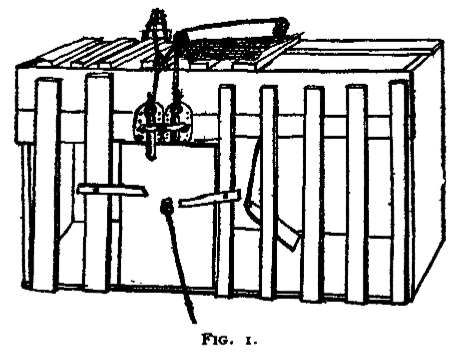
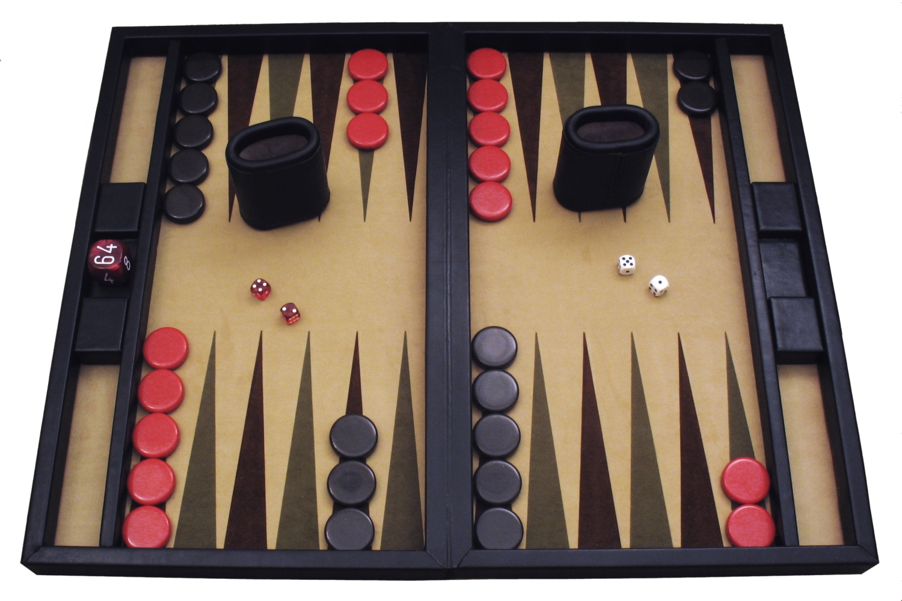
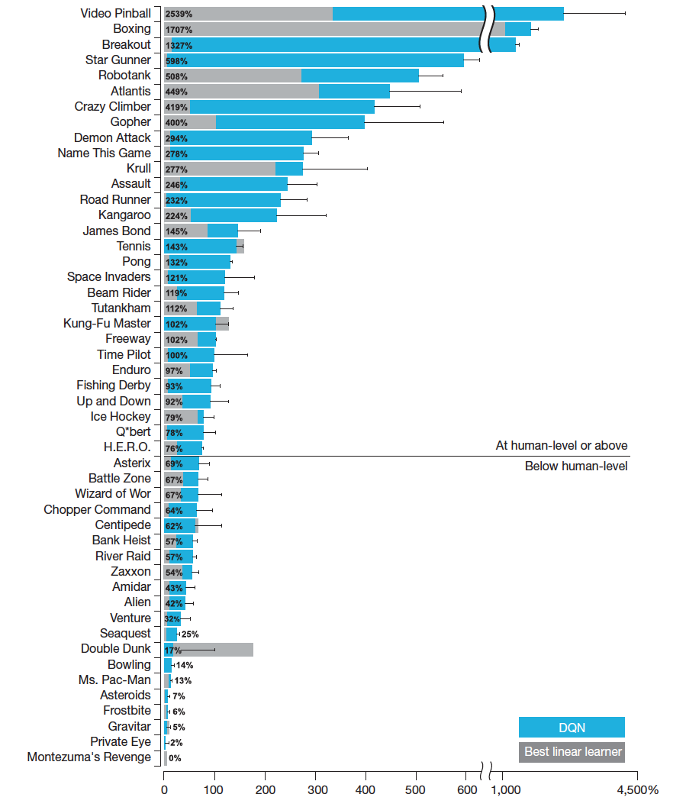
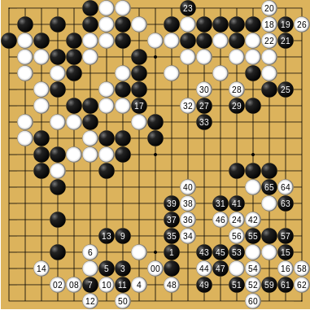
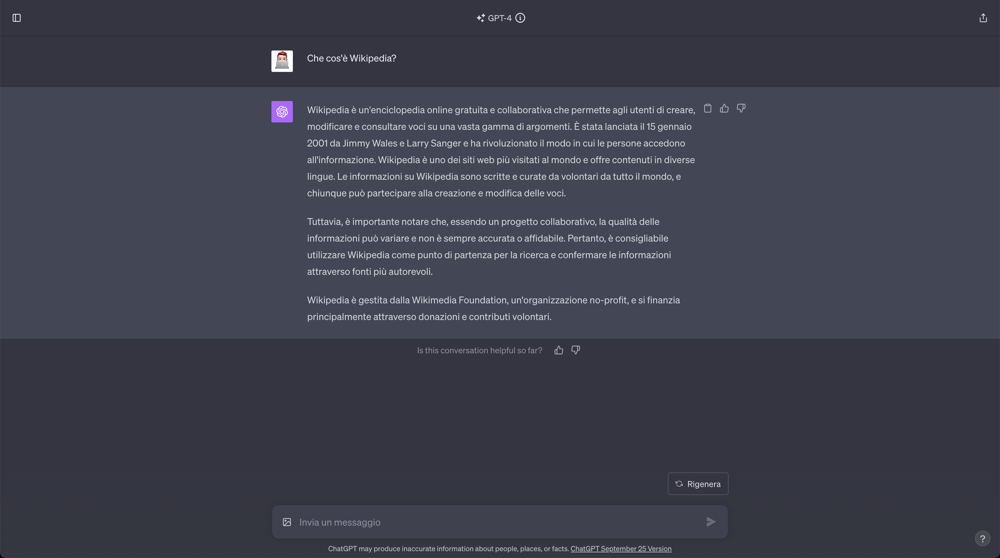

# 

 2010  AI “”，，。，，（Reinforcement Learning, RL）——， AI 。

，，。， RL 。

## 1. ：（1890s - 1950s）

，****。
1898 ，·（Edward Thorndike）""**（Law of Effect）**：，；。"（Trial-and-Error）"。

  <em> 1：（Puzzle Box）。：<a href="https://commons.wikimedia.org/wiki/File:Original_%22Puzzle_Box%22_Apparatus_Design.png" target="_blank" rel="noopener noreferrer">Wikimedia Commons</a></em>

，，。1957 ，·（Richard Bellman）**（MDP）** **（Bellman Equation）** [^1]。 $\langle \mathcal{S}, \mathcal{A}, P, R, \gamma \rangle$ —— $\mathcal{S}$、 $\mathcal{A}$、 $P(s'|s,a)$、 $R(s,a)$  $\gamma$。， $\pi(a|s)$，：

$$G_t = \sum_{k=0}^{\infty} \gamma^k R_{t+k+1}$$

""，****——$V^\pi(s)$  $s$ 、 $\pi$ 。，**** $V^*(s)$。，——****：

$$V^*(s) = \max_a \left[ R(s,a) + \gamma \sum_{s' \in \mathcal{S}} P(s'|s,a) \, V^*(s') \right]$$

：，""""。，——****。。

## 2. ：（1980s - 1990s）

，。**，**—— $P(s'|s,a)$  $R(s,a)$ 。，，AI 。**，""**——，。， $3^{361} \approx 10^{170}$，。****、****，。

- **1988 **，""·（Richard Sutton）**（Temporal Difference, TD）** [^2]。，。TD ：

$$V(s_t) \leftarrow V(s_t) + \alpha \left[ \underbrace{r_{t+1} + \gamma V(s_{t+1}) - V(s_t)}_{\text{TD  } \delta_t} \right]$$

 $\delta_t = r_{t+1} + \gamma V(s_{t+1}) - V(s_t)$  **TD **。，""""——（$\delta_t > 0$），；。""， RL 。

- **1989 **，·（Chris Watkins） **Q-Learning**  [^3]。（Model-Free）， RL 。：

$$Q(s_t, a_t) \leftarrow Q(s_t, a_t) + \alpha \left[ r_{t+1} + \gamma \max_{a'} Q(s_{t+1}, a') - Q(s_t, a_t) \right]$$

Q-Learning ：**** $Q(s,a)$—— $s$  $a$ ""。， $\arg\max_a Q(s,a)$ 。

- **1992 **，IBM ·（Gerald Tesauro） **TD-Gammon** [^4]。 TD ，。 RL 。

  <em> 2：（Backgammon），TD-Gammon 。：<a href="https://commons.wikimedia.org/wiki/File:Backgammon_lg.jpg" target="_blank" rel="noopener noreferrer">Wikimedia Commons</a></em>

1998 ，Sutton  Barto 《：》（_Reinforcement Learning: An Introduction_） [^5]，。

## 3. ： RL （2013 - 2019）

 21 ， RL ，、（）。，RL ""。

- **2013 **，DeepMind ** Q （DQN）** [^6]， RL ， AI  Atari 。（Deep RL）。DQN  $\theta$  $Q(s,a;\theta)$  Q ，：

$$\mathcal{L}(\theta) = \mathbb{E}_{(s,a,r,s') \sim \mathcal{D}} \left[ \left( r + \gamma \max_{a'} Q(s', a'; \theta^{-}) - Q(s, a; \theta) \right)^2 \right]$$

 $\theta^{-}$ ****（ $\theta$ ，），$\mathcal{D}$ ****（Experience Replay Buffer）。———— Q-Learning ， DQN 。

  <em> 3：DQN  Atari ，。：<a href="https://research.google/blog/from-pixels-to-actions-human-level-control-through-deep-reinforcement-learning/" target="_blank" rel="noopener noreferrer">Google Research Blog</a></em>

- **2016 **，。DeepMind  **AlphaGo** [^7] ， 4:1 。， RL 。

  <em> 4：AlphaGo 。：<a href="https://commons.wikimedia.org/wiki/File:AlphaGo_Fan_Huiren_aurka.png" target="_blank" rel="noopener noreferrer">Wikimedia Commons</a></em>

- **2017 **，OpenAI  **PPO（，Proximal Policy Optimization）**  [^8]。，PPO 。****，""：

$$\mathcal{L}^{\text{CLIP}}(\theta) = \mathbb{E}_t \left[ \min \left( \frac{\pi_\theta(a_t|s_t)}{\pi_{\theta_{\text{old}}}(a_t|s_t)} \hat{A}_t, \; \text{clip}\left(\frac{\pi_\theta(a_t|s_t)}{\pi_{\theta_{\text{old}}}(a_t|s_t)}, 1-\epsilon, 1+\epsilon\right) \hat{A}_t \right) \right]$$

 $\frac{\pi_\theta}{\pi_{\theta_{\text{old}}}}$ ****，$\hat{A}_t$ ****，$\epsilon$  0.1~0.2。，——""。，PPO 。 OpenAI  PPO  **OpenAI Five**  DOTA 2 。

## 4. ：（2020s ）

 RL ，（LLM） RL ——**（Alignment）** **（Reasoning）**。

- **2022 **，OpenAI  ChatGPT。 **RLHF（）** [^9]。， PPO ，RL  LLM """"。RLHF ： $r_\phi(x, y)$，， PPO  $\pi_\theta$：

$$\max_\theta \; \mathbb{E}_{x \sim \mathcal{D}, y \sim \pi_\theta(\cdot|x)} \left[ r_\phi(x, y) - \beta \, \text{KL}\left(\pi_\theta(\cdot|x) \| \pi_{\text{ref}}(\cdot|x)\right) \right]$$

 KL  $\beta \, \text{KL}(\pi_\theta \| \pi_{\text{ref}})$ —— RLHF ""（Reward Hacking）。

  <em> 5：ChatGPT 。2022  ChatGPT  RLHF ，。：OpenAI <a href="https://openai.com/index/chatgpt/" target="_blank" rel="noopener noreferrer">Introducing ChatGPT</a></em>

- **2023 **， **DPO（）** [^10]。，，。DPO  RLHF ：

$$\mathcal{L}_{\text{DPO}}(\theta) = -\mathbb{E}_{(x, y_w, y_l)} \left[ \log \sigma \left( \beta \log \frac{\pi_\theta(y_w|x)}{\pi_{\text{ref}}(y_w|x)} - \beta \log \frac{\pi_\theta(y_l|x)}{\pi_{\text{ref}}(y_l|x)} \right) \right]$$

 $y_w$（winner） $y_l$（loser）""""，$\sigma$  sigmoid 。 RLHF ——"，"。DPO  RLHF ，。

- **2024 - 2025 **， OpenAI o1  DeepSeek-R1 [^11] ，。 **DeepSeek-R1-Zero （、）， SFT（）， Base （Pure RL）。** " SFT  RL"，（CoT）（a-ha moment）。DeepSeek  **GRPO（）** ， PPO  Critic ，。GRPO ： prompt $q$  $\{o_1, o_2, \ldots, o_G\}$，：

$$\tilde{r}_i = \frac{r_i - \text{mean}(r_1, \ldots, r_G)}{\text{std}(r_1, \ldots, r_G)}$$

：

$$\mathcal{L}_{\text{GRPO}}(\theta) = \mathbb{E}_q \left[ \frac{1}{G} \sum_{i=1}^{G} \min \left( \frac{\pi_\theta(o_i|q)}{\pi_{\theta_{\text{old}}}(o_i|q)} \tilde{r}_i, \; \text{clip}\left(\frac{\pi_\theta(o_i|q)}{\pi_{\theta_{\text{old}}}(o_i|q)}, 1-\epsilon, 1+\epsilon\right) \tilde{r}_i \right) \right]$$

 Critic ，****， RL 。

## 

，； DQN， DPO  GRPO。， **"、、"** 。

，，（AGI）。，，，。

## 

[^1]: Bellman, R. (1957). A Markovian Decision Process. _Journal of Mathematics and Mechanics_, 6(5), 679-684. [DOI](https://doi.org/10.1512/iumj.1957.6.56038)

[^2]: Sutton, R. S. (1988). Learning to predict by the methods of temporal differences. _Machine Learning_, 3(1), 9-44. [PDF](http://incompleteideas.net/papers/sutton-88.pdf)

[^3]: Watkins, C. J. C. H. (1989). Learning from Delayed Rewards. _PhD Thesis, King's College, Cambridge_. [PDF](https://www.cs.rhul.ac.uk/~chrisw/new_thesis.pdf)

[^4]: Tesauro, G. (1995). Temporal difference learning and TD-Gammon. _Communications of the ACM_, 38(3), 58-68. [DOI](https://doi.org/10.1145/203330.203343)

[^5]: Sutton, R. S., & Barto, A. G. (2018). _Reinforcement Learning: An Introduction_ (2nd ed.). MIT Press. 

[^6]: Mnih, V., et al. (2013). Playing Atari with Deep Reinforcement Learning. _arXiv preprint_. [arXiv:1312.5602](https://arxiv.org/abs/1312.5602)

[^7]: Silver, D., et al. (2016). Mastering the game of Go with deep neural networks and tree search. _Nature_, 529(7587), 484-489. [DOI](https://doi.org/10.1038/nature16961)

[^8]: Schulman, J., et al. (2017). Proximal Policy Optimization Algorithms. _arXiv preprint_. [arXiv:1707.06347](https://arxiv.org/abs/1707.06347)

[^9]: Ouyang, L., et al. (2022). Training language models to follow instructions with human feedback. _arXiv preprint_. [arXiv:2203.02155](https://arxiv.org/abs/2203.02155)

[^10]: Rafailov, R., et al. (2023). Direct Preference Optimization: Your Language Model is Secretly a Reward Model. _arXiv preprint_. [arXiv:2305.18290](https://arxiv.org/abs/2305.18290)

[^11]: DeepSeek-AI, et al. (2025). DeepSeek-R1: Incentivizing Reasoning Capability in LLMs via Reinforcement Learning. _arXiv preprint_. [arXiv:2501.12948](https://arxiv.org/abs/2501.12948)
