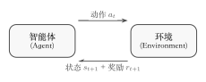
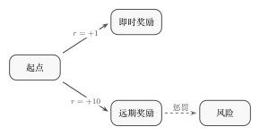
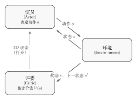
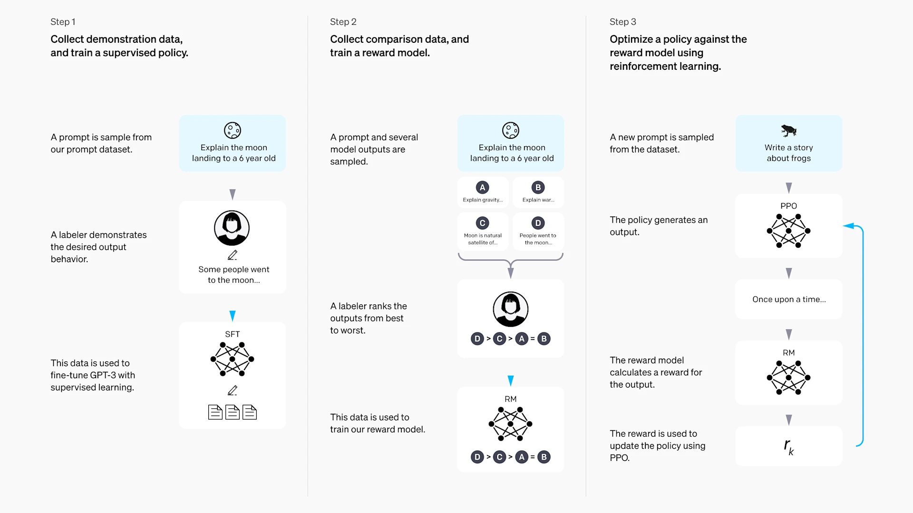
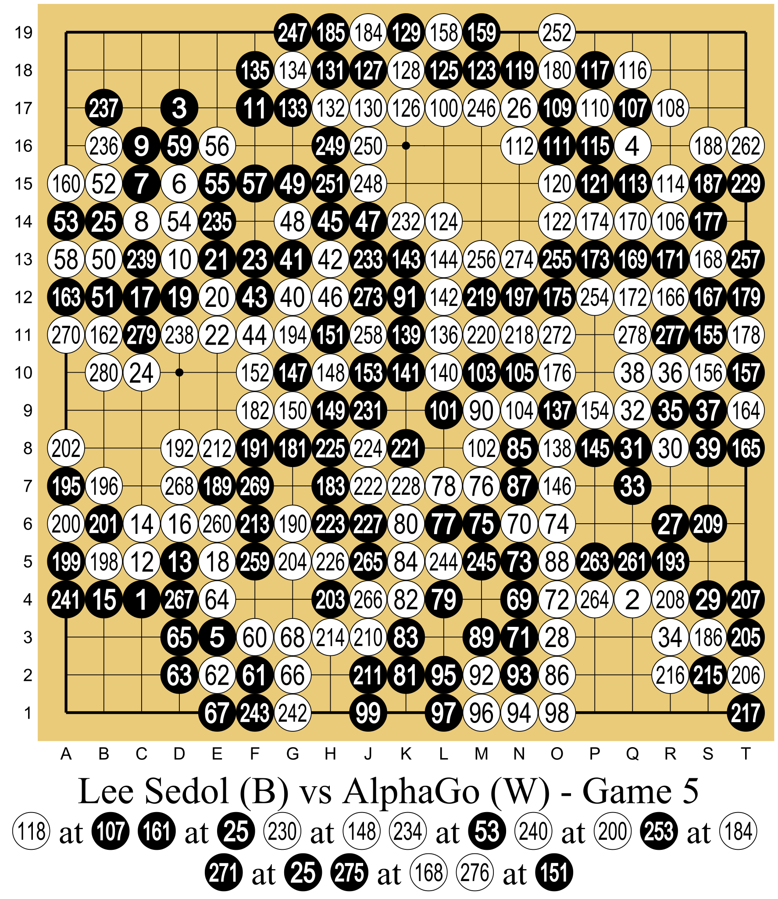

# 

::: info Note
， AGI 。

。 🚧 ，🚧 ，。 [GitHub ](https://github.com/letslego/hands-on-modern-rl)  Star 🌟 ～
:::

::: tip 
，， [amitabha.karmakar@gmail.com](mailto:amitabha.karmakar@gmail.com)。
:::

## ？

2019 ，·（Richard Sutton），《》（[The Bitter Lesson](http://www.incompleteideas.net/IncIdeas/BitterLesson.html)）。 70 ，：

> The biggest lesson that can be read from 70 years of AI research is that general methods that leverage computation are ultimately the most effective, and by a large margin.
>
>  70  AI ：，。
>
> —— Rich Sutton, 2019. ·（Andrew Barto）， 2024  ACM 。


<p class="image-caption"><em>·（Richard S. Sutton），，2024 。：<a href="https://commons.wikimedia.org/wiki/File:Rich_Sutton_on_Reinforcement_Learning-_Alpha_Go_Zero_to_60_(cropped).jpg" target="_blank" rel="noopener noreferrer">Wikimedia Commons</a>（CC BY 2.0）</em></p>

""？ AI 。，，；，，。——， AlphaGo Zero ，，。

：**，。** ————，。

""、？，，：**、、——。**

，——、、——""？"、"。，，，。

。，？


<div style="text-align: center; font-size: 0.9em; color: var(--vp-c-text-2); margin-top: -10px; margin-bottom: 20px;">
  <em> 1：，（Trial-and-Error）。：<a href="https://commons.wikimedia.org/wiki/File:Dad_teaching_child_to_ride_a_bike.jpg" target="_blank" rel="noopener noreferrer">Wikimedia Commons</a></em>
</div>

《》，" 5  10 "——。，。，；，。，。

——**，**——。，。、、，：，。""""——， AI ，——。

，**（Reinforcement Learning, RL）： AI ，、，**。 Q-Learning  DQN， PPO  DPO  GRPO——，。

。（CartPole）， RL 。，。


<div style="text-align: center; font-size: 0.9em; color: var(--vp-c-text-2); margin-top: -10px; margin-bottom: 20px;">
  <em> 2：CartPole ：。：<a href="https://gymnasium.farama.org/environments/classic_control/cart_pole/" target="_blank" rel="noopener noreferrer">Gymnasium</a></em>
</div>

## ？

""。，。

> ****。**（Agent）** **（Environment）** ，**（State）**，**（Action）**；，**（Reward）** 。：****。

：****（，），****（，""），****（，）。

### 

：

<div align="center" style="margin: 2.5rem 0;">
  
</div>
<div style="text-align: center; font-size: 0.9em; color: var(--vp-c-text-2); margin-top: -10px; margin-bottom: 20px;">
  <em>：。，。</em>
</div>

1.  $s_t$， $a_t$
2. ， $s_{t+1}$， $r_{t+1}$
3.  1 

****：$s_0, a_0, r_1, s_1, a_1, r_2, s_2, \ldots$

。**（State）** （），**（Observation）** （）——""， `obs` 。****：****（、、、 4 ）****（），。

，，“”。，**（Return） $G_t$**—— $t$ ，，。

，：。，，。“ 1  1 ”，**（Discount Factor） $\gamma$**（ 0~1 ， 0.95~0.99）。

，，，。：

$$G_t = r_{t+1} + \gamma\, r_{t+2} + \gamma^2\, r_{t+3} + \cdots = \sum_{k=0}^{\infty} \gamma^k\, r_{t+k+1}$$

，：

- $r_{t+1}$ ，****（ $\gamma^0 = 1$）。
- $r_{t+2}$ ，， $\gamma^1$。
- $r_{t+3}$ ，， $\gamma^2$。
- ， $k+1$ ， $\gamma^k$。 $\gamma$  1 （ 0.9）， $\gamma^k$ （0.9, 0.81, 0.729...）。

，$\gamma$ ””。：

<div align="center" style="margin: 2.5rem 0;">
  
</div>
<div style="text-align: center; font-size: 0.9em; color: var(--vp-c-text-2); margin-top: -10px; margin-bottom: 20px;">
  <em>：。（）。</em>
</div>

：

- ****：， +1。， **1 **。
- ****：， +10，。，， $\gamma^3$（ 3 ）。

，$\gamma$ ：

- ** $\gamma = 0.1$（）**： $10 \times 0.1^3 = 0.01$ 。0.01  1 ，****。
- ** $\gamma = 0.9$（）**： $10 \times 0.9^3 = 7.29$ 。7.29  1 ，，****。


<div style="text-align: center; font-size: 0.9em; color: var(--vp-c-text-2); margin-top: -10px; margin-bottom: 20px;">
  <em> 3：，。：<a href="https://commons.wikimedia.org/wiki/File:MAZE_Mouse_Cheese.jpg" target="_blank" rel="noopener noreferrer">Wikimedia Commons</a></em>
</div>

 RL ——****——：""。""""，RL 。

：**（Episodic）** （、 CartPole），**（Continuing）** （）。，””。

### ：

 RL ：****？ $G_t$， $t$ ：

$$G_t = r_{t+1} + \gamma\, r_{t+2} + \gamma^2\, r_{t+3} + \cdots = \sum_{k=0}^{\infty} \gamma^k\, r_{t+k+1}$$

""，。，——**（Policy）$\pi$**，""，。** $\pi^*$**。：****（$a = \pi(s)$），****（$\pi(a|s) = P(a|s)$）——，。

，？：

**：（Value-Based）**——""，。，，： 80 ， 30 ——。""**（Q ）**，，：

$$Q^{\pi}(s, a) = \mathbb{E}_{\pi}\left[G_t \mid s_t = s,\, a_t = a\right]$$

：**，？ Q ？**

：**“”，“”**。，**（MDP）**。

MDP “，”。，，——**（Bellman Equation）**。，Q ，：
** Q  =  +  Q **

，：
，（）。， 1 ， 10 。：“， 1+10=11 ！”， 11。

，“”“”， Q （****）。，，：$a^* = \arg\max_a Q^*(s, a)$。 Q-Learning  DQN。

**：（Policy-Based）**——，""。，，：，。，，。， $\pi_\theta$  $\theta$ ，：

$$J(\theta) = \mathbb{E}_{\pi_\theta}\left[G_t\right], \quad \theta^* = \arg\max_\theta J(\theta)$$

 REINFORCE  PPO。

， RL ——**（Exploration vs. Exploitation）**：，？，（），（）；（），。，、。，。

**Actor-Critic** —— **""（Critic）** ， **""（Actor）** 。：

- **Critic（）** ，" $s$  $a$，？"。，——" +5 "。，、。
- **Actor（）**  $\pi_\theta(a|s)$，" $s$ ，？"。：，；，。

：，；，，。——，，""。

，****，：

- **（Model-Free）**：，“”。、 Actor-Critic，， Model-Free。，，。
- **（Model-Based）**：“”（Model of the environment），“，”。 AlphaGo ，（），，。

 **Model-Free** （ DQN, PPO, DPO ），，。

<div align="center" style="margin: 2.5rem 0;">



</div>

<div style="text-align: center; font-size: 0.9em; color: var(--vp-c-text-2); margin-top: -10px; margin-bottom: 20px;">
  <em> 4：Actor-Critic ：（Actor），（Critic）。</em>
</div>

：""""？，。 16 ， 16 ，"/"—— Q-Learning ：

|   | $\leftarrow$ | $\rightarrow$ | $\uparrow$ | $\downarrow$ |
| :---: | :----------: | :-----------: | :--------: | :----------: |
| $s_0$ |     0.1      |    **0.8**    |    0.3     |     -0.2     |
| $s_1$ |   **0.7**    |      0.2      |    0.5     |     0.0      |
|   ⋮   |      ⋮       |       ⋮       |     ⋮      |      ⋮       |

： $s_0$ ""（0.8 ）， $s_1$ ""（0.7 ）。，""。

 Atari ， $210 \times 160 = 33600$ ， 128 ——，。**（Deep RL）** ""：（）， Q 。，****——，。

- ""（， Q ）， Value-Based（ DQN）；
- ""（，）， Policy-Based（ REINFORCE）；
- ——，—— Actor-Critic（ PPO）。

 Deep RL。

### 

——、、——。：**，？**

2016 ，AlphaGo ，。 RL ， 2022  ChatGPT ——，""""，。


<div style="text-align: center; font-size: 0.9em; color: var(--vp-c-text-2); margin-top: -10px; margin-bottom: 20px;">
  <em> 5：ChatGPT ， RLHF 。：OpenAI <a href="https://openai.com/index/chatgpt/" target="_blank" rel="noopener noreferrer">Introducing ChatGPT</a></em>
</div>

，： +1 ， -100 。 AI ""，：""？？？？，。

**RLHF（Reinforcement Learning from Human Feedback）** ，""""：



<div style="text-align: center; font-size: 0.9em; color: var(--vp-c-text-2); margin-top: -10px; margin-bottom: 20px;">
  <em> 6：OpenAI  InstructGPT ：，，。：OpenAI <a href="https://openai.com/index/instruction-following/" target="_blank" rel="noopener noreferrer">Aligning language models to follow instructions</a></em>
</div>

1. **（SFT）**：，。
2. **（RM）**：，""。
3. **（RL）**： PPO ，，。

 RL 。**：（RLHF / DPO）**——""（、），。""， RL 。DPO ，""，—— 8-9 。**：（RLVR）**——、，。DeepSeek-R1-Zero ： SFT ，，（Chain-of-Thought）。 AI  AGI 。


<div style="text-align: center; font-size: 0.9em; color: var(--vp-c-text-2); margin-top: -10px; margin-bottom: 20px;">
  <em> 7：DeepSeek-R1 “ RL”：，、 GRPO 。：<a href="https://arxiv.org/abs/2501.12948" target="_blank" rel="noopener noreferrer">DeepSeek-R1 Paper</a></em>
</div>

 PPO ？，， LLM 。 PPO  Critic ，。**GRPO（Group Relative Policy Optimization）** —— Critic ，，""。 RL ，。

### 

" AI "" AI "，。

**（Agentic RL）**。""——，。：，、、。Agentic RL  AI 、、，。""""， 10 。

****。RL ：-（VLM） RL ，（Embodied AI） RL ——、。（Sim-to-Real Gap）：，。（Domain Randomization）， Model-Based RL （Self-Play）。

——****。""：。，，，——，。， AGI。

---

。，——，，。

## 

2016 ，AlphaGo ，。2022  ChatGPT ， RL """"。 DeepSeek-R1 ，RLHF、DPO、GRPO  AI 。



<div style="text-align: center; font-size: 0.9em; color: var(--vp-c-text-2); margin-top: -10px; margin-bottom: 20px;">
  <em>：2016  AlphaGo 。AlphaGo  4:1 ，。：<a href="https://commons.wikimedia.org/wiki/File:Lee_Sedol_(B)_vs_AlphaGo_(W)_-_Game_5.svg" target="_blank" rel="noopener noreferrer">Wikimedia Commons</a>（CC BY-SA 4.0）</em>
</div>

，。 RL ， RL ， PPO、DPO、GRPO 。 RLHF ，。，。

——**，、。**

### "、"

 MDP ，，。，****。 CartPole ， DPO ""，，，。

：，；；；，。

### 

。****——， reward ； clip ，。。

### 

，：

<div class="preface-structure-map" align="center" style="margin: 2.5rem 0;">

```mermaid
graph TD
    subgraph P1["：（ 1-2 ）"]
        Q["<br/>CartPole  DPO"]
    end

    subgraph P2["：（ 3-7 ）"]
        A["RL <br/>"] --> B["Value-Based<br/>"]
        A --> C["Policy-Based<br/>"]
        B --> D["Q-Learning → DQN<br/>（ 4 ）"]
        C --> E["REINFORCE<br/>（ 5 ）"]
        D --> F["Actor-Critic <br/>（ 6 ）"]
        E --> F
        F --> G["PPO（ 7 ）"]
    end

    subgraph P3["：（ 8-10 ）"]
        H[" RL"] --> I["RLHF  DPO<br/>（ 8-9 ）"]
        H --> J["GRPO  RLVR ()<br/>（ 9 ）"]
        H --> K["Agentic RL ()<br/>（ 10 ）"]
    end

    subgraph P4["：（ 11-12 ）"]
        L[""] --> M["VLM  RL<br/>（ 11 ）"]
        L --> N[" Self-Play <br/>（ 12 ）"]
    end

    Q --> A
    G --> H
    H --> L

    style P1 fill:#f8f9fa,stroke:#616161,color:#000
    style P2 fill:#eef6ff,stroke:#1976d2,color:#000
    style P3 fill:#edf7ed,stroke:#2e7d32,color:#000
    style P4 fill:#f5eef8,stroke:#7b1fa2,color:#000
    style Q fill:#f8f9fa,stroke:#616161,color:#000
    style A fill:#eef6ff,stroke:#1976d2,color:#000
    style B fill:#e3f2fd,stroke:#1976d2,color:#000
    style D fill:#e3f2fd,stroke:#1976d2,color:#000
    style C fill:#fff3e0,stroke:#f57c00,color:#000
    style E fill:#fff3e0,stroke:#f57c00,color:#000
    style F fill:#e8f5e9,stroke:#388e3c,color:#000
    style G fill:#e8f5e9,stroke:#388e3c,stroke-width:3px,color:#000
    style H fill:#edf7ed,stroke:#2e7d32,color:#000
    style I fill:#edf7ed,stroke:#2e7d32,color:#000
    style J fill:#edf7ed,stroke:#2e7d32,color:#000
    style K fill:#edf7ed,stroke:#2e7d32,color:#000
    style L fill:#f5eef8,stroke:#7b1fa2,color:#000
    style M fill:#f5eef8,stroke:#7b1fa2,color:#000
    style N fill:#f5eef8,stroke:#7b1fa2,color:#000

```

</div>

。****（）， CartPole  DPO 。****（）： Value-Based——，； Policy-Based——，。 Actor-Critic ， PPO。****（）：PPO ， RLHF、DPO、GRPO  Agentic RL。****（）， RL 。

。

**。**

- ** 1 ** RL ， CartPole "AI "。
- ** 2 **""""， DPO ""， RL 。

**。**

- ** 3 ** RL ——（MDP），，、、，。
- ** 4 **， DQN  Q-Learning ， Atari ——。
- ** 5 **——， REINFORCE ，。
- ** 6 ** Actor-Critic ， Critic ， Value-Based  Policy-Based 。
- ** 7 ** PPO，（Clipping）（GAE），——PPO ，。

**。**

- ** 8 ** SFT → RM → RL ， RLHF ，、、。
- ** 9 **。 DPO ""； GRPO  Critic 。 **RLVR（ RL）**，， **DeepSeek-R1-Zero** （CoT）。
- ** 10 ** **Agentic RL（）**。 RL 、、，、、（ Deep Research Agent）。""""。

** RL 、。**

- ** 11 ** RL -（VLM）， RL 、， Open-R1 。
- ** 12 **。， Sim-to-Real ****， Model-Based RL、（Self-Play）、LLM  RL（Offline RL）。

### 

、。， Python 、（）、（、）（、）。，，。

## 

：

- **Linux**（）：Ubuntu 20.04 ，。
- **Windows**： WSL2（Windows Subsystem for Linux 2），。
- **macOS**：Apple Silicon（M1/M2/M3/M4） Intel Mac 。

GPU ：

|      |              |                                             |                      |
| -------- | -------------------- | --------------------------------------------------- | ---------------------------- |
|  | CPU  / 4GB+  | CartPole、Atari、 RL              | 、GTX 1650         |
|  | 24GB             | DPO 、PPO 、GRPO            | RTX 3090、RTX 4090、A5000  |
|  | 80GB             | （ 7B+  RLHF ） | A100、H100                 |

 **24GB **，（ RTX 3090 / 4090） 90% 。 80GB 。

::: tip
。， 24GB 。
:::

## 

- ****：——，""，。
- ****：RL -，，Actor-Critic 。
- ****： RLHF  DPO， PPO  GRPO  RLVR，。
- ****：Agentic RL、 RL  RL 、，。
- "、"， Python 。
